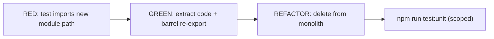
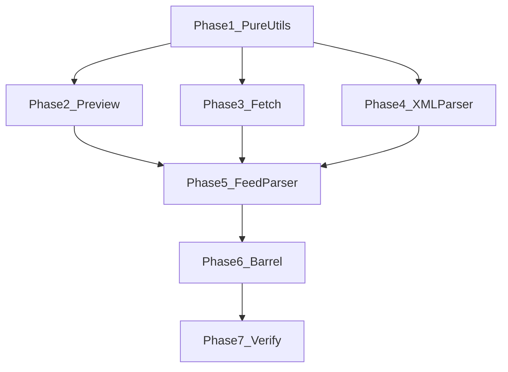

# Feed Parser Refactor Plan

## Problem

[`src/services/feed-parser.ts`](src/services/feed-parser.ts) (~3,787 lines) mixes six distinct responsibilities:

| Section | Lines (approx) | Responsibility |
|---------|----------------|----------------|
| Podcast platform resolution | 36–232 | Apple/Pocket Casts URL → RSS feed URL |
| Feed preview | 234–401 | Lightweight DOM preview for discover UI |
| Errors & validation | 403–450 | `EmptyFeedError`, `isValidFeed` |
| Feed discovery + fetch | 452–968 | `discoverFeedUrl`, `fetchFeedXml` (Obsidian `requestUrl`, proxies, Android) |
| `CustomXMLParser` | 1,030–2,642 | RSS/Atom/JSON parsing, XML preprocessing, HTML entity fixes |
| Retention + orchestration | 2,644–3,786 | `mergeFeedHistoryItems`, `applyFeedRetentionLimits`, `FeedParser`, `FeedParserService` |

**Consumers** (must stay stable via barrel re-exports):

- [`main.ts`](main.ts) — `FeedParser`, `applyFeedRetentionLimits`, `formatFeedParseNoticeMessage`
- [`src/modals/feed-preview-modal.ts`](src/modals/feed-preview-modal.ts) — `fetchFeedXml`
- [`src/modals/feed-manager/feed-preview-loader.ts`](src/modals/feed-manager/feed-preview-loader.ts) — `loadFeedForPreview`, `resolvePodcastPlatformUrl`
- [`src/services/background-import-service.ts`](src/services/background-import-service.ts) — `getFeedErrorMessage`
- [`src/utils/domain-icon-helpers.ts`](src/utils/domain-icon-helpers.ts) — `FeedParser`

**Existing test assets** (leverage, don't rewrite):

- [`test_files/unit/services/feed-parser.test.ts`](test_files/unit/services/feed-parser.test.ts) — ~1,850 lines, 12 `describe` blocks
- [`test_files/unit/discover/feed-preview-parsing.test.ts`](test_files/unit/discover/feed-preview-parsing.test.ts)
- [`test_files/unit/utils/ios-namespace-fix.test.ts`](test_files/unit/utils/ios-namespace-fix.test.ts)
- Vitest: `jsdom` + Obsidian stub at [`test_files/stubs/obsidian.ts`](test_files/stubs/obsidian.ts)

**Note:** `FeedParserService` is only exercised in unit tests (not used in `main.ts`). Extract as-is; do not merge with `FeedParser` in this refactor.

---

## TDD Workflow (every checklist item)

Follow the same red→green pattern used in [`plans/article-list-refactor.md`](plans/article-list-refactor.md):



1. **RED** — Point test(s) at the *new* module path (or add a characterization test for untested fetch logic). Run scoped test; confirm failure (`Cannot find module` or assertion fail).
2. **GREEN** — Move implementation into new file; add re-export in barrel. Run scoped test; confirm pass.
3. **REFACTOR** — Delete extracted code from monolith; run full `feed-parser` test suite.
4. **Gate** — Do not start next extraction until current phase tests are green.

**Per-phase test command pattern:**

```bash
npm run test:unit -- test_files/unit/services/feed-parser/<module>.test.ts
```

---

## Target Directory Structure

```text
src/services/feed-parser/
├── index.ts                         # internal barrel (optional)
├── types.ts                         # ParsedFeed, ParsedItem, FeedPreviewData, FeedParseOptions, Rss2Json types
├── feed-errors.ts                   # EmptyFeedError, getFeedErrorMessage, formatFeedParseNoticeMessage
├── feed-validation.ts               # isValidFeed
├── feed-retention.ts                # mergeFeedHistoryItems, applyFeedRetentionLimits
├── podcast-platform-resolver.ts     # resolvePodcastPlatformUrl (+ private helpers)
├── feed-preview.ts                  # parseFeedPreviewFromXmlText, loadFeedForPreview, parseFeedDoc
├── feed-fetch.ts                    # discoverFeedUrl, fetchFeedXml
├── parsed-feed-assert.ts            # assertParsedFeedHasEntries
├── xml-parser/
│   ├── custom-xml-parser.ts         # class facade: parseString orchestration
│   ├── xml-preprocessing.ts           # preprocessXmlContent, extractRssContent, fallbackParse
│   ├── rss-parser.ts                # parseRSS (+ channel/item helpers)
│   ├── atom-parser.ts               # parseAtom, getAtomEntryLink
│   ├── json-feed-parser.ts          # parseJSON
│   └── xml-html-utils.ts            # decodeHtmlEntities, sanitizeCDATA, Substack image rewrite
├── feed-item-mapper.ts              # parsed item → FeedItem field mapping (shared helpers)
├── feed-parser-class.ts             # FeedParser class
└── feed-parser-service.ts           # FeedParserService singleton

src/services/feed-parser.ts          # THIN re-export barrel (~30 lines) — keeps all existing import paths
```

**Backward compatibility:** [`src/services/feed-parser.ts`](src/services/feed-parser.ts) becomes a re-export-only file:

```typescript
export { FeedParser } from "./feed-parser/feed-parser-class";
export { CustomXMLParser } from "./feed-parser/xml-parser/custom-xml-parser";
// ... all public symbols
```

No consumer import changes required.

---

## Test File Layout (mirror source)

```text
test_files/unit/services/feed-parser/
├── fixtures/
│   └── rss-fixtures.ts              # move RSS2_BASIC, ATOM_*, etc. from feed-parser.test.ts
├── feed-errors.test.ts
├── feed-validation.test.ts
├── feed-retention.test.ts           # split from feed-parser.test.ts
├── feed-preview.test.ts             # absorb discover/feed-preview-parsing.test.ts
├── feed-fetch.test.ts               # NEW characterization tests (mock requestUrl)
├── podcast-platform-resolver.test.ts # NEW (mock requestUrl + iTunes API)
├── custom-xml-parser.test.ts        # split RSS/Atom/JSON/entity tests
├── feed-parser-class.test.ts        # FeedParser.parseFeed integration tests
└── feed-parser-service.test.ts
```

Keep [`test_files/unit/utils/ios-namespace-fix.test.ts`](test_files/unit/utils/ios-namespace-fix.test.ts) importing from `feed-parser` barrel (validates re-export chain).

---

## Phase Checklist

### Phase 0: Scaffold (no behavior change)

- [ ] **0.1** Create `src/services/feed-parser/` directory and empty module files with `export {}` placeholders
- [ ] **0.2** Create `test_files/unit/services/feed-parser/fixtures/rss-fixtures.ts`; move shared XML fixtures from [`feed-parser.test.ts`](test_files/unit/services/feed-parser.test.ts)
- [ ] **0.3** Verify baseline: `npm run test:unit -- test_files/unit/services/feed-parser.test.ts` passes

---

### Phase 1: Pure utilities (lowest risk — already well tested)

Extract functions with zero Obsidian/DOM dependencies.

- [ ] **1.1 RED** — Create `feed-errors.test.ts` importing from `src/services/feed-parser/feed-errors.ts` (fails)
- [ ] **1.2 GREEN** — Extract lines 403–437 → `feed-errors.ts`; re-export from barrel
- [ ] **1.3 RED** — Create `feed-validation.test.ts` importing `feed-validation.ts`
- [ ] **1.4 GREEN** — Extract `isValidFeed` (lines 439–450)
- [ ] **1.5 RED** — Create `feed-retention.test.ts`; move `mergeFeedHistoryItems` + `applyFeedRetentionLimits` tests
- [ ] **1.6 GREEN** — Extract lines 2644–2735 → `feed-retention.ts` (include private `getPubDateMs`, `isProtectedItem`)
- [ ] **1.7** — Extract `ParsedFeed` / `ParsedItem` / `FeedParseOptions` → `types.ts`; extract `assertParsedFeedHasEntries` → `parsed-feed-assert.ts`
- [ ] **1.8 GATE** — `npm run test:unit -- test_files/unit/services/feed-parser/feed-{errors,validation,retention}.test.ts`

---

### Phase 2: Feed preview (partial coverage today)

- [ ] **2.1 RED** — Create `feed-preview.test.ts`; move test from [`feed-preview-parsing.test.ts`](test_files/unit/discover/feed-preview-parsing.test.ts) to import new path; add test for bare-ampersand `BARE_AMPERSAND_REGEX` edge cases
- [ ] **2.2 GREEN** — Extract lines 234–401 → `feed-preview.ts`
- [ ] **2.3 REFACTOR** — Delete or thin `discover/feed-preview-parsing.test.ts` (re-export test or remove duplicate)
- [ ] **2.4 GATE** — preview tests green; `feed-preview-loader.test.ts` still passes (imports barrel)

---

### Phase 3: Network fetch layer (needs new tests)

Currently only mocked in modal tests — add characterization tests before extraction.

- [ ] **3.1 RED** — Create `feed-fetch.test.ts` with `vi.mock("obsidian")` covering:
  - `isValidFeed` response accepted on direct fetch
  - FeedBurner URL rewrite path
  - Android skips proxy fallback (`Platform.isAndroidApp`)
  - rss2json XML reconstruction fallback
- [ ] **3.2 RED** — Create `podcast-platform-resolver.test.ts` for Apple/Pocket Casts resolution (mock `requestUrl`)
- [ ] **3.3 GREEN** — Extract lines 36–232 → `podcast-platform-resolver.ts`
- [ ] **3.4 GREEN** — Extract lines 452–968 → `feed-fetch.ts` (imports `isValidFeed`, `feed-validation`)
- [ ] **3.5 GATE** — fetch + podcast tests green

---

### Phase 4: CustomXMLParser split (largest chunk — ~1,600 lines)

Split incrementally; keep `CustomXMLParser.parseString` as the stable public API.

**4a — HTML/XML utilities (pure, easy to test)**

- [ ] **4a.1 RED** — Move `decodeHtmlEntities`, ampersand/malformed XML tests to import `xml-html-utils.ts`
- [ ] **4a.2 GREEN** — Extract `decodeHtmlEntities`, `sanitizeCDATA`, Substack rewrite helpers → `xml-html-utils.ts`
- [ ] **4a.3 RED** — Add preprocessing tests (if not covered) for `preprocessXmlContent` / `extractRssContent`
- [ ] **4a.4 GREEN** — Extract → `xml-preprocessing.ts`

**4b — Format-specific parsers**

- [ ] **4b.1 RED** — Point RSS 2.0 tests at `rss-parser.ts` (via parser facade or direct if helpers exported for testing)
- [ ] **4b.2 GREEN** — Extract `parseRSS` (+ private RSS helpers) → `rss-parser.ts`
- [ ] **4b.3 GREEN** — Extract `parseAtom`, `getAtomEntryLink` → `atom-parser.ts`
- [ ] **4b.4 GREEN** — Extract `parseJSON` → `json-feed-parser.ts`
- [ ] **4b.5 GREEN** — Extract `fallbackParse` → `xml-preprocessing.ts`

**4c — Facade**

- [ ] **4c.1 GREEN** — Slim `custom-xml-parser.ts` to orchestration only: `parseString`, `parseXML`, `validateFeedStructure`, delegate to sub-parsers
- [ ] **4c.2 GATE** — `npm run test:unit -- test_files/unit/services/feed-parser/custom-xml-parser.test.ts` + `ios-namespace-fix.test.ts`

---

### Phase 5: FeedParser class (orchestration — ~930 lines)

- [ ] **5.1 RED** — Create `feed-item-mapper.test.ts` for pure mapping helpers (cover image extraction, URL normalization, summary truncation) extracted from `FeedParser` private methods
- [ ] **5.2 GREEN** — Extract duplicated URL/HTML helpers shared with `CustomXMLParser` into `feed-item-mapper.ts` or `xml-html-utils.ts` (single source of truth for `decodeHtmlEntities`, `normalizeUrlEncoding`)
- [ ] **5.3 RED** — Point `FeedParser.parseFeed` tests at `feed-parser-class.ts`
- [ ] **5.4 GREEN** — Move `FeedParser` class (lines 2737–3669) → `feed-parser-class.ts`; inject `fetchFeedXml` import, `CustomXMLParser`, retention, `MediaService`
- [ ] **5.5 GREEN** — Extract `FeedParserService` → `feed-parser-service.ts`
- [ ] **5.6 GATE** — `feed-parser-class.test.ts` + `feed-parser-service.test.ts` green

---

### Phase 6: Barrel finalize + monolith deletion

- [ ] **6.1** — Replace [`feed-parser.ts`](src/services/feed-parser.ts) body with re-exports only (~30 lines)
- [ ] **6.2** — Split remaining monolithic [`feed-parser.test.ts`](test_files/unit/services/feed-parser.test.ts) into per-module test files; delete original or leave as re-export smoke test
- [ ] **6.3** — `npx tsc -noEmit -skipLibCheck` — no type errors
- [ ] **6.4** — `npx eslint src/services/feed-parser/**/*.ts src/services/feed-parser.ts`

---

### Phase 7: Verification

- [ ] **7.1** — Full unit suite: `npm run test:unit`
- [ ] **7.2** — Build: `npm run build`
- [ ] **7.3** — Manual Obsidian smoke test:
  - Add/refresh a standard RSS feed
  - Add a podcast feed (enclosure + iTunes tags)
  - Feed preview in discover / feed manager
  - Pocket Casts / Apple Podcasts URL resolution (if used)
  - Retention limits + merge on refresh (starred/saved items preserved)
  - Android device: confirm fetch does not silently proxy-fallback incorrectly

---

## Extraction Order Rationale



Pure utils first (no downstream deps). Preview and fetch parallelize after Phase 1. XML parser before `FeedParser` (class depends on `CustomXMLParser` + `fetchFeedXml`). Barrel last to avoid mid-refactor import churn.

---

## Known Duplication to Resolve During Phase 5

`FeedParser` reimplements methods already on `CustomXMLParser`:

- `decodeHtmlEntities` (lines ~2858 vs ~1163)
- `normalizeUrlEncoding` (lines ~3014 vs ~1620)

**Refactor rule:** extract once to `xml-html-utils.ts`; both classes import shared helpers. Add a RED test asserting identical output for a shared fixture before deleting duplicate.

---

## Estimated Impact

| Module | Lines moved |
|--------|-------------|
| feed-errors + validation | ~50 |
| feed-retention + types | ~120 |
| feed-preview | ~170 |
| podcast-platform-resolver | ~200 |
| feed-fetch | ~500 |
| xml-parser/* | ~1,600 |
| feed-item-mapper | ~200 |
| feed-parser-class + service | ~1,050 |
| **Total extracted** | **~3,750** |

[`feed-parser.ts`](src/services/feed-parser.ts) ends at ~30 lines (re-exports only).

---

## Out of Scope (follow-up PRs)

- Merging `FeedParserService` into `FeedParser` (service appears test-only)
- Changing public API surface or renaming exports
- Moving `apple-podcasts-service.ts` logic into podcast resolver (separate concern)
- Performance optimization of `fetchFeedXml` proxy chain
