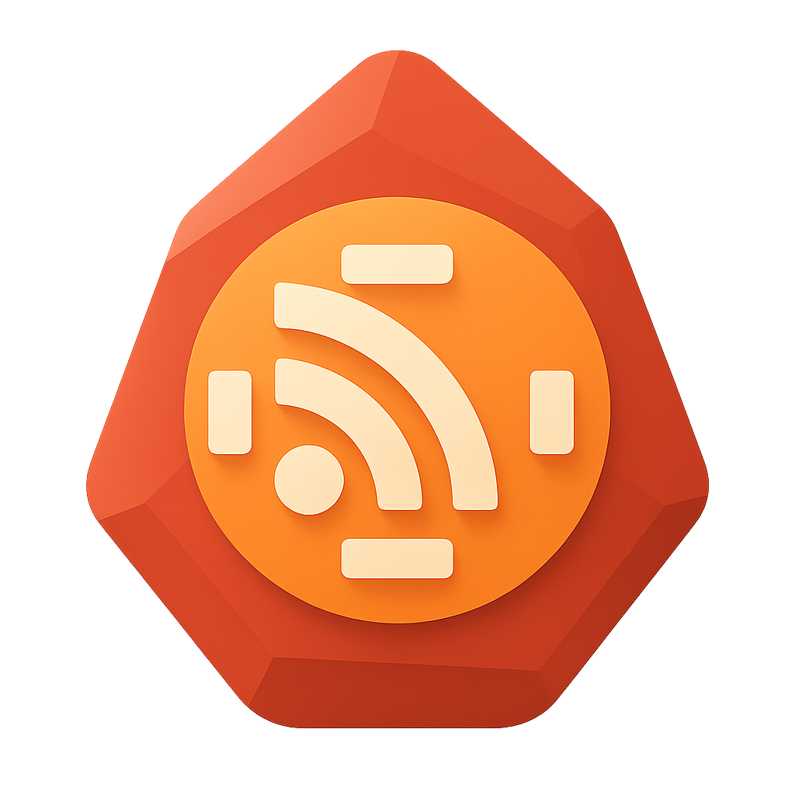
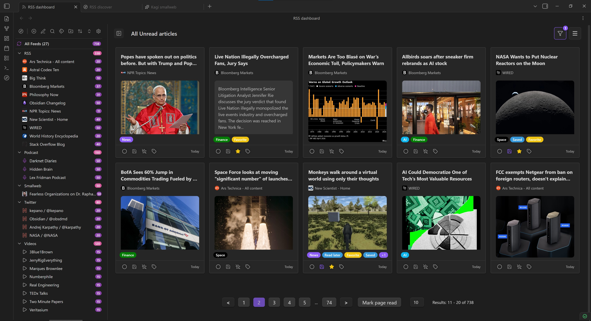
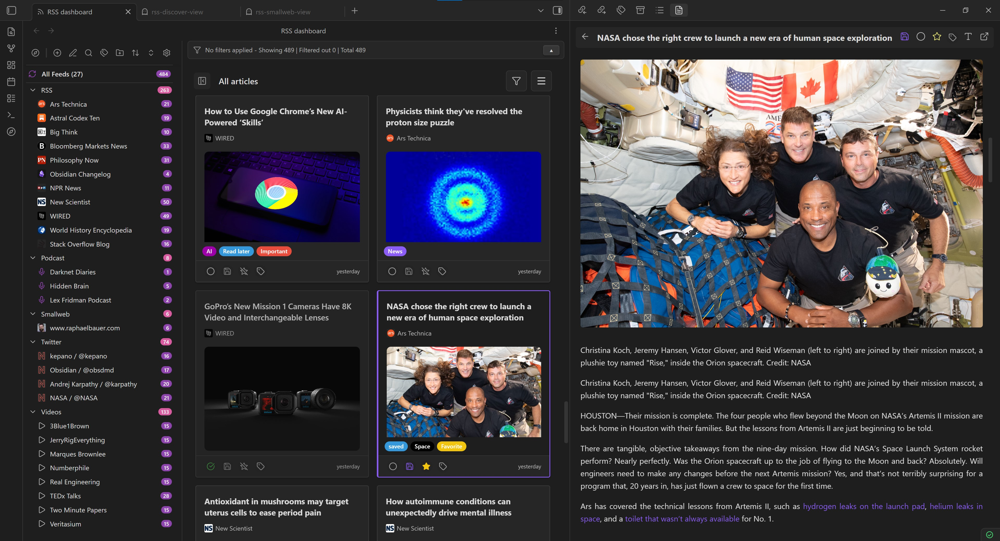
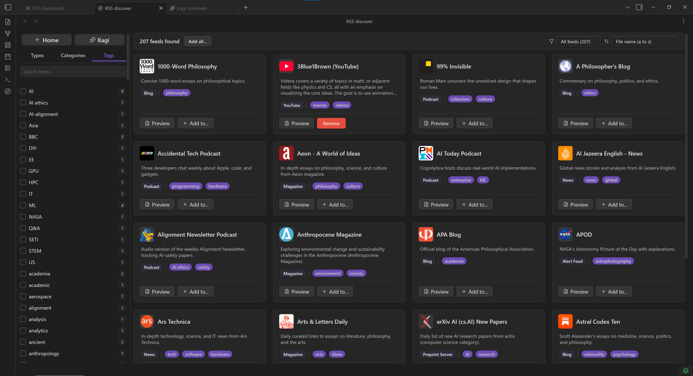
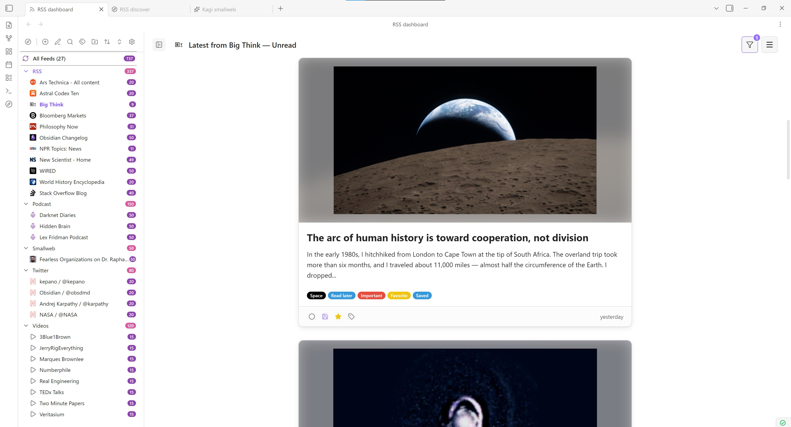
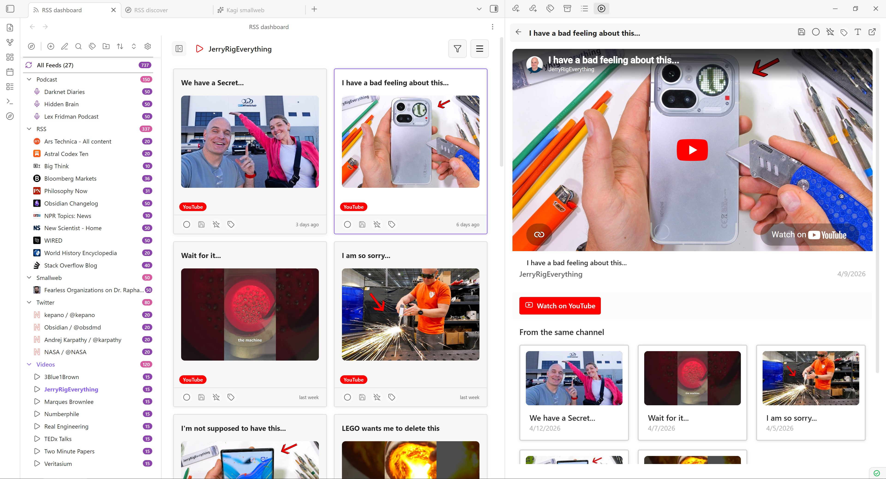
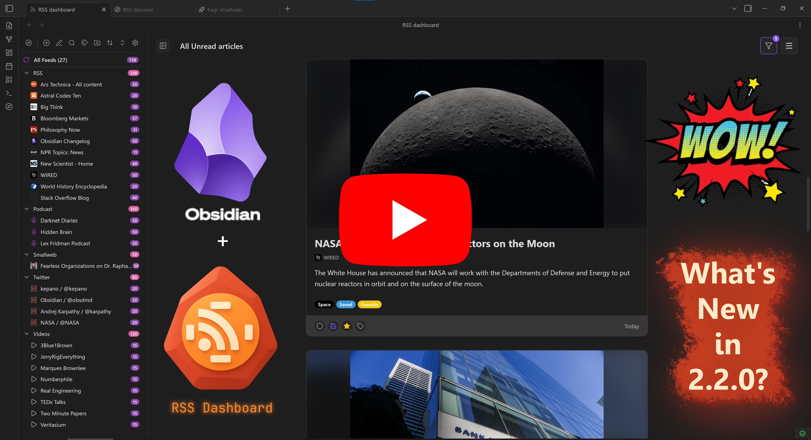

<div align="center">
  
</div>

# RSS Dashboard

Only the feeds you need. Stream the world's knowledge into your vault: RSS, podcasts, YouTube, and more, all in one dashboard.

[](https://github.com/amatya-aditya/obsidian-rss-dashboard/releases/latest)

[](https://github.com/amatya-aditya/obsidian-rss-dashboard/blob/main/LICENSE)

[](https://github.com/amatya-aditya/obsidian-rss-dashboard/issues)

[Version 2.2.0 Showcase Video](https://www.youtube.com/watch?v=Lq2TRCZlqlQ)

## Table of Contents

- [About](#about)
- [Community](#community)
- [Features](#features)
- [Screenshots](#screenshots)
- [Roadmap](#roadmap)
- [Vault Shards Storage Guide](#vault-shards-storage-guide)
- [Tags Guide](#tags-guide)
- [Installation](#installation)
- [Getting Started](#getting-started)
- [One-Click Subscribe URI](#one-click-subscribe-uri)
- [Keyboard Shortcuts](#keyboard-shortcuts)
- [Development](#development)
- [Troubleshooting](#troubleshooting)
- [YouTube Embeds and Terms](#youtube-embeds-and-terms)
- [Support the Development](#support-the-development)
- [Other Plugins by Me](#other-plugins-by-me)
- [License](#license)

## About

RSS Dashboard is a free, open source community plugin for Obsidian that makes it easy to manage your RSS feeds, YouTube subscriptions, podcasts, and Twitter/X feeds in one place.

- Data is stored locally.
- Content can be saved directly to your vault.
- No ads, no tracking, no paywalls.

## Community

Want to help shape the next release? Join the Discord server: <https://discord.gg/9bu7V9BBbs>

Community highlights:

- Build the manually curated Discover page with one-click subscriptions grouped by category.
- Discuss ideas, questions, and best practices in real time.
- Share sneak peeks of upcoming features and gather early feedback.

## Features

### Feed and Media Support

| Feature                  | Description                                                                         |
| ------------------------ | ----------------------------------------------------------------------------------- |
| Multi-Format RSS Support | Support for RSS, Atom, XML and JSON feeds with automatic feed discovery and parsing |
| YouTube Integration      | Convert YouTube channels to RSS feeds with embedded video playback                  |
| Podcast Support          | Full podcast feed support with an integrated podcast player                         |
| Twitter/X Support        | Convert Twitter/X profile URLs to chronological Nitter RSS feeds automatically      |
| Media Detection          | Automatic detection of video and podcast content                                    |

### Reading and Saving

| Feature               | Description                                                                 |
| --------------------- | --------------------------------------------------------------------------- |
| Article Reader View   | Built-in reader with full article content fetching and Markdown conversion  |
| Article Saving        | Save articles as Markdown files with customizable templates and frontmatter |
| Custom Templates      | Customize saved article output with variable substitution                   |
| Media Progress        | Resume from where you left off in videos and podcasts                       |
| Pagination            | Paginated article lists with configurable page sizes                        |
| Android/Apple Support | Responsive support for cross-platform mobile devices                        |

### Organization and Workflow

| Feature             | Description                                                            |
| ------------------- | ---------------------------------------------------------------------- |
| Folder Organization | Organize feeds into folders and subfolders with hierarchical structure |
| Tag Management      | Add custom tags to feeds and articles for better organization          |
| Article Filtering   | Filter articles by read status, age, starred, saved, and more          |
| Article Sorting     | Sort articles by newest, oldest, and group by feed, date, or folder    |
| Auto-Refresh        | Automatic feed refresh with configurable intervals                     |
| OPML Import/Export  | Import and export feed subscriptions in OPML format                    |

### Discovery

| Feature       | Description                                                                        |
| ------------- | ---------------------------------------------------------------------------------- |
| Discover Page | Curated collection of RSS feeds organized by categories                            |
| Kagi Smallweb | Browse and subscribe to a curated stream of smaller independent blogs and websites |

## Screenshots











## Video Showcase

[](https://www.youtube.com/watch?v=Lq2TRCZlqlQ)

## Roadmap

Looking for upcoming features? The old README planned-features list now lives in [docs/plans/public-roadmap.md](docs/plans/public-roadmap.md), along with links to other public-facing plans that have not been implemented yet.

## Vault Shards Storage Guide

Using the new Vault Shards storage mode? See the user-facing guide here: [docs/storage-vault-shards-guide.md](docs/storage-vault-shards-guide.md).

## Tags Guide

Tags let you label and filter articles the way that works best for you. For a full walkthrough of manual vs automatic tagging, the tag palette, per-article tagging, per-feed custom tags, and filter modes, see [docs/tags-primer.md](docs/tags-primer.md).

## Installation

### Community Plugins Directory

1. Open **Settings** in Obsidian.
2. Go to **Community plugins** and disable **Restricted mode** if it is enabled.
3. Click **Browse**.
4. Search for **RSS Dashboard**.
5. Click **Install**, then **Enable**.

### Installing Through BRAT

1. Install BRAT from Obsidian's Community Plugins browser.
2. Copy the repository URL: `https://github.com/amatya-aditya/obsidian-rss-dashboard`
3. Open the command palette and run `BRAT: Add a beta plugin for testing`.
4. Paste the repository URL into the modal and select the latest version.
5. Click **Add Plugin** and wait for BRAT to finish.
6. Open **Settings** > **Community plugins**.
7. Refresh the plugin list if needed.
8. Find **RSS Dashboard** and enable it.

### Manual Installation

1. Download the latest release files (`manifest.json`, `styles.css`, `main.js`) from the [Releases page](https://github.com/amatya-aditya/obsidian-rss-dashboard/releases).
2. Create a folder named `rss-dashboard` in your vault's `.obsidian/plugins` directory.
3. Copy the downloaded files into that folder.
4. Enable the plugin in **Settings** > **Community plugins**. You may need to restart Obsidian before it appears.

## Getting Started

### Adding Your First Feed

1. Open the RSS Dashboard view using the ribbon icon or the command palette.
2. Click the `+` button in the sidebar to add a new feed.
3. Enter a feed URL or website URL. The plugin will try to auto-discover the feed for you.
4. Choose a folder to organize the feed.
5. Click **Add Feed** to subscribe.

### Using the Discover Page

1. Open the RSS Discover view using the Discover icon or the command palette.
2. Browse curated feeds organized by category.
3. Use the Kagi Smallweb button at the top of the Discover sidebar to open a curated collection of smaller independent blogs and websites.
4. Use filters or search to find content you want to follow.
5. Click **Add Feed** on any feed card to subscribe instantly.

### Reading Articles

1. Click any article in the dashboard to open it in the reader view.
2. Use the built-in reader for a cleaner reading experience.
3. Save articles as Markdown files for long-term storage in your vault.
4. Use the video player for YouTube content or the audio player for podcasts.
5. YouTube embeds use Privacy Enhanced Mode through `youtube-nocookie.com`, and each video includes a visible **Watch on YouTube** link.

## One-Click Subscribe URI

RSS Dashboard supports adding feeds directly from external apps and browser extensions through Obsidian's URI protocol handler.

Use this format:

```text
obsidian://rss-dashboard?action=add-feed&url=<encoded-feed-url>
```

Example:

```text
obsidian://rss-dashboard?action=add-feed&url=https%3A%2F%2Fexample.com%2Frss.xml
```

Browser-extension mapping example:

- Set your extension's subscribe/open URL target to `obsidian://rss-dashboard?action=add-feed&url=${encodeURIComponent(feedUrl)}` (replace `feedUrl` with your extension's feed URL variable).

Notes:

- The `url` query parameter is required.
- Feed URLs must be URL-encoded before being inserted into the URI.
- The URI opens the Add Feed modal with the URL prefilled so you can confirm settings before saving.

Troubleshooting:

- `Unsupported RSS Dashboard URI action`: verify `action=add-feed`.
- `Missing required URL parameter for add-feed.`: include `url=<encoded-feed-url>`.
- `URL must start with http:// or https://`: pass a valid web feed URL.
- `Feed URL is malformed. Ensure the url parameter is URL-encoded.`: encode the feed URL before launching the URI.

### Organizing Your Feeds

1. Create folders and subfolders to organize your subscriptions.
2. Drag and drop feeds and folders to reorder them and build the structure you want more directly.
3. Add tags to categorize your content.
4. Use the filtering and sorting options to find specific articles quickly.
5. Export your feed list as OPML for backup or migration.

### Keyboard Shortcuts

To quickly access the keyboard shortcuts help file, press `?` (Shift + /) within the app. This will display a comprehensive list of available shortcuts and their functions.

For a preview of the keyboard shortcuts, see [Keyboard Shortcuts](docs/keyboard-shortcuts.md).

## Development

Before opening a PR, read the contributor policy in [CONTRIBUTING.MD](CONTRIBUTING.MD), especially the **Compliance Declarations (Audit Guardrails)** section.

For implementation examples and approved patterns used in recent compliance passes, see [docs/development/compliance-patterns.md](docs/development/compliance-patterns.md).

### Local Setup

This repo targets Node 22 for local development and CI. Both `.nvmrc` and `.node-version` are pinned to `22`.

If you use `nvm`, run:

```bash
nvm use
npm ci
```

### Local Development

Use the development build while making changes locally:

```bash
nvm use
npm ci
npm run dev
```

### Local CI-Equivalent Commands

Run the same install and unit test flow used in GitHub Actions:

```bash
nvm use
npm ci
npm run test:unit -- --coverage
```

**Test Baseline**: 130 test files, 1180 passing tests, 100% compliance audit. See [testing-guide.md](docs/development/test_coverage/testing-guide.md) for details.

### Production Build

To mirror the release workflow build step locally:

```bash
nvm use
npm ci
npm run build
```

## Troubleshooting

### Common Issues

**Feed not loading**

- Check that the feed URL is correct.
- Try refreshing the feed manually.
- Some feeds require authentication.

**YouTube feeds not working**

- Make sure you are using a valid YouTube channel, user, or playlist URL.
- Try using the channel ID instead of a custom URL.
- Some channels have disabled RSS feeds.
- YouTube feed retrieval is currently limited, and only about 15 YouTube feeds can usually be fetched at a time.
- Embedded playback uses `youtube-nocookie.com` with a strict referrer policy to satisfy current YouTube embed requirements.

**Podcast audio not playing**

- Check that the audio URL is accessible.
- Some podcasts require authentication.
- Try opening the audio URL in a browser.

### Getting Help

If you run into an issue or have a suggestion:

- Create an issue on [GitHub](https://github.com/amatya-aditya/obsidian-rss-dashboard/issues)
- Join the [Discord community](https://discord.com/invite/9bu7V9BBbs)
- Check existing issues for known fixes and workarounds

## YouTube Embeds and Terms

RSS Dashboard resolves YouTube feed items to a canonical `videoId`, renders the embedded player through Privacy Enhanced Mode (`https://www.youtube-nocookie.com/embed/...`), and provides a standard **Watch on YouTube** link that opens the original video in your browser or native YouTube app.

The plugin does not add YouTube download features, background audio-only playback, or ad-blocking behavior around the embedded player.

YouTube embeds and API usage are subject to:

- [YouTube API Services Terms of Service](https://developers.google.com/youtube/terms/api-services-terms-of-service)
- [YouTube Terms of Service](https://www.youtube.com/t/terms)

## Support the Development

If you find this plugin useful, consider supporting its long-term development:

- Buy me a coffee: <https://www.buymeacoffee.com/amatya_aditya>
- Ko-fi: <https://ko-fi.com/Y8Y41FV4WI>

## Other Plugins by Me

1. [Media Slider](https://github.com/amatya-aditya/obsidian-media-slider)
2. [Zen Space](https://github.com/amatya-aditya/obsidian-zen-space)

## License

This project is licensed under the MIT License. See [LICENSE](LICENSE) for details.
