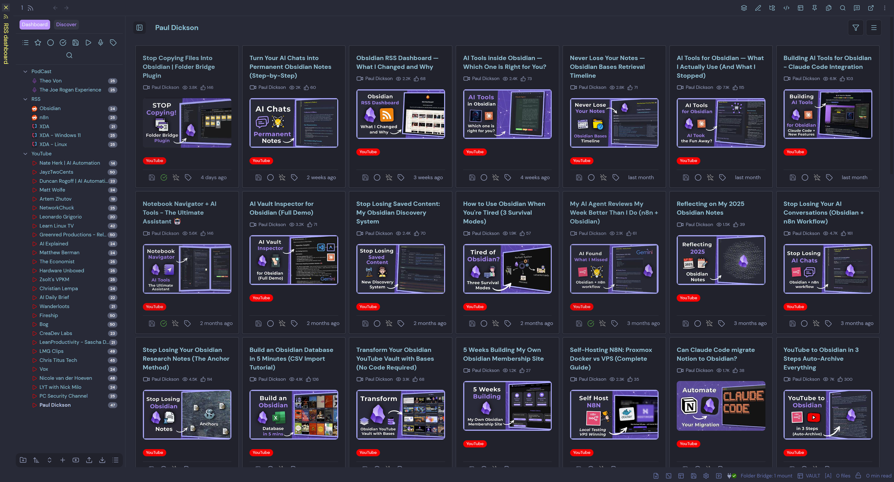
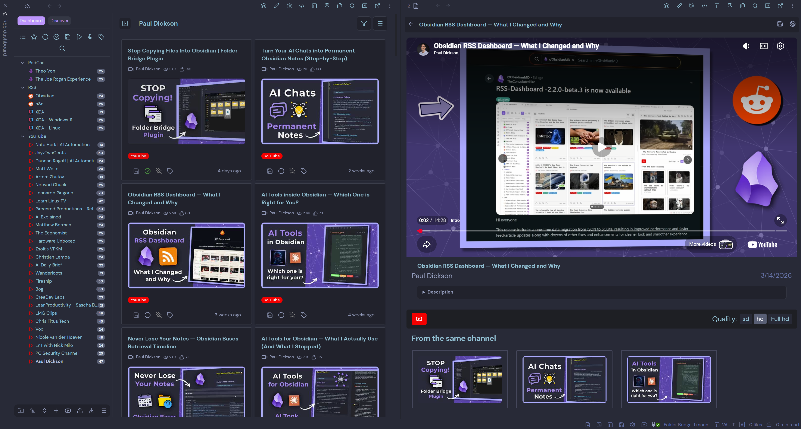

<div align="center">
  
</div>

<h1 align="center">RSS Dashboard — Personal Fork</h1>
<h4 align="center">Stream the world's knowledge into your vault: RSS, podcasts, and YouTube, all in one Dashboard</h4>

<br>
<p align="center">
  
</p>

<p align="center">
  
</p>

<p align="center">
  <a href="https://github.com/motion2082/obsidian-rss-dashboard/releases/latest">
    
  </a>
  
  <a href="https://github.com/motion2082/obsidian-rss-dashboard/blob/master/LICENSE">
    
  </a>
</p>

<p align="center">
  <a href="#about-this-fork">About</a> •
  <a href="#features">Features</a> •
  <a href="#my-modifications">Modifications</a> •
  <a href="#installation">Installation</a> •
  <a href="#youtube-api-setup">YouTube API</a> •
  <a href="#license">License</a>
</p>


## About This Fork

This is a personal fork of [RSS Dashboard](https://github.com/amatya-aditya/obsidian-rss-dashboard) by [Aditya Amatya](https://github.com/amatya-aditya) — an excellent Obsidian plugin for managing RSS feeds, YouTube channels, and podcasts in a unified dashboard.

I've contributed several of these changes back to the original repository, but maintain this fork as a personalised build that suits my own workflow and preferences. It tracks the original closely and is distributed via BRAT for easy installation.

If you find this useful, please consider supporting the original developer whose work this is built on:

<p align="center">
  <a href="https://www.buymeacoffee.com/amatya_aditya" target="_blank">☕ Buy Aditya a coffee</a> &nbsp;|&nbsp;
  <a href="https://ko-fi.com/Y8Y41FV4WI" target="_blank">Ko-fi</a>
</p>


## Features

| **Feature**                             | **Description**                                                                                | **Status** |
| --------------------------------------- | ---------------------------------------------------------------------------------------------- | ---------- |
| **Multi-Format RSS Support**            | Support for RSS, Atom, and JSON feeds with automatic feed discovery and parsing               | ✅         |
| **YouTube Integration**                 | Convert YouTube channels, users, and playlists to RSS feeds with embedded video player        | ✅         |
| **Podcast Support**                     | Full podcast feed support with integrated podcast player                                      | ✅         |
| **Discover Page**                       | Curated collection of RSS feeds organized by categories (News, Technology, Science, etc.)     | ✅         |
| **Article Reader View**                 | Built-in reader with full article content fetching and markdown conversion                    | ✅         |
| **Article Saving**                      | Save articles as markdown files with customizable templates and frontmatter                   | ✅         |
| **Folder Organization**                 | Organize feeds into folders and subfolders with hierarchical structure                        | ✅         |
| **Tag Management**                      | Add custom tags to feeds and articles for better organization                                 | ✅         |
| **OPML Import/Export**                  | Import and export feed subscriptions in OPML format                                           | ✅         |
| **Auto-Refresh**                        | Automatic feed refresh with configurable intervals                                            | ✅         |
| **Article Filtering**                   | Filter articles by read status, age, starred, saved, and more                                 | ✅         |
| **Article Sorting**                     | Sort articles by newest, oldest, and group by feed, date, or folder                           | ✅         |
| **Pagination**                          | Paginated article lists with configurable page sizes                                          | ✅         |
| **Media Detection**                     | Automatic detection of video and podcast content                                              | ✅         |
| **Custom Templates**                    | Customizable templates for saved articles with variable substitution                          | ✅         |
| **Mobile/iPad Support**                 | Responsive design for mobile and tablet                                                       | ✅         |


## My Modifications

Changes I've made on top of the original plugin:

| **Change**                              | **Description**                                                                                         |
| --------------------------------------- | ------------------------------------------------------------------------------------------------------- |
| **YouTube View & Like Counts**          | Cards display view and like counts (requires YouTube API key). Updated on every feed refresh.           |
| **YouTube GUID Fix**                    | Fixed a critical bug where YouTube feeds stopped updating after the first refresh due to GUID mangling. |
| **YouTube API Fallback**                | When YouTube's RSS endpoint is down, the plugin falls back to the YouTube Data API v3 automatically.    |
| **YouTube Handle Case Fix**             | Mixed-case YouTube handles (e.g. `@AIDailyBrief`) now resolve correctly.                               |
| **Extended Save Template Variables**    | 9 new template variables for media: `{{videoId}}`, `{{embedUrl}}`, `{{channelName}}`, `{{duration}}`, `{{coverImage}}`, `{{mediaType}}`, `{{audioUrl}}`, and more. |
| **Reddit Card Summaries**               | Fixed blank card previews on Reddit feeds — shows text summary when images fail to load.                |
| **Orphaned Feed Items Fix**             | Items older than the RSS window (e.g. videos outside YouTube's 15-item feed) are now correctly preserved on refresh. |
| **Reader Image Optimization**           | Images in the reader are capped at 400px height and load lazily with a fade-in transition.              |
| **Save & Open In-Place**               | "Save & Open" now opens the saved note in the same pane as the reader instead of a new tab.             |
| **Dead Proxy Cleanup**                  | Removed broken CORS proxies from the fallback chain to reduce console noise.                            |
| **Discover Feed Cleanup**               | Trimmed the Discover page to a focused set of ~36 feeds across tech, AI, dev, PKM, and security.        |


## Installation

### Via BRAT (recommended)

[BRAT](https://github.com/TfTHacker/obsidian42-brat) lets you install and auto-update beta plugins directly from GitHub.

1. Install **BRAT** from Obsidian's Community Plugins.
2. Open the command palette → **"BRAT: Add a beta plugin for testing"**
3. Enter this repository URL:
   ```
   https://github.com/motion2082/obsidian-rss-dashboard
   ```
4. Select the latest version and click **Add Plugin**.
5. Go to **Settings → Community Plugins**, find **RSS Dashboard**, and enable it.

### Manual Installation

1. Download `main.js`, `manifest.json`, and `styles.css` from the [latest release](https://github.com/motion2082/obsidian-rss-dashboard/releases/latest).
2. Create a folder at `.obsidian/plugins/rss-dashboard/` in your vault.
3. Copy the three files into that folder.
4. Enable the plugin under **Settings → Community Plugins**.


## YouTube API Setup

YouTube view/like counts and the API fallback for RSS outages require a free YouTube Data API v3 key.

1. Go to the [Google Cloud Console](https://console.cloud.google.com/) and create a new project.
2. Navigate to **APIs & Services → Library**, search for **YouTube Data API v3**, and enable it.
3. Go to **APIs & Services → Credentials** → **Create Credentials → API key**.
4. Copy the key and paste it into **Obsidian → Settings → RSS Dashboard → YouTube API Key**.

The free quota (10,000 units/day) is more than sufficient for personal use. View/like count fetches use batch requests, so a feed refresh costs roughly 1 unit per 50 videos.


## Getting Started

### Adding Your First Feed

1. Open the RSS Dashboard view via the ribbon icon or command palette.
2. Click **"+"** in the sidebar to add a new feed.
3. Enter a feed URL or website URL — the plugin auto-discovers RSS feeds.
4. Choose a folder and click **Add Feed**.

### YouTube Channels

Enter any YouTube channel URL (e.g. `https://www.youtube.com/@3blue1brown`). The plugin converts it to an RSS feed automatically. With an API key configured, you'll also see view and like counts on video cards.

### Saving Articles

Open any article in the reader view and click the save icon. Articles are saved as Markdown files using your configured template. Use `{{videoId}}`, `{{embedUrl}}`, and other variables to build rich YouTube note templates.


## Troubleshooting

**Feed not loading**: Check the URL is correct and try a manual refresh. Some feeds require direct access (no CORS proxy support).

**YouTube feeds not updating**: Usually caused by the GUID fix in this fork — if upgrading from the original plugin, delete and re-add YouTube feeds once to reset stored GUIDs.

**YouTube view counts not showing**: Ensure a valid API key is configured in settings. RSS-only YouTube feeds (no API key) won't show stats.

**Podcast audio not playing**: Verify the audio URL is publicly accessible. Try opening it directly in a browser.


## License

This project is licensed under the MIT License — see the [LICENSE](LICENSE) file for details.

Original plugin by [Aditya Amatya](https://github.com/amatya-aditya) — [amatya-aditya/obsidian-rss-dashboard](https://github.com/amatya-aditya/obsidian-rss-dashboard).
