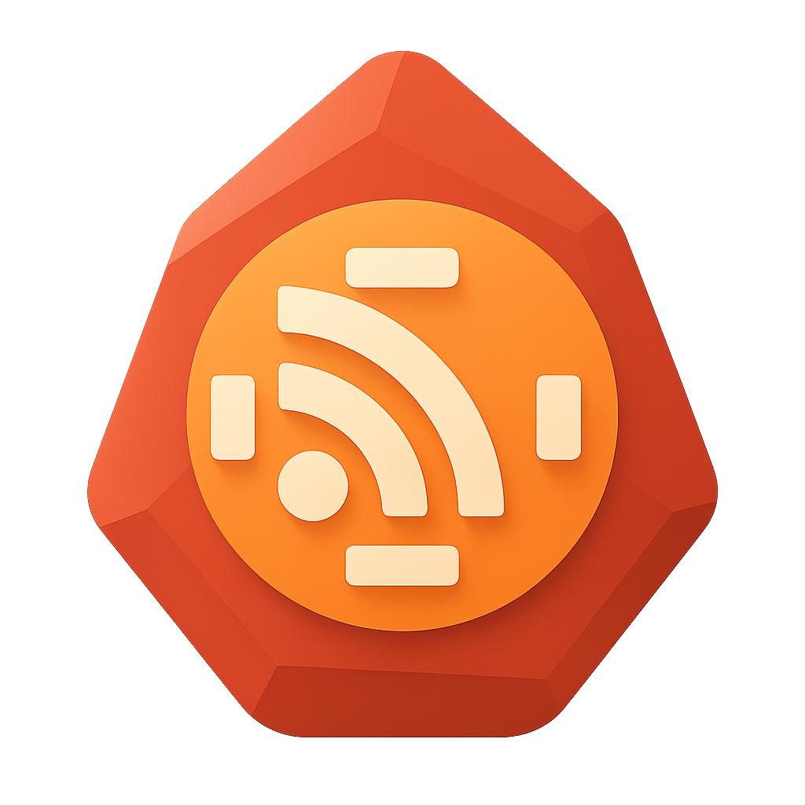
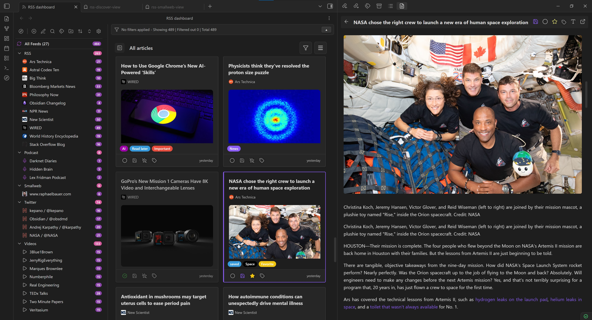
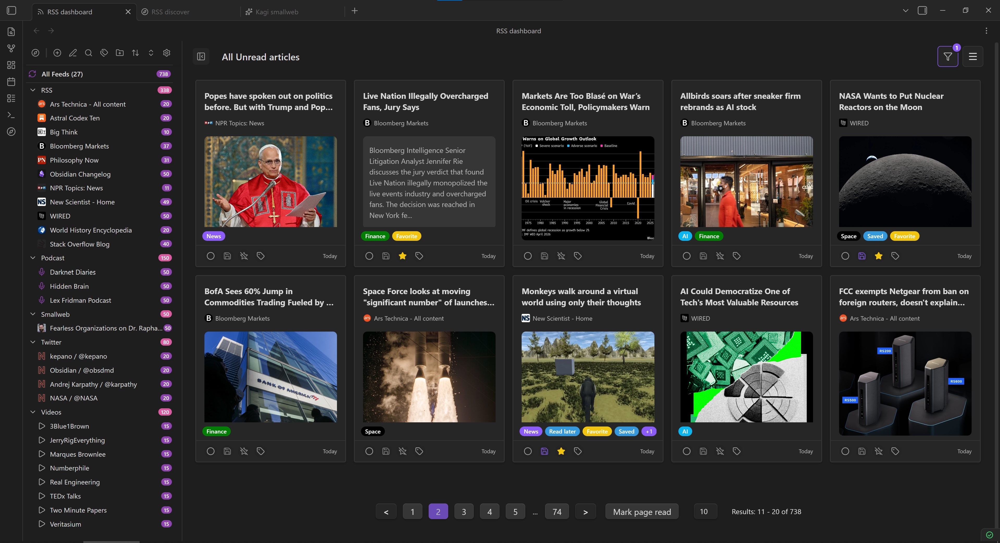
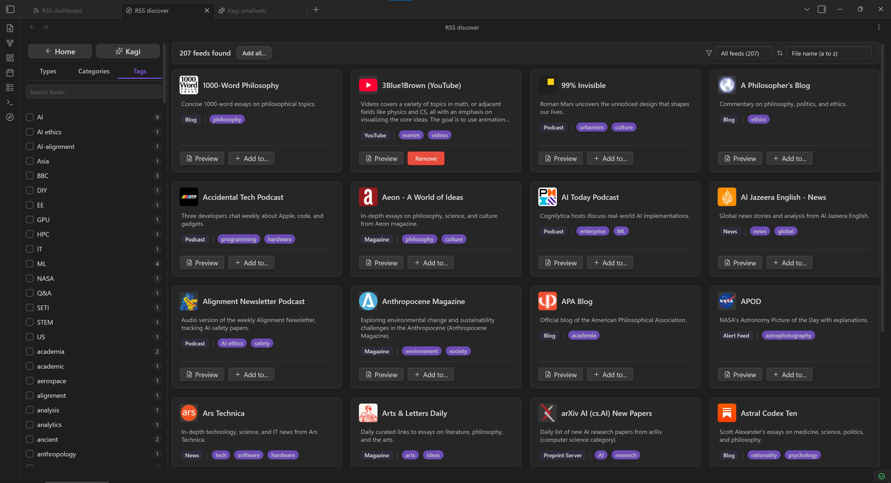
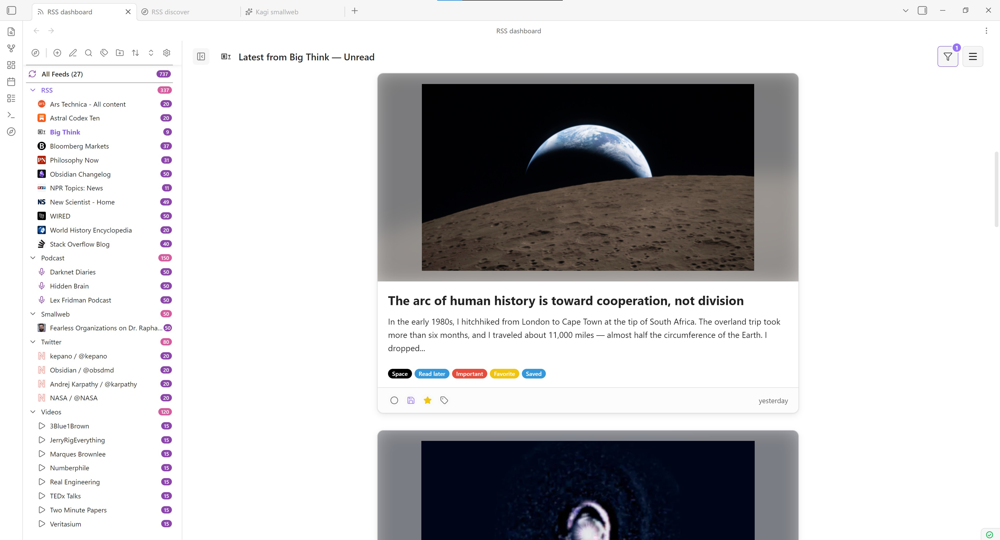
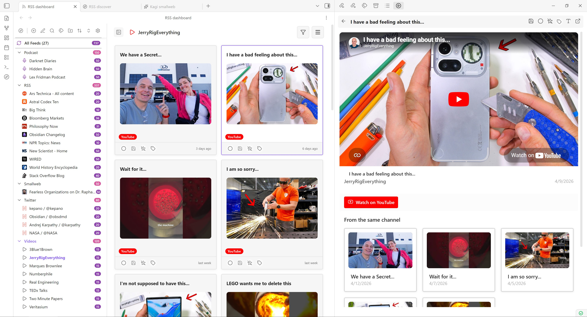
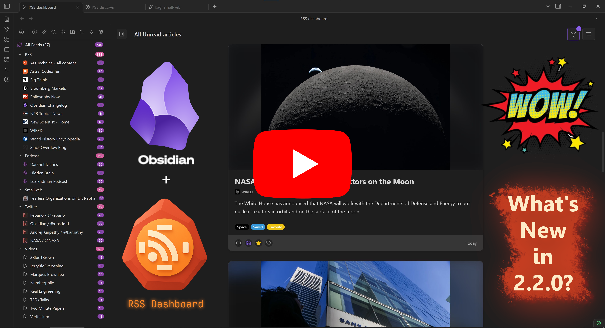

  

# RSS Dashboard

Only the feeds you need. Stream the world's knowledge into your vault: RSS, podcasts, YouTube, and more, all in one dashboard.

**[Install](#installation)** · **[Documentation](docs/)** · **[Discord](https://discord.gg/9bu7V9BBbs)** · **[Latest Release](https://github.com/amatya-aditya/obsidian-rss-dashboard/releases/latest)** · **[Contributing](CONTRIBUTING.md)**

## What is RSS Dashboard?

A free, open-source Obsidian plugin that streams RSS, podcasts, YouTube, and more directly into your vault. Read, organize, and save content without leaving Obsidian.

**No ads. No trackers. No pop-ups. Open source.**

## Community & Philosophy

Built for people who value privacy and data ownership. Part of the Obsidian ecosystem—developed in the open, funded by the community, and designed to integrate seamlessly with your vault.

Want to help shape the next release? [Join Discord](https://discord.gg/9bu7V9BBbs)

## Read Without Distraction

Full article content fetched and rendered right in Obsidian. No ads, no distracting sidebars—just the text you came to read. Track your progress through articles, videos, and podcasts. Resume where you left off, distraction-free.

## Build Your Reading System

Your feeds, organized your way. Create folders and subfolders, add custom tags, filter by read status or feed, sort by date or category. Automatic refresh keeps your subscriptions current. Discover new feeds from our curated Discover page or browse smaller independent blogs through Kagi Smallweb.

## Keep What Matters

Save articles directly to your vault as Markdown. Customize what gets saved with templates, frontmatter variables, and automatic tagging. Your archive, perfectly formatted.

## Own Your Data

Completely local. Completely open source. No ads, no tracking, no paywalls—just your data, stored on your device. Full control over what you read and how it's organized.

## Move Your Data Freely

Import and export your subscriptions as OPML. Support for RSS, Atom, JSON feeds, YouTube channels, podcasts, and Mastodon accounts. Migrating from Inoreader or FreshRSS? [Import your starred articles](docs/starred-import-guide.md) directly. Switch tools anytime—your data comes with you.

## Screenshots

> [!NOTE]
> These screenshots predate 2.7.0. The **Twitter** folder and the X/Twitter feeds in the sidebar relied on the Nitter integration, which was removed in 2.7.0 after Nitter shut down. See the [changelog](CHANGELOG.md) for details and alternatives.

## Version 2.2.0 Demo

Version 2.2.0 demo (core experience remains similar).

## Installation

1. Open **Settings** in Obsidian.
2. Go to **Community plugins** → disable **Restricted mode** (if enabled).
3. Click **Browse**.
4. Search **RSS Dashboard** and click **Install**.
5. Enable the plugin in Community plugins list.

For BRAT beta testing or manual installation, see [Installation Methods](docs/installation.md).

## Getting Started

1. Open RSS Dashboard from the ribbon or command palette.
2. Click **+** to add your first feed. Try a familiar URL (e.g., a news site or YouTube channel).
3. Click an article to read in the built-in reader.
4. Optionally save articles to your vault.

For detailed workflows, see [Getting Started Guide](docs/getting-started.md).

## Documentation

Complete guides, workflows, and reference: [Read the Docs](docs/)

## Roadmap

Feature direction and what's being explored: [Public Roadmap](docs/plans/public-roadmap.md)

## Support & Community

- 💬 [Discord Community](https://discord.gg/9bu7V9BBbs)
- 🐛 [GitHub Issues](https://github.com/amatya-aditya/obsidian-rss-dashboard/issues)
- ❓ [Troubleshooting](docs/troubleshooting.md)

## Contributing

Want to help? [See CONTRIBUTING.md](CONTRIBUTING.md)

## Support Development

If you find this plugin useful:

- [Buy me a coffee](https://www.buymeacoffee.com/amatya_aditya)
- [Ko-fi](https://ko-fi.com/Y8Y41FV4WI)

## License

MIT. See [LICENSE](LICENSE) for details.
