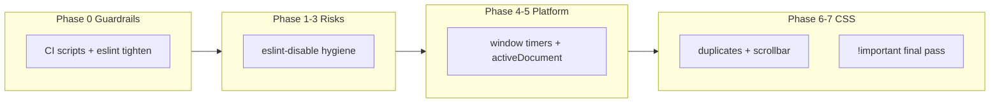

# 2.4.0 Community Audit Remediation Plan

## Current state

| Category | Count | Local ESLint today | Notes |
|----------|-------|-------------------|-------|
| **Risks** | 56 | Partially enforced | Pre-commit + CI flag *undescribed* disables via [`scripts/check-commit-message.mjs`](scripts/check-commit-message.mjs); community also flags *any* disable of banned rules |
| **Warnings** | 363 | Mostly not enforced | `obsidianmd/platform` in [`eslint.config.mjs`](eslint.config.mjs) only covers `navigator.*`, **not** timer/document rules |
| **`!important`** | ~130 in audit doc; **~69 live** in `src/styles/` | None | Down from 900+ in 2.3.0; [`modals.css`](src/styles/modals.css) is clean; gaps in [`settings.css`](src/styles/settings.css) (7) and [`podcast-player.css`](src/styles/podcast-player.css) (8) |

**Already done on branch (continue from here):**
- [`main.ts`](main.ts) sentence-case disables at :823 and :1352 — described, checked off in audit
- [`src/components/sidebar.ts`](src/components/sidebar.ts) and [`src/services/article-saver.ts`](src/services/article-saver.ts) — described `no-explicit-any` disables
- [`test_files/stubs/obsidian.ts`](test_files/stubs/obsidian.ts) — most stub `any` disables documented; **lines 865 and 990 still missing `--` descriptions**
- [`keyword-filter-editor.ts`](src/components/keyword-filter-editor.ts) — eslint-disable removed (audit line stale)
- CI wiring started in [`.github/workflows/test.yml`](.github/workflows/test.yml) and [`.githooks/pre-commit`](.githooks/pre-commit)

**Policy conflict to resolve:** [`docs/development/compliance-patterns.md`](docs/development/compliance-patterns.md) §4 recommends `activeWindow` timers; community scanner requires `window.*` timers + `activeDocument`. Remediation will follow the **community scanner** and update compliance docs.



---

## Phase 0 — Guardrails and config hygiene

**Goal:** Make local checks approximate the community scanner before bulk fixes land.

### ESLint config fixes ([`eslint.config.mjs`](eslint.config.mjs))

1. **Remove duplicate `obsidianmd/ui/sentence-case`** — currently declared `"off"` (lines 109–116) then `"warn"` (line 137); consolidate to one entry.
2. **Ignore scratch files** — add `.tmp-*` to `ignores`; delete [`.tmp-eslint-directive.ts`](.tmp-eslint-directive.ts) (currently breaks `npm run lint:dev`).
3. **Stage strictness ramp** (flip to `"error"` only after Phase 3 passes):
   - `obsidianmd/ui/sentence-case`
   - `@typescript-eslint/no-unnecessary-type-assertion`
   - `@typescript-eslint/no-unused-vars` (already warn; unused `_e` bindings still flagged by scanner)

### New compliance scripts (mirror audit categories)

| Script | Enforces | Pattern |
|--------|----------|---------|
| `scripts/check-platform-compat.mjs` | Timer/document/globalThis warnings | Regex + small allowlist for test harness files |
| `scripts/check-css-important.mjs` | Every `!important` line has `/* audit-ok: … */` on same line | Same spirit as [`scripts/check-css-scope.js`](scripts/check-css-scope.js) |
| Extend `check-commit-message.mjs` | Block `/* eslint-disable … */` without `--`; optionally **reject any** disable of the 4 banned rules even when described (matches community “Disabling X is not allowed”) | Add vitest coverage alongside [`test_files/unit/check-eslint-directive-comments.test.ts`](test_files/unit/check-eslint-directive-comments.test.ts) |

**Platform check rules (production `src/**/*.ts`, `main.ts`):**

```text
FORBID: activeWindow.setTimeout|clearTimeout|setInterval|clearInterval|requestAnimationFrame
FORBID: bare setTimeout|clearTimeout|setInterval|clearInterval|requestAnimationFrame (no window. prefix)
REQUIRE: window.setTimeout / window.clearTimeout / etc.
FORBID: globalThis (use window or activeWindow)
FORBID: document. in UI paths (use activeDocument) — allowlist test_files/**
```

Wire into [`package.json`](package.json):

```json
"check:platform": "node scripts/check-platform-compat.mjs",
"check:important": "node scripts/check-css-important.mjs",
"check:compliance": "npm run check:css-scope && npm run check:platform && npm run check:important && npm run check:commit-message",
"build": "... && npm run check:compliance && ..."
```

Update [`.github/workflows/test.yml`](.github/workflows/test.yml) and [`.githooks/pre-commit`](.githooks/pre-commit):
- Pre-commit: `check:compliance` on staged files (or full repo once clean)
- Add **commit-msg hook** calling `check-commit-message.mjs --message-file $1` (body validation exists in script but is not hooked today)
- Keep `npm run lint` with `--max-warnings=0` as blocking step

### Dependency advisory (7 warnings)

- `undici` comes transitively via [`jsdom`](package.json) → run `npm update jsdom` / `npm audit fix`; if no patched release, document accepted risk in [`docs/SECURITY.md`](docs/SECURITY.md) and pin override only if advisory is dev-only (test env).

**Commit 0a:** `chore(compliance): add platform and css-important CI checks`

**Commit 0b:** `chore(compliance): tighten eslint config and hook wiring`

---

## Phase 1 — Risks: eliminate eslint-disable in production (`src/`)

**Goal:** Clear all 28 remaining production sentence-case disables + 1 deprecated + production `any` without relying on suppressions.

**Strategy (prefer fix over disable):**

1. **Sentence-case (26 locations)** — batch by directory:
   - [`src/modals/import-opml-modal.ts`](src/modals/import-opml-modal.ts) (7)
   - [`src/settings/tabs/*`](src/settings/tabs/) + [`src/settings/modals/*`](src/settings/modals/) (remaining ~17)
   - [`src/modals/feed-manager/edit-feed-modal.ts`](src/modals/feed-manager/edit-feed-modal.ts) (1)

   Tactics (in order):
   - Extend `acronyms` / `brands` in eslint config (`CORS`, `URI`, etc.) where strings are legitimately capitalized
   - Reword UI copy to sentence case (e.g. headings that don't need brand casing)
   - For protocol literals (like [`main.ts`](main.ts) URI examples), keep a **single** documented disable only if rewording would break user-facing protocol accuracy — verify against community rescan

2. **[`src/hotkeys/dashboard-hotkeys.ts`](src/hotkeys/dashboard-hotkeys.ts):28** — remove `@typescript-eslint/no-deprecated` disable by replacing `workspace.activeLeaf` with non-deprecated API (`getActiveLeaf()` / leaf lookup pattern used elsewhere in codebase)

3. **[`src/components/sidebar.ts`](src/components/sidebar.ts):2851–2853** — replace `(app as any).setting` with a narrow boundary type or `unknown` + typed guard (eliminate `no-explicit-any` disable entirely)

4. **[`src/services/article-saver.ts`](src/services/article-saver.ts):289** — already described; evaluate replacing `(moment as any)(date)` with Obsidian's typed moment usage or a small typed wrapper

**Commit 1a:** `fix(compliance): remove sentence-case disables in modals and settings`

**Commit 1b:** `fix(compliance): resolve deprecated API and explicit-any in src`

After each commit: `npm run lint && npm run test:unit && node scripts/check-commit-message.mjs` (full staged scan)

---

## Phase 2 — Risks: test stub directives (`test_files/`)

**Goal:** Clear remaining undescribed / disallowed disables in test infrastructure.

| File | Action |
|------|--------|
| [`test_files/stubs/obsidian.ts`](test_files/stubs/obsidian.ts):865, :990 | Add `--` descriptions (match existing stub pattern) **or** type `addDropdown` callback without `any` |
| [`test_files/stubs/obsidian.ts`](test_files/stubs/obsidian.ts):6 | `no-restricted-imports` — already described; verify scanner accepts |
| [`test_files/unit/test-dom-polyfills.ts`](test_files/unit/test-dom-polyfills.ts) | Already described — verify only |
| Block-level `/* eslint-disable @typescript-eslint/no-explicit-any … */` in tests (e.g. [`dashboard-shift-select.test.ts`](test_files/unit/views/dashboard-shift-select.test.ts)) | Add file-header comment with `--` reason **or** migrate to per-line documented disables |

Consider a **test_files-only** eslint override: allow `no-explicit-any` as `"off"` in [`eslint.config.mjs`](eslint.config.mjs) test block (already partially done) so production ban on disabling the rule is enforceable without fighting every test cast.

**Commit 2:** `fix(compliance): document or remove test eslint-disable exceptions`

---

## Phase 3 — Warnings: platform API migration (largest batch)

**Goal:** Clear ~155 timer warnings + 45 `document` warnings + 6 `globalThis` + 31 unnecessary assertions + 4 misc unused bindings.

### 3a — Timer migration (~109 call sites in `src/`)

Replace per community scanner (user confirmed):

| From | To |
|------|-----|
| `activeWindow.setTimeout(fn, ms)` | `window.setTimeout(fn, ms)` |
| `activeWindow.clearTimeout(id)` | `window.clearTimeout(id)` |
| Same for `setInterval`, `clearInterval`, `requestAnimationFrame` | `window.*` equivalents |
| Bare `setTimeout(...)` | `window.setTimeout(...)` |

**High-churn files** (do in sub-commits to keep diffs reviewable):

- [`src/views/dashboard-view.ts`](src/views/dashboard-view.ts) (~21)
- [`src/components/sidebar.ts`](src/components/sidebar.ts) (~20)
- [`src/components/article-list.ts`](src/components/article-list.ts) (~11)
- [`main.ts`](main.ts) (~6)
- [`src/views/reader-view.ts`](src/views/reader-view.ts), [`src/views/podcast-player.ts`](src/views/podcast-player.ts), services/utils remainder

**Note:** `registerInterval(window.setInterval(...))` in [`main.ts`](main.ts) is the correct pattern when the handle must be plugin-scoped.

**Commit 3a:** `fix(platform): use window timer APIs in views`

**Commit 3b:** `fix(platform): use window timer APIs in components and services`

**Commit 3c:** `fix(platform): use window timer APIs in main and settings`

### 3b — `document` → `activeDocument` (production)

Files from audit:
- [`src/hotkeys/dashboard-hotkeys.ts`](src/hotkeys/dashboard-hotkeys.ts) (also fixed in Phase 1)
- [`src/settings/tabs/sidebar-settings-tab.ts`](src/settings/tabs/sidebar-settings-tab.ts), [`storage-settings-tab.ts`](src/settings/tabs/storage-settings-tab.ts)
- [`src/utils/safe-html.ts`](src/utils/safe-html.ts)
- [`src/views/dashboard-view.ts`](src/views/dashboard-view.ts), [`video-player.ts`](src/views/video-player.ts)

Test harness files (`test_files/**`) — either fix or add to platform-check allowlist with documented reason.

**Commit 3d:** `fix(platform): use activeDocument in production UI paths`

### 3c — `globalThis`, type assertions, misc

- [`main.ts`](main.ts):2211–2216, [`feed-storage-repository.ts`](src/services/feed-storage-repository.ts):75 → `window` / `activeWindow`
- Remove 31 unnecessary `as` assertions (batch by file from audit list; start with [`discover-sidebar.ts`](src/components/discover-sidebar.ts), settings tabs, test fixtures)
- Unused bindings: [`feed-storage-repository.ts`](src/services/feed-storage-repository.ts):1041, [`window-instanceof.ts`](src/utils/window-instanceof.ts):19, [`media-service.ts`](src/services/media-service.ts):463, [`safe-html.ts`](src/utils/safe-html.ts):161 — use `_`-prefix pattern already allowed by eslint config or remove binding

**Commit 3e:** `fix(platform): globalThis, assertions, and unused bindings`

Update [`docs/development/compliance-patterns.md`](docs/development/compliance-patterns.md) §4 to document **window timers + activeDocument** as the approved pattern.

---

## Phase 4 — Warnings: CSS hygiene (non-`!important`)

### Duplicate properties (6)

[`src/styles/modals.css`](src/styles/modals.css) and [`dropdown-portal.css`](src/styles/dropdown-portal.css) use intentional fallbacks (`100vh` / `100dvh`). Refactor to progressive pattern:

```css
height: 100vh;
@supports (height: 100dvh) {
  .selector { height: 100dvh; }
}
```

Or consolidate via custom properties if scanner still flags duplicates.

### Browser feature warnings (13)

- **`css-scrollbar`** (12): wrap in `@supports` blocks or remove non-critical scrollbar styling in [`styles.css`](styles.css), [`modals.css`](src/styles/modals.css), [`sidebar.css`](src/styles/sidebar.css)
- **`multicolumn`** (1): [`src/styles/settings-keyword-filters.css`](src/styles/settings-keyword-filters.css):159 — replace with flex/grid or document exception

**Commit 4:** `fix(css): resolve duplicate properties and browser-feature warnings`

---

## Phase 5 — Final `!important` audit (last phase)

**Goal:** Every remaining declaration is either **removed** or **justified** with inline `/* audit-ok: … */` per [`CONTRIBUTING.MD`](CONTRIBUTING.MD) and [2.3.0 CSS templates](docs/development/2.3.0-audit/CSS%20Refactor%20Prompt%20Template.md).

### Current inventory (~69 declarations in `src/styles/`)

| File | Count | Status |
|------|-------|--------|
| [`controls.css`](src/styles/controls.css) | 18 | Mostly commented |
| [`sidebar.css`](src/styles/sidebar.css) | 11 | Mostly commented |
| [`dropdown-portal.css`](src/styles/dropdown-portal.css) | 8 | Commented |
| [`podcast-player.css`](src/styles/podcast-player.css) | 8 | **Missing comments** |
| [`settings.css`](src/styles/settings.css) | 7 | **Missing comments** |
| Others | ≤5 each | Spot-check |

### Per-file workflow (reuse 2.3.0 methodology)

For each file in the audit checklist order:

1. Attempt removal via higher-specificity selector / CSS variable / `body.rss-*` scoping (patterns already used in [`sidebar.css`](src/styles/sidebar.css))
2. If retained, add same-line `/* audit-ok: [specific reason] */`
3. Run `npm run check:important` + visual smoke test in Obsidian (settings modal, podcast player, mobile layout)

**Suggested sub-commits:**

- **Commit 5a:** `fix(css): audit-ok comments for settings and podcast-player !important`
- **Commit 5b:** `fix(css): review controls and sidebar !important necessity`
- **Commit 5c:** `fix(css): review remaining !important declarations`

Enable `check:important` as CI blocker **after** 5a so new declarations cannot land without comments.

---

## Phase 6 — Strict mode flip and scorecard closeout

1. Set remediated rules to `"error"` in [`eslint.config.mjs`](eslint.config.mjs)
2. Run full gate: `npm run build && npm run test:unit -- --coverage`
3. Update checkboxes in [`docs/development/2.4.0-audit/2.4.0 audit.md`](docs/development/2.4.0-audit/2.4.0%20audit.md)
4. Add **2.4.1 post-mortem** section to [`docs/plugin-scorecard.md`](docs/plugin-scorecard.md)
5. Trigger community rescan; target exit from red “Risks” tier

**Commit 6:** `chore(compliance): enable strict eslint rules and update audit docs`

---

## Commit map for `release/2.4.1` (squash-friendly)

| # | Commit message (subject) | Safe to squash after |
|---|--------------------------|----------------------|
| 0a | `chore(compliance): add platform and css-important CI checks` | Yes — tooling only |
| 0b | `chore(compliance): tighten eslint config and hook wiring` | Yes |
| 1a | `fix(compliance): remove sentence-case disables in modals and settings` | Yes |
| 1b | `fix(compliance): resolve deprecated API and explicit-any in src` | Yes — **Risks clear in src** |
| 2 | `fix(compliance): document or remove test eslint-disable exceptions` | Yes — **all Risks clear** |
| 3a–3e | Platform sub-commits (5) | Squash to one `fix(platform): …` or keep split |
| 4 | `fix(css): resolve duplicate properties and browser-feature warnings` | Yes |
| 5a–5c | `!important` sub-commits (3) | Squash to one `fix(css): final !important audit` |
| 6 | `chore(compliance): enable strict eslint rules and update audit docs` | **Keep as release anchor** |

**Recommended squash groups for merge to `dev`:**
1. Guardrails (0a + 0b)
2. Risk fixes (1a + 1b + 2)
3. Platform (3a–3e)
4. CSS (4 + 5a–5c)
5. Release closeout (6 + version bump)

Each commit must pass: `npm run lint`, `npm run test:unit`, and (once added) `npm run check:compliance`.

---

## Risk notes

- **Timer migration volume** — largest regression risk; prioritize views with existing test coverage ([`dashboard-view`](src/views/dashboard-view.ts), [`reader-view`](src/views/reader-view.ts)) and run targeted vitest suites after each sub-commit.
- **Sentence-case** — community may still flag disables even with descriptions; prefer elimination over documented suppressions.
- **Audit doc staleness** — line numbers and counts (e.g. 130 `!important`, `keyword-filter-editor.ts:172`) reflect 2.4.0 release scan; regenerate checklist from scripts before final closeout.
- **`styles.css` bundle** — audit references compiled [`styles.css`](styles.css) line numbers; fix source files in `src/styles/` and rebuild to verify bundled output.
