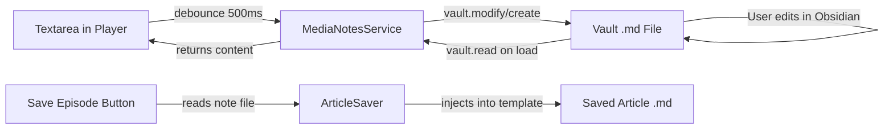

# Media Notes Feature — Podcast & Video Player

Add an "Episode notes" / "Video notes" collapsible section to both the podcast and video players, backed by **individual vault files** for full two-way Obsidian sync.

## User Review Required

> [!IMPORTANT]
> **Two-way sync**: Notes are stored as standalone [.md](file:///c:/Obsidian/Obsidian_Main/.obsidian/plugins/obsidian-rss-dashboard/.agents/workflows/code-change.md) files in the vault. Editing the note in Obsidian's editor will update the player's textarea next time the episode is loaded (or on focus). This makes notes first-class Obsidian citizens — searchable, linkable, and sync-able.

> [!WARNING]
> **YouTube iframe limitation**: The YouTube embed iframe does not expose `currentTime` via the standard HTML5 API. To support timestamp insertion in video notes, we would need to switch to the [YouTube IFrame Player API](https://developers.google.com/youtube/iframe_api_reference) (`enablejsapi=1` + `postMessage`). **I recommend we scope timestamp insertion to podcasts only for v1**, and add video timestamps as a follow-up feature. The video notes textarea and vault-file persistence will work identically — just without the timestamp button.

## Architecture Overview



## Proposed Changes

### New Service

#### [NEW] [media-notes-service.ts](file:///c:/Obsidian/Obsidian_Main/.obsidian/plugins/obsidian-rss-dashboard/src/services/media-notes-service.ts)

Central service for reading/writing note files. Both players delegate to this.

- [constructor(app: App, settings: MediaSettings)](file:///c:/Obsidian/Obsidian_Main/.obsidian/plugins/obsidian-rss-dashboard/src/services/article-saver.ts#14-29) — takes app and media settings refs
- `async loadNote(item: FeedItem): Promise<string>` — reads vault file by `getNotePath(item)`, returns content (empty string if no file)
- `async saveNote(item: FeedItem, content: string): Promise<void>` — creates/modifies vault file with frontmatter linking to guid + title
- `getNotePath(item: FeedItem): string` — builds path from settings folder + sanitised title, e.g. `Podcast Notes/Ep 1 — Feed Title.md`
- `async deleteNote(item: FeedItem): Promise<void>` — cleanup if needed
- `async noteExists(item: FeedItem): Promise<boolean>` — quick check for playlist badge
- `generateNoteFrontmatter(item: FeedItem): string` — minimal frontmatter: guid, title, feedTitle, mediaType

Note file format:
```markdown
---
guid: "abc123"
title: "Episode Title"
feedTitle: "Podcast Name"
mediaType: podcast
---

[2:05] The host discusses...
[15:30] Key insight about...
```

---

### Types

#### [MODIFY] [types.ts](file:///c:/Obsidian/Obsidian_Main/.obsidian/plugins/obsidian-rss-dashboard/src/types/types.ts)

- Add `userNotes?: string` to [FeedItem](file:///c:/Obsidian/Obsidian_Main/.obsidian/plugins/obsidian-rss-dashboard/src/types/types.ts#1-57) (runtime-only, populated from note file for save injection)
- Add to [MediaSettings](file:///c:/Obsidian/Obsidian_Main/.obsidian/plugins/obsidian-rss-dashboard/src/types/types.ts#124-136):
  - `podcastNotesFolder: string` (default: `"Podcast Notes"`)
  - `videoNotesFolder: string` (default: `"Video Notes"`)
- Add defaults to `DEFAULT_SETTINGS.media`

---

### Podcast Player

#### [MODIFY] [podcast-player.ts](file:///c:/Obsidian/Obsidian_Main/.obsidian/plugins/obsidian-rss-dashboard/src/views/podcast-player.ts)

- Accept `MediaNotesService` via constructor (new parameter)
- New `renderEpisodeNotesSection()` method — creates `<details class="podcast-episode-notes-user">` after Episode Details, containing:
  - **Toolbar**: `clock-arrow-down` icon button (Lucide) for timestamp insertion (podcast only)
  - **Textarea**: `.podcast-notes-textarea` bound to note content
  - [oninput](file:///c:/Obsidian/Obsidian_Main/.obsidian/plugins/obsidian-rss-dashboard/src/views/podcast-player.ts#453-463) debounces `notesService.saveNote()` at 500ms
- On [loadEpisode()](file:///c:/Obsidian/Obsidian_Main/.obsidian/plugins/obsidian-rss-dashboard/src/views/podcast-player.ts#70-128) — call `notesService.loadNote(item)` and populate textarea
- New `getEpisodeNotes(): string | undefined` — reads current textarea value
- `insertTimestamp()` — reads `audioElement.currentTime`, formats `[H:MM:SS]` or `[M:SS]`, inserts at cursor
- Playlist rows: if `notesService.noteExists(ep.guid)`, add `pencil` icon badge

---

### Video Player

#### [MODIFY] [video-player.ts](file:///c:/Obsidian/Obsidian_Main/.obsidian/plugins/obsidian-rss-dashboard/src/views/video-player.ts)

- Accept `MediaNotesService` via constructor
- New `renderVideoNotesSection()` — same pattern as podcast, but **no timestamp button** (v1)
- On [loadVideo()](file:///c:/Obsidian/Obsidian_Main/.obsidian/plugins/obsidian-rss-dashboard/src/views/video-player.ts#20-35) — load notes from service
- New `getVideoNotes(): string | undefined` — reads textarea value

---

### Article Saver

#### [MODIFY] [article-saver.ts](file:///c:/Obsidian/Obsidian_Main/.obsidian/plugins/obsidian-rss-dashboard/src/services/article-saver.ts)

- [applyTemplate()](file:///c:/Obsidian/Obsidian_Main/.obsidian/plugins/obsidian-rss-dashboard/src/services/article-saver.ts#153-189): add `{{episodeNotes}}` replacement
- If template lacks `{{episodeNotes}}` but `item.userNotes` exists → append `\n\n## My Notes\n\n{notes}` after content

---

### Reader View

#### [MODIFY] [reader-view.ts](file:///c:/Obsidian/Obsidian_Main/.obsidian/plugins/obsidian-rss-dashboard/src/views/reader-view.ts)

- Instantiate `MediaNotesService` and pass to [PodcastPlayer](file:///c:/Obsidian/Obsidian_Main/.obsidian/plugins/obsidian-rss-dashboard/src/views/podcast-player.ts#6-1303) / [VideoPlayer](file:///c:/Obsidian/Obsidian_Main/.obsidian/plugins/obsidian-rss-dashboard/src/views/video-player.ts#7-307) constructors
- In [showSaveOptions()](file:///c:/Obsidian/Obsidian_Main/.obsidian/plugins/obsidian-rss-dashboard/src/views/reader-view.ts#312-349) / [showCustomSaveModal()](file:///c:/Obsidian/Obsidian_Main/.obsidian/plugins/obsidian-rss-dashboard/src/views/reader-view.ts#350-439): before saving, set `item.userNotes = this.podcastPlayer?.getEpisodeNotes()` (or video equivalent)

---

### Settings Tab

#### [MODIFY] [settings-tab.ts](file:///c:/Obsidian/Obsidian_Main/.obsidian/plugins/obsidian-rss-dashboard/src/settings/settings-tab.ts)

Under the existing "Podcast" heading, add:
- **"Podcast notes folder"** — text input with `VaultFolderSuggest`, default `"Podcast Notes"`

Under "YouTube" heading, add:
- **"Video notes folder"** — text input with `VaultFolderSuggest`, default `"Video Notes"`

---

### Styles

#### [MODIFY] [podcast-player.css](file:///c:/Obsidian/Obsidian_Main/.obsidian/plugins/obsidian-rss-dashboard/src/styles/podcast-player.css)

- `.podcast-episode-notes-user` — reuses the `podcast-episode-details` collapsible pattern
- `.podcast-notes-toolbar` — flex row with gap for the timestamp button
- `.podcast-notes-timestamp-btn` — styled like existing `clickable-icon` buttons
- `.podcast-notes-textarea` — full-width, min 4 rows, auto-grow, uses Obsidian's `--font-monospace`, natively themed background/border
- `.podcast-notes-badge` — small pencil icon on playlist rows

#### [NEW] [video-notes.css](file:///c:/Obsidian/Obsidian_Main/.obsidian/plugins/obsidian-rss-dashboard/src/styles/video-notes.css)

- `.video-notes-section` — mirrors podcast notes styling for the video player

---

## Two-Way Sync Details

| Direction | How |
|-----------|-----|
| **Player → Vault** | [oninput](file:///c:/Obsidian/Obsidian_Main/.obsidian/plugins/obsidian-rss-dashboard/src/views/podcast-player.ts#453-463) with 500ms debounce calls `notesService.saveNote()` → `vault.modify()` on existing file or `vault.create()` for new |
| **Vault → Player** | On [loadEpisode()](file:///c:/Obsidian/Obsidian_Main/.obsidian/plugins/obsidian-rss-dashboard/src/views/podcast-player.ts#70-128) / [loadVideo()](file:///c:/Obsidian/Obsidian_Main/.obsidian/plugins/obsidian-rss-dashboard/src/views/video-player.ts#20-35), read file via `vault.read()`. Also on textarea focus, re-read to pick up external edits |
| **Vault → Saved article** | On save button click, `vault.read()` the note file and inject content via `{{episodeNotes}}` or auto-append |

> [!NOTE]
> We won't watch for live vault changes via `vault.on('modify')` in v1 to avoid complexity. Re-reading on episode load and textarea focus is sufficient. Live watching can be a follow-up.

---

## Verification Plan

### Automated Tests — `npm run test:unit`

#### [NEW] [podcast-player-episode-notes.test.ts](file:///c:/Obsidian/Obsidian_Main/.obsidian/plugins/obsidian-rss-dashboard/test_files/unit/podcast-player-episode-notes.test.ts)

1. Renders "Episode notes" `<details>` section with `<summary>` and `<textarea>`
2. Timestamp button inserts `[M:SS]` at cursor position when `audioElement.currentTime = 125`
3. Notes persist across episode switches (via mocked `MediaNotesService`)
4. `getEpisodeNotes()` returns current textarea value
5. Playlist rows show pencil badge when notes exist

### Build — `npm run build`

### Manual Testing
1. Open podcast → expand "Episode notes" → type notes → verify [.md](file:///c:/Obsidian/Obsidian_Main/.obsidian/plugins/obsidian-rss-dashboard/.agents/workflows/code-change.md) file appears in vault folder
2. Close and reopen episode → verify notes load from file
3. Edit the [.md](file:///c:/Obsidian/Obsidian_Main/.obsidian/plugins/obsidian-rss-dashboard/.agents/workflows/code-change.md) file in Obsidian editor → reopen in player → verify changes appear
4. Click timestamp button → verify `[M:SS]` inserted at cursor
5. Save episode → open saved [.md](file:///c:/Obsidian/Obsidian_Main/.obsidian/plugins/obsidian-rss-dashboard/.agents/workflows/code-change.md) → verify notes appear under `## My Notes`
6. Repeat 1-3 for video player (minus timestamp)
7. Change notes folder in settings → verify new notes go to new folder
