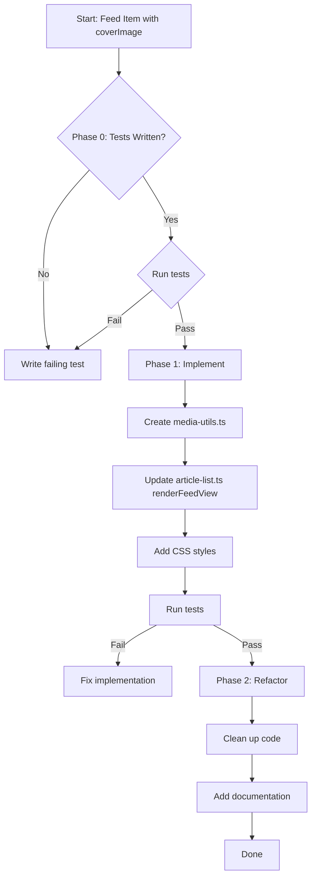

# Plan: Handle .mp4 Files as Hero Images in Feed View

## This feature was attempted but turns out the URL parsing for videos is a lot more in depth. Reverted changes, moved this plan to Future. 3/27/26

## Problem Summary

Some feeds (like QZ) provide `.mp4` URLs as `coverImage` values instead of `.jpg` or `.png`. The plugin needs to:

1. Detect when `coverImage` is a video file
2. Render it appropriately in **Feed View only** (not list or card views)
3. Display the video as the hero image with playback capability

Example from QZ feed:

```json
"coverImage": "https://qz.com/cdn-cgi/image/width=600,quality=85,format=auto/https://assets.qz.com/media/metaorderedtopay375million-69c40310d14788f58da23a42.mp4"
```

---

## Test-Driven Development (TDD) Approach

Following the project's [Testing Guide](../development/testing-guide.md), we follow the standard TDD cycle:

1. **Red**: Write a failing test first
2. **Green**: Write the minimum amount of code necessary to make the test pass
3. **Refactor**: Clean up and optimize the implementation

---

## Phase 0: Write Failing Tests (Red)

### Test File: `test_files/unit/utils/media-utils.test.ts`

Create tests for the new utility functions:

```typescript
import { describe, expect, it } from "vitest";
import { isVideoUrl, getVideoMimeType } from "../../../src/utils/media-utils";

describe("Media Utils - Video URL Detection", () => {
  describe("isVideoUrl", () => {
    it("returns true for .mp4 URLs", () => {
      expect(isVideoUrl("https://example.com/video.mp4")).toBe(true);
    });

    it("returns true for .webm URLs", () => {
      expect(isVideoUrl("https://example.com/video.webm")).toBe(true);
    });

    it("returns true for .mov URLs", () => {
      expect(isVideoUrl("https://example.com/video.mov")).toBe(true);
    });

    it("returns true for URLs with query parameters", () => {
      expect(
        isVideoUrl(
          "https://qz.com/cdn-cgi/image/width=600/video.mp4?quality=85",
        ),
      ).toBe(true);
    });

    it("returns false for .jpg URLs", () => {
      expect(isVideoUrl("https://example.com/image.jpg")).toBe(false);
    });

    it("returns false for .png URLs", () => {
      expect(isVideoUrl("https://example.com/image.png")).toBe(false);
    });

    it("returns false for empty strings", () => {
      expect(isVideoUrl("")).toBe(false);
    });

    it("returns false for undefined", () => {
      expect(isVideoUrl(undefined as unknown as string)).toBe(false);
    });
  });

  describe("getVideoMimeType", () => {
    it("returns video/mp4 for .mp4 URLs", () => {
      expect(getVideoMimeType("https://example.com/video.mp4")).toBe(
        "video/mp4",
      );
    });

    it("returns video/webm for .webm URLs", () => {
      expect(getVideoMimeType("https://example.com/video.webm")).toBe(
        "video/webm",
      );
    });

    it("returns video/quicktime for .mov URLs", () => {
      expect(getVideoMimeType("https://example.com/video.mov")).toBe(
        "video/quicktime",
      );
    });

    it("returns video/x-msvideo for .avi URLs", () => {
      expect(getVideoMimeType("https://example.com/video.avi")).toBe(
        "video/x-msvideo",
      );
    });

    it("defaults to video/mp4 for unknown extensions", () => {
      expect(getVideoMimeType("https://example.com/video.unknown")).toBe(
        "video/mp4",
      );
    });
  });
});
```

### Test File: `test_files/unit/components/article-list-feed-view.test.ts`

Create tests for Feed View video hero rendering:

```typescript
import { describe, expect, it, beforeEach, vi } from "vitest";
import { JSDOM } from "jsdom";

// Mock Obsidian API
vi.mock("obsidian", () => ({
  Notice: vi.fn(),
  setIcon: vi.fn(),
}));

// Import after mocking
import { ArticleList } from "../../../src/components/article-list";

describe("ArticleList - Feed View Video Hero", () => {
  let container: HTMLElement;
  let articleList: ArticleList;

  beforeEach(() => {
    const dom = new JSDOM("<!DOCTYPE html><body><div id='test'></div></body>");
    global.document = dom.window.document;
    container = document.getElementById("test") as HTMLElement;
    // Setup article list with feed view
  });

  it("renders video element when coverImage is an .mp4 URL", () => {
    const article = {
      title: "Test Article",
      coverImage: "https://example.com/hero.mp4",
      image: "https://example.com/poster.jpg",
      // ... other required properties
    };

    // render feed view with this article
    articleList.renderFeedView(container, [article]);

    const videoEl = container.querySelector(
      "video.rss-dashboard-feed-hero-video",
    );
    expect(videoEl).not.toBeNull();
    expect(videoEl.querySelector("source")?.getAttribute("src")).toBe(
      "https://example.com/hero.mp4",
    );
  });

  it("renders image element when coverImage is a .jpg URL", () => {
    const article = {
      title: "Test Article",
      coverImage: "https://example.com/hero.jpg",
      // ... other required properties
    };

    articleList.renderFeedView(container, [article]);

    const imgEl = container.querySelector("img.rss-dashboard-feed-hero-image");
    expect(imgEl).not.toBeNull();
    expect(imgEl.getAttribute("src")).toBe("https://example.com/hero.jpg");
  });

  it("uses regular image as video poster when available", () => {
    const article = {
      title: "Test Article",
      coverImage: "https://example.com/hero.mp4",
      image: "https://example.com/poster.jpg",
    };

    articleList.renderFeedView(container, [article]);

    const videoEl = container.querySelector(
      "video.rss-dashboard-feed-hero-video",
    );
    expect(videoEl?.getAttribute("poster")).toBe(
      "https://example.com/poster.jpg",
    );
  });
});
```

---

## Phase 1: Implementation (Green)

### Step 1.1: Create Utility Functions

**File:** `src/utils/media-utils.ts` (new file)

```typescript
/**
 * Check if a URL points to a video file based on extension
 */
export function isVideoUrl(url: string | undefined | null): boolean {
  if (!url) return false;
  const videoExtensions = [".mp4", ".webm", ".mov", ".avi"];
  const lowerUrl = url.toLowerCase();
  return videoExtensions.some((ext) => lowerUrl.includes(ext));
}

/**
 * Extract the video type MIME string from URL
 */
export function getVideoMimeType(url: string): string {
  if (!url) return "video/mp4";
  const ext = url.toLowerCase().split(".").pop()?.split("?")[0];
  switch (ext) {
    case "webm":
      return "video/webm";
    case "mov":
      return "video/quicktime";
    case "avi":
      return "video/x-msvideo";
    default:
      return "video/mp4";
  }
}
```

### Step 1.2: Update Feed View Rendering

**File:** `src/components/article-list.ts` - modify `renderFeedView()` method

In the hero image rendering section (around line 1402-1450), detect video URLs and render accordingly.

Key changes:

1. Import `isVideoUrl` and `getVideoMimeType` from media-utils
2. Check if `coverImage` is a video URL
3. Render `<video>` element with appropriate attributes instead of ``

### Step 1.3: Add CSS Styles

**File:** `src/styles/feed-view.css`

Add styles for the video hero element:

```css
.rss-dashboard-feed-hero-video {
  position: relative;
  z-index: 1;
  max-width: 100%;
  max-height: 100%;
  width: auto;
  height: auto;
  object-fit: contain;
  display: block;
  border-radius: 8px;
}
```

---

## Phase 2: Refactoring

After tests pass:

1. Ensure code follows project conventions
2. Add JSDoc comments for public APIs
3. Consider if `isVideoUrl` and `getVideoMimeType` should be moved to `MediaService` class for better organization

---

## Summary of Affected Files

| File                                                              | Changes                          |
| ----------------------------------------------------------------- | -------------------------------- |
| `test_files/unit/utils/media-utils.test.ts` (new)                 | Phase 0: Write failing tests     |
| `test_files/unit/components/article-list-feed-view.test.ts` (new) | Phase 0: Write failing tests     |
| `src/utils/media-utils.ts` (new)                                  | Phase 1: Add utility functions   |
| `src/components/article-list.ts`                                  | Phase 1: Update renderFeedView() |
| `src/styles/feed-view.css`                                        | Phase 1: Add video hero styles   |

---

## Mermaid Diagram: Implementation Flow



---

## Notes

- Video hero images only apply to **Feed View** (not list or card views) as specified in requirements
- The `video` element includes `controls`, `muted`, `loop`, and `playsinline` attributes for inline playback
- If a regular `image` is available, it's used as the video poster frame
- The implementation follows the existing patterns in the codebase (e.g., similar to how podcast audio is handled)
