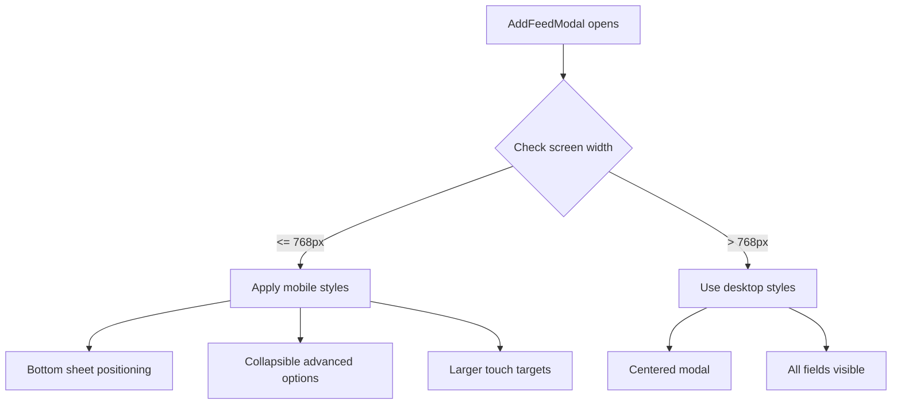

# Add Feed Modal - Mobile/Tablet Responsive Refactor

## Current State Analysis

### Modal Structure

The [`AddFeedModal`](src/modals/feed-manager-modal.ts:499) contains:

1. **Header**: "Add feed" heading
2. **Feed URL input** with "Load" button
3. **Title input**
4. **Latest entry posted** (read-only status display)
5. **Status** (read-only status display)
6. **Folder input** with autocomplete
7. **Per feed control options** section:
    - Auto delete articles duration (dropdown with custom option)
    - Max items limit (dropdown with custom option)
    - Scan interval (dropdown with custom option)
8. **Save/Cancel buttons**

### Current Styling Issues on Mobile/Tablet

| Issue                        | Impact                                      |
| ---------------------------- | ------------------------------------------- |
| Fixed width (760px)          | Horizontal overflow on small screens        |
| All fields always visible    | Excessive scrolling required                |
| Small touch targets          | Difficult to interact with on touch devices |
| No bottom-sheet pattern      | Doesn't match mobile UX patterns            |
| Dropdowns with custom inputs | Complex UI that's hard to use on mobile     |

### Existing Mobile Modal Pattern

The codebase already has a mobile-optimized modal pattern in [`MobileNavigationModal`](src/modals/mobile-navigation-modal.ts:6) that uses:

- Bottom-sheet positioning (fixed to bottom of screen)
- Full-width layout
- Scrollable content area
- Applied via `.rss-mobile-navigation-modal` class

---

## Proposed Solutions

### Option A: Bottom Sheet Modal (Recommended)

Convert the Add Feed modal to a bottom-sheet style on mobile devices, similar to the existing mobile navigation modal.

**Pros:**

- Consistent with existing mobile patterns in the codebase
- Native mobile feel (like iOS/Android bottom sheets)
- Easy to reach with thumb (bottom-positioned)
- Maximizes screen real estate

**Cons:**

- May feel different from desktop experience
- Requires careful handling of keyboard appearance

**Implementation:**



**CSS Changes:**

```css
@media (max-width: 768px) {
	.rss-dashboard-modal-container {
		width: 100% !important;
		max-width: 100% !important;
		max-height: 90vh !important;
		position: fixed !important;
		bottom: 0 !important;
		top: auto !important;
		left: 0 !important;
		right: 0 !important;
		transform: none !important;
		border-radius: 16px 16px 0 0 !important;
		z-index: 99999 !important;
	}
}
```

**Note:** No slide-up animation - modal simply appears/disappears.

---

### Option B: Collapsible Sections

Keep the centered modal but make "Per feed control options" collapsible/expandable on mobile.

**Pros:**

- Minimal code changes
- Preserves desktop experience
- Reduces initial modal height

**Cons:**

- Still centered modal (not optimal for thumb reach)
- User may miss advanced options

**Implementation:**

- Add a toggle/accordion for "Per feed control options"
- Show only essential fields by default (URL, Title, Folder)
- Advanced options hidden behind "Advanced Options" expandable section

---

### Option C: Two-Column to Single-Column Layout

Adapt the modal layout from multi-column on desktop to single-column on mobile.

**Pros:**

- Simple CSS-only solution
- Maintains all functionality
- No JavaScript changes required

**Cons:**

- Still requires significant scrolling
- Doesn't address touch target issues
- Modal may still feel cramped

---

### Option D: Simplified Mobile Version

Create a streamlined mobile-first version with only essential fields.

**Essential Fields:**

- Feed URL (with Load button)
- Title
- Folder

**Deferred to Edit Modal:**

- Auto delete duration
- Max items limit
- Scan interval

**Pros:**

- Fastest mobile experience
- Reduces cognitive load
- Most users don't need advanced options immediately

**Cons:**

- Users must edit feed later to set advanced options
- Two different UX flows for mobile vs desktop

---

## Recommended Approach: Option A + B Hybrid (Modified)

Combine the bottom-sheet positioning with collapsible sections for the best mobile experience:

1. **Bottom Sheet Positioning** (from Option A)
    - Modal positioned at bottom of screen on mobile (no slide-up animation)
    - Full-width with rounded top corners
    - High z-index to appear above all UI elements
    - Simply appears/disappears without animation

2. **Collapsible Advanced Options** (from Option B)
    - Essential fields always visible
    - "Advanced Options" section collapsed by default on mobile
    - Expandable when needed

3. **Touch-Optimized Controls**
    - Larger input fields (min 44px height)
    - Larger buttons with more padding
    - Better spacing between interactive elements

---

## Implementation Plan

### Phase 1: CSS Responsive Styles

- [ ] Add mobile-specific modal styles in [`modals.css`](src/styles/modals.css)
- [ ] Add bottom-sheet positioning for screens <= 768px
- [ ] Increase touch target sizes
- [ ] Adjust padding and spacing for mobile

### Phase 2: Collapsible Advanced Options

- [ ] Add collapsible container for "Per feed control options"
- [ ] Create toggle button/accordion header
- [ ] Add smooth expand/collapse animation
- [ ] Default collapsed on mobile, expanded on desktop

### Phase 3: Touch Optimization

- [ ] Increase input field heights
- [ ] Increase button sizes
- [ ] Add proper spacing between form elements
- [ ] Ensure dropdown menus are touch-friendly

### Phase 4: Testing

- [ ] Test on various screen sizes (320px - 768px)
- [ ] Test on tablet (768px - 1024px)
- [ ] Test with keyboard appearance
- [ ] Test landscape orientation

---

## Files to Modify

| File                                                                   | Changes                          |
| ---------------------------------------------------------------------- | -------------------------------- |
| [`src/styles/modals.css`](src/styles/modals.css)                       | Add responsive styles for mobile |
| [`src/styles/responsive.css`](src/styles/responsive.css)               | Add modal-specific breakpoints   |
| [`src/modals/feed-manager-modal.ts`](src/modals/feed-manager-modal.ts) | Add collapsible section logic    |

---

## Visual Mockup (Mobile)

```
┌─────────────────────────────────┐
│  ──────  (drag handle)          │
├─────────────────────────────────┤
│  Add Feed                    ✕  │
├─────────────────────────────────┤
│                                 │
│  Feed URL                       │
│  ┌─────────────────────┐ ┌────┐│
│  │                     │ │Load││
│  └─────────────────────┘ └────┘│
│                                 │
│  Title                          │
│  ┌─────────────────────────────┐│
│  │                             ││
│  └─────────────────────────────┘│
│                                 │
│  Folder                         │
│  ┌─────────────────────────────┐│
│  │                             ││
│  └─────────────────────────────┘│
│                                 │
│  ▼ Advanced Options             │
│  ┌─────────────────────────────┐│
│  │ Auto delete duration        ││
│  │ Max items limit             ││
│  │ Scan interval               ││
│  └─────────────────────────────┘│
│                                 │
│  ┌──────────┐ ┌──────────────┐  │
│  │  Cancel  │ │     Save     │  │
│  └──────────┘ └──────────────┘  │
└─────────────────────────────────┘
```

---

## Questions for User

1. **Which approach do you prefer?**
    - Option A: Bottom Sheet Modal
    - Option B: Collapsible Sections
    - Option C: Single-Column Layout
    - Option D: Simplified Mobile Version
    - Hybrid (Recommended): Bottom Sheet + Collapsible

2. **Should advanced options be collapsed by default on tablet as well, or only on mobile?**

3. **Should we apply the same mobile treatment to [`EditFeedModal`](src/modals/feed-manager-modal.ts:43) as well?**
