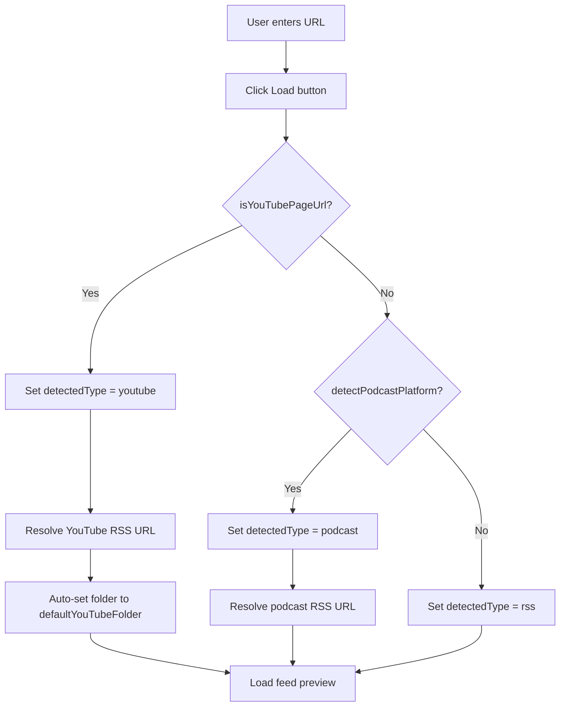
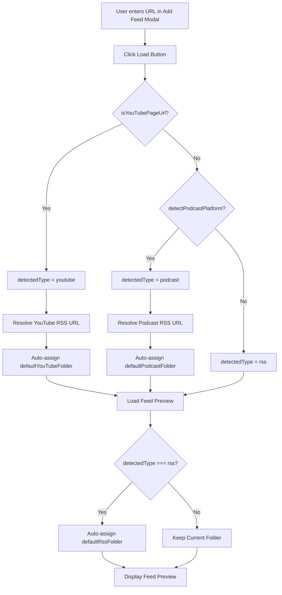

# Auto-Folder Assignment Enhancement Plan

## Overview

This plan documents the implementation of automatic folder assignment for Apple Podcasts URLs and adds new default settings for RSS feeds. The implementation follows the existing YouTube auto-assign pattern as a reference.

---

## Current Implementation Analysis: YouTube Auto-Folder Assignment

### How It Works

The YouTube auto-folder assignment feature operates in the [`AddFeedModal`](src/modals/feed-manager-modal.ts:469) class within the Load button click handler.

#### Detection Flow



#### Key Code Location

**File:** [`src/modals/feed-manager-modal.ts`](src/modals/feed-manager-modal.ts:571-630)

```typescript
// Lines 571-612: YouTube detection and folder assignment
if (isYouTubePageUrl(url)) {
  detectedType = "youtube";
  status = "⏳ Resolving YouTube channel...";
  if (refs.statusDiv) refs.statusDiv.textContent = status;

  const rssUrl = await MediaService.getYouTubeRssFeed(url);
  if (!rssUrl) {
    throw new Error("Could not resolve YouTube channel. Please check the URL.");
  }
  feedUrl = rssUrl;
  url = rssUrl;
  if (urlInput) urlInput.value = rssUrl;
  status = "⏳ Loading YouTube feed...";
  if (refs.statusDiv) refs.statusDiv.textContent = status;

  // Auto-set folder to default YouTube folder if not already set by user
  const defaultYouTubeFolder =
    this.plugin?.settings?.media?.defaultYouTubeFolder || "Videos";

  // Check if folder is empty or still at default Uncategorized
  if (
    folderInput &&
    (!folderInput.value || folderInput.value === "Uncategorized")
  ) {
    folder = defaultYouTubeFolder;
    folderInput.value = defaultYouTubeFolder;
  }
}
```

#### YouTube Detection Functions

**File:** [`src/modals/feed-manager-modal.ts`](src/modals/feed-manager-modal.ts:27-41)

```typescript
function isYouTubePageUrl(url: string): boolean {
  if (!url) return false;
  // Check if it matches YouTube patterns
  if (!MediaService.isYouTubeFeed(url)) return false;
  // Exclude YouTube RSS feed URLs - these are valid RSS feeds
  if (url.includes("youtube.com/feeds/videos.xml")) return false;
  return true;
}
```

**File:** [`src/services/media-service.ts`](src/services/media-service.ts:5-18)

```typescript
private static readonly YOUTUBE_PATTERNS = [
  "youtube.com/feeds/videos.xml",
  "youtube.com/channel/",
  "youtube.com/user/",
  "youtube.com/c/",
  "youtube.com/@",
  "youtube.com/watch",
  "youtu.be/",
];

static isYouTubeFeed(url: string): boolean {
  if (!url) return false;
  return this.YOUTUBE_PATTERNS.some((pattern) => url.includes(pattern));
}
```

---

## Current Podcast Platform Detection

### Detection Logic

**File:** [`src/utils/podcast-platforms.ts`](src/utils/podcast-platforms.ts:1-61)

```typescript
export const APPLE_PODCASTS: PodcastPlatform = {
  name: "Apple Podcasts",
  id: "apple",
  detect(url: string): boolean {
    return url.includes("podcasts.apple.com");
  },
  extractId(url: string): string | null {
    const match = url.match(/id(\d+)(?:\?|$)/);
    return match ? match[1] : null;
  },
};

export function detectPodcastPlatform(url: string): PodcastPlatform | null {
  for (const platform of PLATFORMS) {
    if (platform.detect(url)) {
      return platform;
    }
  }
  return null;
}
```

### Resolution Logic

**File:** [`src/services/feed-parser.ts`](src/services/feed-parser.ts:22-80)

```typescript
export async function resolvePodcastPlatformUrl(
  url: string,
): Promise<string | null> {
  const platform = detectPodcastPlatform(url);
  if (!platform) return null;

  if (platform.id === APPLE_PODCASTS.id) {
    return resolveApplePodcastUrl(url);
  }
  return null;
}

async function resolveApplePodcastUrl(
  applePodcastsUrl: string,
): Promise<string | null> {
  const podcastId = APPLE_PODCASTS.extractId(applePodcastsUrl);
  if (!podcastId) {
    throw new Error("Invalid Apple Podcasts URL: could not extract podcast ID");
  }
  const lookupUrl = `https://itunes.apple.com/lookup?id=${podcastId}&entity=podcast`;
  // ... iTunes API call to get RSS feed URL
}
```

### Current Podcast Handling in AddFeedModal

**File:** [`src/modals/feed-manager-modal.ts`](src/modals/feed-manager-modal.ts:613-630)

```typescript
// Lines 613-630: Podcast platform detection - NO FOLDER AUTO-ASSIGNMENT
else {
  // Check for podcast platform URLs
  const platform = detectPodcastPlatform(url);
  if (platform) {
    detectedType = "podcast";
    status = `⏳ Resolving ${platform.name} URL...`;
    if (refs.statusDiv) refs.statusDiv.textContent = status;
    const resolvedUrl = await resolvePodcastPlatformUrl(url);
    if (!resolvedUrl) {
      throw new Error("Could not resolve podcast feed URL");
    }
    feedUrl = resolvedUrl;
    url = resolvedUrl;
    if (urlInput) urlInput.value = feedUrl;
    status = "⏳ Loading feed...";
    if (refs.statusDiv) refs.statusDiv.textContent = status;
    // MISSING: Auto-folder assignment for podcasts!
  }
}
```

---

## Gap Analysis

### Missing Features

1. **Apple Podcasts Auto-Folder Assignment**: The podcast platform detection resolves the RSS URL but does NOT auto-assign the folder like YouTube does.

2. **Default RSS Folder/Tag Settings**: No settings exist for default RSS folder and tag.

### Current Settings Structure

**File:** [`src/types/types.ts`](src/types/types.ts:123-130)

```typescript
export interface MediaSettings {
  defaultYouTubeFolder: string;
  defaultYouTubeTag: string;
  defaultPodcastFolder: string;
  defaultPodcastTag: string;
  openInSplitView: boolean;
  podcastTheme: PodcastTheme;
}
```

**Default Values:** [`src/types/types.ts`](src/types/types.ts:284-291)

```typescript
media: {
  defaultYouTubeFolder: "Videos",
  defaultYouTubeTag: "youtube",
  defaultPodcastFolder: "Podcasts",
  defaultPodcastTag: "podcast",
  openInSplitView: true,
  podcastTheme: "obsidian",
},
```

---

## Implementation Plan

### Task 1: Add Default RSS Folder and Tag Settings

#### 1.1 Update MediaSettings Interface

**File:** [`src/types/types.ts`](src/types/types.ts:123-130)

```typescript
export interface MediaSettings {
  defaultYouTubeFolder: string;
  defaultYouTubeTag: string;
  defaultPodcastFolder: string;
  defaultPodcastTag: string;
  defaultRssFolder: string; // NEW
  defaultRssTag: string; // NEW
  openInSplitView: boolean;
  podcastTheme: PodcastTheme;
}
```

#### 1.2 Update Default Settings

**File:** [`src/types/types.ts`](src/types/types.ts:284-291)

```typescript
media: {
  defaultYouTubeFolder: "Videos",
  defaultYouTubeTag: "youtube",
  defaultPodcastFolder: "Podcasts",
  defaultPodcastTag: "podcast",
  defaultRssFolder: "RSS",        // NEW
  defaultRssTag: "RSS",           // NEW
  openInSplitView: true,
  podcastTheme: "obsidian",
},
```

#### 1.3 Add Settings UI

**File:** [`src/settings/settings-tab.ts`](src/settings/settings-tab.ts:543-627)

Add a new RSS section in the `createMediaSettings` method after the Podcast section:

```typescript
new Setting(containerEl).setName("RSS").setHeading();

new Setting(containerEl)
  .setName("Default RSS folder")
  .setDesc("Default folder for RSS feeds")
  .addText((text) => {
    text
      .setValue(this.plugin.settings.media.defaultRssFolder)
      .onChange(async (value) => {
        this.plugin.settings.media.defaultRssFolder = normalizePath(value);
        await this.plugin.saveSettings();
      });
    new FolderSuggest(this.app, text.inputEl, this.plugin.settings.folders);
  });

new Setting(containerEl)
  .setName("Default RSS tag")
  .setDesc("Default tag for RSS articles")
  .addText((text) =>
    text
      .setValue(this.plugin.settings.media.defaultRssTag)
      .onChange(async (value) => {
        this.plugin.settings.media.defaultRssTag = value;
        await this.plugin.saveSettings();
      }),
  );
```

---

### Task 2: Implement Apple Podcasts Auto-Folder Assignment

#### 2.1 Update AddFeedModal Load Handler

**File:** [`src/modals/feed-manager-modal.ts`](src/modals/feed-manager-modal.ts:613-630)

Add folder auto-assignment after podcast platform detection:

```typescript
else {
  // Check for podcast platform URLs
  const platform = detectPodcastPlatform(url);
  if (platform) {
    detectedType = "podcast";
    status = `⏳ Resolving ${platform.name} URL...`;
    if (refs.statusDiv) refs.statusDiv.textContent = status;
    const resolvedUrl = await resolvePodcastPlatformUrl(url);
    if (!resolvedUrl) {
      throw new Error("Could not resolve podcast feed URL");
    }
    feedUrl = resolvedUrl;
    url = resolvedUrl;
    if (urlInput) urlInput.value = feedUrl;
    status = "⏳ Loading feed...";
    if (refs.statusDiv) refs.statusDiv.textContent = status;

    // NEW: Auto-set folder to default podcast folder if not already set by user
    const defaultPodcastFolder =
      this.plugin?.settings?.media?.defaultPodcastFolder || "Podcasts";

    if (folderInput && (!folderInput.value || folderInput.value === "Uncategorized")) {
      folder = defaultPodcastFolder;
      folderInput.value = defaultPodcastFolder;
    }
  }
}
```

---

### Task 3: Implement RSS Auto-Folder Assignment

#### 3.1 Update AddFeedModal Load Handler

**File:** [`src/modals/feed-manager-modal.ts`](src/modals/feed-manager-modal.ts:632-658)

Add RSS folder assignment after feed is loaded successfully:

```typescript
// Use loadFeedForPreview which has CORS proxy fallbacks
const feedData = await loadFeedForPreview(feedUrl);
title = feedData.title;
if (titleInput) titleInput.value = title;
// ... existing code ...

// NEW: Auto-set folder for RSS feeds if not YouTube or Podcast
if (detectedType === "rss") {
  const defaultRssFolder =
    this.plugin?.settings?.media?.defaultRssFolder || "RSS";

  if (
    folderInput &&
    (!folderInput.value || folderInput.value === "Uncategorized")
  ) {
    folder = defaultRssFolder;
    folderInput.value = defaultRssFolder;
  }
}
```

---

### Task 4: Add Default RSS Folder to Default Folders List

#### 4.1 Update Default Folders

**File:** [`src/types/types.ts`](src/types/types.ts:235-254)

```typescript
folders: [
  {
    name: "Uncategorized",
    subfolders: [],
    createdAt: Date.now(),
    modifiedAt: Date.now(),
  },
  {
    name: "Videos",
    subfolders: [],
    createdAt: Date.now(),
    modifiedAt: Date.now(),
  },
  {
    name: "Podcasts",
    subfolders: [],
    createdAt: Date.now(),
    modifiedAt: Date.now(),
  },
  {
    name: "RSS",           // NEW
    subfolders: [],
    createdAt: Date.now(),
    modifiedAt: Date.now(),
  },
],
```

---

## Complete Flow Diagram



---

## File Changes Summary

| File                                                                   | Changes                                                                                        |
| ---------------------------------------------------------------------- | ---------------------------------------------------------------------------------------------- |
| [`src/types/types.ts`](src/types/types.ts)                             | Add `defaultRssFolder` and `defaultRssTag` to `MediaSettings` interface and `DEFAULT_SETTINGS` |
| [`src/settings/settings-tab.ts`](src/settings/settings-tab.ts)         | Add RSS settings UI in `createMediaSettings` method                                            |
| [`src/modals/feed-manager-modal.ts`](src/modals/feed-manager-modal.ts) | Add podcast auto-folder assignment and RSS auto-folder assignment                              |

---

## Unit Tests

### Test File: `tests/auto-folder-assignment.test.ts`

```typescript
import { describe, it, expect, beforeEach } from "vitest";
import {
  detectPodcastPlatform,
  APPLE_PODCASTS,
} from "../src/utils/podcast-platforms";
import { MediaService } from "../src/services/media-service";

describe("Auto Folder Assignment", () => {
  describe("YouTube Detection", () => {
    it("should detect YouTube channel URLs", () => {
      expect(
        MediaService.isYouTubeFeed(
          "https://www.youtube.com/channel/UC1234567890",
        ),
      ).toBe(true);
      expect(
        MediaService.isYouTubeFeed("https://www.youtube.com/@username"),
      ).toBe(true);
      expect(MediaService.isYouTubeFeed("https://youtu.be/videoId")).toBe(true);
    });

    it("should not detect YouTube RSS URLs as page URLs", () => {
      // YouTube RSS URLs should be treated as regular RSS feeds
      const rssUrl =
        "https://www.youtube.com/feeds/videos.xml?channel_id=UC123";
      expect(MediaService.isYouTubeFeed(rssUrl)).toBe(true);
    });
  });

  describe("Podcast Platform Detection", () => {
    it("should detect Apple Podcasts URLs", () => {
      const platform = detectPodcastPlatform(
        "https://podcasts.apple.com/us/podcast/example/id123456789",
      );
      expect(platform).not.toBeNull();
      expect(platform?.id).toBe(APPLE_PODCASTS.id);
    });

    it("should extract podcast ID from Apple Podcasts URL", () => {
      const id = APPLE_PODCASTS.extractId(
        "https://podcasts.apple.com/us/podcast/example/id123456789",
      );
      expect(id).toBe("123456789");
    });

    it("should return null for non-podcast URLs", () => {
      expect(detectPodcastPlatform("https://example.com/feed.xml")).toBeNull();
      expect(
        detectPodcastPlatform("https://youtube.com/channel/UC123"),
      ).toBeNull();
    });
  });

  describe("Settings Validation", () => {
    it("should have default media settings", () => {
      const defaultSettings = DEFAULT_SETTINGS.media;
      expect(defaultSettings.defaultYouTubeFolder).toBe("Videos");
      expect(defaultSettings.defaultYouTubeTag).toBe("youtube");
      expect(defaultSettings.defaultPodcastFolder).toBe("Podcasts");
      expect(defaultSettings.defaultPodcastTag).toBe("podcast");
      expect(defaultSettings.defaultRssFolder).toBe("RSS");
      expect(defaultSettings.defaultRssTag).toBe("RSS");
    });
  });
});
```

### Test File: `tests/settings-tab.test.ts`

```typescript
import { describe, it, expect, vi } from "vitest";
import { RssDashboardSettingTab } from "../src/settings/settings-tab";

describe("Media Settings UI", () => {
  it("should render RSS folder setting", () => {
    // Test that RSS settings are rendered in the Media tab
  });

  it("should save RSS folder setting on change", () => {
    // Test that changing the RSS folder setting saves correctly
  });

  it("should save RSS tag setting on change", () => {
    // Test that changing the RSS tag setting saves correctly
  });
});
```

---

## Implementation Checklist

- [x] **Task 1: Settings Updates**
  - [x] Add `defaultRssFolder` and `defaultRssTag` to `MediaSettings` interface
  - [x] Add default values in `DEFAULT_SETTINGS`
  - [x] Add RSS folder to default folders list
  - [x] Add RSS settings UI in settings tab

- [x] **Task 2: Podcast Auto-Folder Assignment**
  - [x] Add folder auto-assignment logic after podcast platform detection
  - [x] Use `defaultPodcastFolder` setting with fallback to "Podcasts"
  - [x] Only assign if folder is empty or "Uncategorized"

- [x] **Task 3: RSS Auto-Folder Assignment**
  - [x] Add folder auto-assignment for RSS feeds after feed preview loads
  - [x] Use `defaultRssFolder` setting with fallback to "RSS"
  - [x] Only assign if `detectedType === "rss"` and folder is empty or "Uncategorized"

- [x] **Task 4: Testing**
  - [ ] Write unit tests for podcast platform detection
  - [ ] Write unit tests for settings validation
  - [ ] Manual testing with Apple Podcasts URLs
  - [ ] Manual testing with regular RSS URLs
  - [ ] Manual testing with YouTube URLs

- [x] **Task 5: Documentation**
  - [ ] Update README with new settings
  - [x] Update CHANGELOG

---

## Risk Assessment

| Risk                                  | Impact | Mitigation                                       |
| ------------------------------------- | ------ | ------------------------------------------------ |
| Settings migration for existing users | Medium | New settings have defaults, no migration needed  |
| Folder doesn't exist when assigned    | Low    | Existing `ensureFolderExists` logic handles this |
| Podcast detection false positives     | Low    | Only matches specific platform domains           |

---

## Notes

1. The implementation follows the exact same pattern as YouTube auto-folder assignment
2. No breaking changes - all new settings have sensible defaults
3. The RSS folder assignment only triggers for feeds that are NOT YouTube or Podcast URLs
4. Users can override the auto-assigned folder by typing a different value before clicking Save
