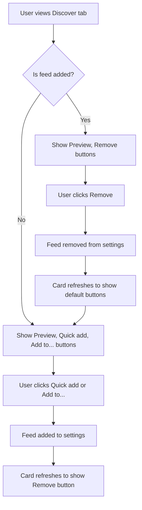

# Discover Tab Remove Button Implementation Plan

## Overview

Change the "Added" button in the Discover tab to a functional red "Remove" button that allows users to remove feeds they've previously added.

## Current Behavior

When a feed is added from the Discover tab, the button changes to a grayed-out, non-functioning "Added" button. Users cannot remove the feed directly from the Discover view.

**Location**: [`src/views/discover-view.ts`](src/views/discover-view.ts:1339-1374)

```typescript
if (isAdded) {
	const addedBtn = rightSection.createEl("button", {
		text: "Added",
		cls: "rss-discover-card-add-btn",
	});
	addedBtn.disabled = true;
}
```

## Proposed Behavior

Replace the disabled "Added" button with a red "Remove" button that:

1. Is clickable and functional
2. Removes the feed from the user's feed list
3. Refreshes the card to show the default state (Preview, Quick add, Add to... buttons)

## Implementation Details

### 1. Modify `renderFeedCard` Method in discover-view.ts

**File**: [`src/views/discover-view.ts`](src/views/discover-view.ts:1339-1374)

Replace the disabled "Added" button with a functional "Remove" button:

```typescript
if (isAdded) {
	const removeBtn = rightSection.createEl("button", {
		text: "Remove",
		cls: "rss-discover-card-remove-btn",
	});
	removeBtn.addEventListener("click", () => {
		void (async () => {
			await this.removeFeed(feed.url);
			// Refresh the view to show default state
			this.render();
		})();
	});
}
```

### 2. Add `removeFeed` Method to DiscoverView Class

**File**: [`src/views/discover-view.ts`](src/views/discover-view.ts)

Add a new private method to handle feed removal:

```typescript
/**
 * Remove a feed from settings by URL
 */
private async removeFeed(feedUrl: string): Promise<void> {
    try {
        const feedIndex = this.plugin.settings.feeds.findIndex(
            (f) => f.url === feedUrl
        );

        if (feedIndex >= 0) {
            const feedTitle = this.plugin.settings.feeds[feedIndex].title;
            this.plugin.settings.feeds.splice(feedIndex, 1);
            await this.plugin.saveSettings();

            // Refresh the dashboard view if it exists
            const dashboardView = await this.plugin.getActiveDashboardView();
            if (dashboardView) {
                dashboardView.refresh();
            }

            new Notice(`Feed "${feedTitle}" removed`);
        }
    } catch (error) {
        new Notice(
            `Failed to remove feed: ${error instanceof Error ? error.message : "Unknown error"}`
        );
    }
}
```

### 3. Add CSS Styling for Remove Button

**File**: [`src/styles/discover.css`](src/styles/discover.css:255-262)

Add styling for the red "Remove" button after the existing add button styles:

```css
.rss-discover-card-remove-btn {
	cursor: pointer;
	border: 1px solid var(--background-modifier-border);
	background: var(--background-secondary);
	color: #e74c3c;
	transition: all 0.2s ease;
}

.rss-discover-card-remove-btn:hover {
	background: #e74c3c;
	color: white;
	border-color: #c0392b;
}
```

## Files to Modify

| File                                                       | Changes                                                 |
| ---------------------------------------------------------- | ------------------------------------------------------- |
| [`src/views/discover-view.ts`](src/views/discover-view.ts) | Modify `renderFeedCard` method, add `removeFeed` method |
| [`src/styles/discover.css`](src/styles/discover.css)       | Add CSS for `.rss-discover-card-remove-btn`             |

## User Flow



## Testing Checklist

- [ ] Remove button appears with red styling for added feeds
- [ ] Clicking Remove removes the feed from settings
- [ ] Card refreshes to show default buttons after removal
- [ ] Dashboard view refreshes to reflect the removal
- [ ] Notice appears confirming feed removal
- [ ] Error handling works for failed removals
