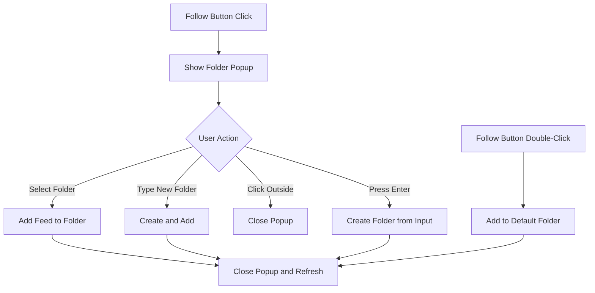

# Folder Selector Popup Menu for Kagi Smallweb Follow Button

## Overview

This plan outlines the implementation of a popup menu that appears when clicking the "+ Follow" button in the Kagi Smallweb view. The menu allows users to select which folder to add the feed to or create a new folder via a text input box, all while adhering to Obsidian's filename constraints.

## Implementation Status: ✅ COMPLETED

All tasks have been implemented and tested successfully.

## Features Implemented

### Core Features

1. **Folder Selector Popup** - A popup menu appears when clicking the "+ Follow" button
2. **Scrollable List** - Shows 5 rows at a time with smooth scrolling
3. **Search/Filter** - Input box to filter folders or type new folder names
4. **Create New Folder** - Type a new folder name and press Enter or click "Create"
5. **Keyboard Navigation** - Arrow keys, Enter to select, Escape to close
6. **Obsidian Filename Validation** - Real-time sanitization of forbidden characters: `\ : * ? " < > |`

### Enhancement Features

1. **Enter Key to Create** - Press Enter after typing to create a new folder
2. **Default Folder Settings** - Configurable in Settings > Media > Kagi smallweb
3. **Double-Click Follow** - Double-click the Follow button to add to default folder directly
4. **Prioritized Default Folder** - Default folder appears at top of list when popup opens

## Files Modified

| File                                      | Changes                                                                 |
| ----------------------------------------- | ----------------------------------------------------------------------- |
| `src/components/folder-selector-popup.ts` | **NEW** - Popup component with folder selection and creation            |
| `src/views/kagi-smallweb-view.ts`         | Integrated popup, added double-click handler                            |
| `src/styles/discover.css`                 | Added popup styles with animations                                      |
| `src/types/types.ts`                      | Added `defaultSmallwebFolder` and `defaultSmallwebTag` to MediaSettings |
| `src/settings/settings-tab.ts`            | Added settings UI for smallweb defaults                                 |

## Component Architecture



## Key Implementation Details

### 1. FolderSelectorPopup Component

Location: [`src/components/folder-selector-popup.ts`](src/components/folder-selector-popup.ts)

Key methods:

- `collectAllFolders()` - Flattens folder hierarchy from settings
- `getPrioritizedFolders()` - Moves default folder to top of list
- `createPopup()` - Creates and positions the popup element
- `renderFolderList()` - Renders filtered folder items with "Create" option
- `handleKeydown()` - Handles keyboard navigation
- `sanitizeFolderName()` - Removes forbidden characters per Obsidian constraints

### 2. Integration with KagiSmallwebView

Location: [`src/views/kagi-smallweb-view.ts`](src/views/kagi-smallweb-view.ts:534-560)

```typescript
// Single click: Show folder selector popup
followBtn.addEventListener("click", () => {
  new FolderSelectorPopup(this.plugin, {
    anchorEl: followBtn,
    defaultFolder: defaultFolder,
    onSelect: (folderName) => {
      void this.handleSmallwebSubscribeToFolder(entry, folderName);
    },
  });
});

// Double click: Add to default folder directly
followBtn.addEventListener("dblclick", () => {
  void this.handleSmallwebSubscribeToFolder(entry, defaultFolder);
});
```

### 3. Settings Configuration

Location: [`src/settings/settings-tab.ts`](src/settings/settings-tab.ts:628-656)

Settings added:

- **Default smallweb folder** - Default: "Smallweb"
- **Default smallweb tag** - Default: "smallweb"

### 4. CSS Styles

Location: [`src/styles/discover.css`](src/styles/discover.css)

Styles include:

- Fixed positioning with viewport edge detection
- Smooth fade-in animation
- Scrollable list with custom scrollbar
- Hover and selected states
- Mobile-responsive adjustments
- Invalid input visual feedback

## Bug Fixes Applied

### Click-Outside Handler Timing Issue

**Problem**: Popup wasn't showing because the click-outside handler was registered immediately, catching the same click that opened the popup.

**Solution**: Wrapped handler registration in `setTimeout(..., 0)` to delay it until after the current click event finishes propagating.

```typescript
// Click outside to close - delay registration to avoid immediate trigger
this.clickOutsideHandler = (e: MouseEvent) => {
  if (!this.popupEl.contains(e.target as Node)) {
    this.close();
  }
};
window.setTimeout(() => {
  document.addEventListener("click", this.clickOutsideHandler);
}, 0);
```

## Task List (All Completed)

### Phase 1: Core Component Creation

- [x] Create `src/components/folder-selector-popup.ts` with the `FolderSelectorPopup` class
- [x] Implement folder collection logic (reuse from `FolderSuggest`)
- [x] Implement popup positioning relative to anchor element
- [x] Implement input filtering and folder list rendering
- [x] Implement keyboard navigation (Arrow Up/Down, Enter, Escape)
- [x] Implement click-outside-to-close behavior
- [x] Implement folder name sanitization for Obsidian constraints

### Phase 2: Styling

- [x] Add CSS styles to `src/styles/discover.css`
- [x] Style popup container with proper positioning
- [x] Style input field with focus states
- [x] Style folder list items with hover and selected states
- [x] Add scrollbar styling for the list
- [x] Add mobile-responsive adjustments
- [x] Add animation for popup open

### Phase 3: Integration

- [x] Import `FolderSelectorPopup` in `kagi-smallweb-view.ts`
- [x] Modify `renderSmallwebCard` to show popup on Follow button click
- [x] Add `handleSmallwebSubscribeToFolder` method
- [x] Handle edge cases (no folders, feed discovery failure)

### Phase 4: Enhancements

- [x] Add Enter key support for creating new folder from input
- [x] Add Smallweb default folder/tag settings to MediaSettings
- [x] Add settings UI in Media tab for Smallweb defaults
- [x] Add double-click Follow button to use default folder
- [x] Prioritize default folder in popup menu

### Phase 5: Testing & Polish

- [x] Test popup positioning at screen edges
- [x] Test keyboard navigation
- [x] Test folder creation with special characters
- [x] Test on mobile devices
- [x] Verify Obsidian filename constraints are enforced
- [x] Build passes with no TypeScript/ESLint errors

## Edge Cases Handled

1. **Screen Edge Positioning** - Popup repositions above button if it would overflow bottom
2. **Empty Folder List** - Shows "Create new folder" option
3. **Duplicate Folder Names** - Case-insensitive comparison prevents duplicates
4. **Long Folder Names** - Text truncates with ellipsis
5. **Special Characters** - Real-time sanitization with visual feedback
6. **Feed Discovery Failure** - Shows appropriate error notice
7. **Already Subscribed** - Shows "Following" button with unfollow option

## Future Enhancements (Out of Scope)

- Recent folders section at top
- Folder icons based on type
- Nested folder display with indentation
- Multi-select for batch operations
- Folder color indicators
