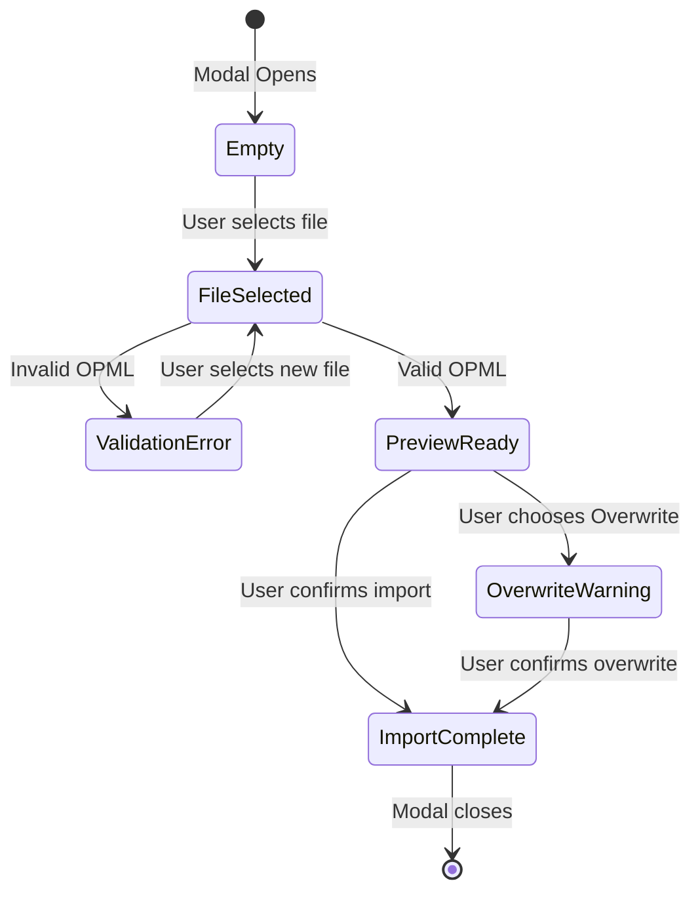

# Import OPML Modal Feature Plan

## Overview

Create a new Import OPML Modal that provides a preview-based import experience, allowing users to:

1. Select an OPML file through a file picker
2. Validate the file and see errors if invalid
3. Preview the contents before importing
4. Choose between Update (merge) or Overwrite import modes
5. Receive a warning when choosing Overwrite mode

## Current State Analysis

### Current OPML Import Implementation

Location: [`main.ts`](main.ts:594-672)

The current `importOpml()` method:

- Creates a hidden file input element
- Opens the native file picker
- Validates `.opml` extension only
- Parses and imports immediately without preview
- Only supports merge (update) mode

```typescript
importOpml(): void {
  const input = document.body.createEl("input", {
    attr: { type: "file" },
  });
  input.onchange = async () => {
    const file = input.files?.[0];
    if (file && file.name.endsWith(".opml")) {
      const content = await file.text();
      // ... immediately imports without preview
    }
  };
  input.click();
}
```

### OPML Manager Service

Location: [`src/services/opml-manager.ts`](src/services/opml-manager.ts)

Key methods available:

- `parseOpml(opmlContent: string)` - Returns `{ feeds: Feed[], folders: Folder[] }`
- `parseOpmlMetadata(opmlContent: string)` - Returns `{ feeds: FeedMetadata[], folders: Folder[] }`
- `importOpml(opmlContent, existingFeeds, existingFolders)` - Merges feeds
- `generateOpml(feeds, folders)` - Exports to OPML format

### Delete All Warning Modal Pattern

Location: [`src/modals/feed-manager-modal.ts`](src/modals/feed-manager-modal.ts:1359-1471)

The `showDeleteConfirmModal()` pattern:

- Creates overlay on top of existing modal
- Shows warning message with context
- Provides Export OPML recommendation
- Has Cancel and Confirm buttons

---

## Proposed Implementation

### 1. New Import OPML Modal Class

Create a new modal class `ImportOpmlModal` in [`src/modals/feed-manager-modal.ts`](src/modals/feed-manager-modal.ts).

#### Modal States



#### UI Layout

```
┌─────────────────────────────────────────────────────────────────┐
│  Import OPML                                                ✕   │
├─────────────────────────────────────────────────────────────────┤
│                                                                  │
│  ┌──────────────────────────────────────────┐ ┌──────────────┐ │
│  │ File path or No file selected...         │ │ 📁 Import    │ │
│  │                                          │ │ OPML file... │ │
│  └──────────────────────────────────────────┘ └──────────────┘ │
│                                                                  │
│  ┌──────────────────────────────────────────────────────────┐   │
│  │ ❌ Error: This is not a valid OPML file...               │   │
│  └──────────────────────────────────────────────────────────┘   │
│                                                                  │
│  OR (if valid)                                                   │
│                                                                  │
│  ┌──────────────────────────────────────────────────────────┐   │
│  │ 📋 Preview - 15 feeds found in 3 folders                 │   │
│  │ ──────────────────────────────────────────────────────   │   │
│  │ 📁 News                                                  │   │
│  │    • TechCrunch                                          │   │
│  │    • BBC News                                            │   │
│  │ 📁 Videos                                                │   │
│  │    • YouTube Channel 1                                   │   │
│  │ 📁 Podcasts                                              │   │
│  │    • The Daily                                           │   │
│  │    • Serial                                              │   │
│  │ ... and 10 more feeds                                    │   │
│  └──────────────────────────────────────────────────────────┘   │
│                                                                  │
│  Import mode:                                                    │
│  ○ Update - Add new feeds to existing list                      │
│  ○ Overwrite - Replace all existing feeds                       │
│                                                                  │
│                              [Cancel]  [Import feeds]            │
│                                                                  │
└─────────────────────────────────────────────────────────────────┘
```

### 2. Overwrite Warning Modal

When user selects Overwrite mode and clicks Import:

```
┌─────────────────────────────────────────────────────────────────┐
│  ⚠️ Overwrite All Feeds?                                    ✕   │
├─────────────────────────────────────────────────────────────────┤
│                                                                  │
│  ┌──────────────────────────────────────────────────────────┐   │
│  │ ⚠ This action is irreversible. All your existing feeds  │   │
│  │   will be permanently replaced with the imported feeds.  │   │
│  └──────────────────────────────────────────────────────────┘   │
│                                                                  │
│  ┌──────────────────────────────────────────────────────────┐   │
│  │ 📦 Recommended: Export your feeds first                  │   │
│  │                                                          │   │
│  │ Before overwriting, we strongly recommend backing up     │   │
│  │ your current feeds by exporting to an OPML file.         │   │
│  │                                                          │   │
│  │ [Export OPML]                                            │   │
│  └──────────────────────────────────────────────────────────┘   │
│                                                                  │
│                              [Cancel]  [Overwrite feeds]         │
│                                                                  │
└─────────────────────────────────────────────────────────────────┘
```

### 3. Implementation Details

#### ImportOpmlModal Class Structure

```typescript
export class ImportOpmlModal extends Modal {
  plugin: RssDashboardPlugin;

  // State
  private selectedFile: File | null = null;
  private opmlContent: string | null = null;
  private parsedFeeds: Feed[] = [];
  private parsedFolders: Folder[] = [];
  private validationError: string | null = null;
  private importMode: "update" | "overwrite" = "update";

  // UI References
  private filePathInput: HTMLInputElement;
  private previewContainer: HTMLDivElement;
  private errorContainer: HTMLDivElement;
  private importButton: HTMLButtonElement;

  constructor(app: App, plugin: RssDashboardPlugin) {
    super(app);
    this.plugin = plugin;
  }

  onOpen() {
    // Build modal UI
  }

  private openFilePicker() {
    // Open native file picker
  }

  private async validateAndParseFile(file: File) {
    // Validate OPML and parse contents
  }

  private renderPreview() {
    // Show parsed feeds preview
  }

  private renderError(message: string) {
    // Show validation error in red
  }

  private showOverwriteWarning() {
    // Show overwrite confirmation modal
  }

  private async executeImport() {
    // Perform the actual import
  }
}
```

#### OPML Validation Logic

```typescript
private async validateAndParseFile(file: File): Promise<void> {
  // Check file extension
  if (!file.name.endsWith('.opml')) {
    this.validationError = 'Please select a valid OPML file (.opml extension required)';
    return;
  }

  try {
    const content = await file.text();

    // Basic XML validation
    const parser = new DOMParser();
    const xmlDoc = parser.parseFromString(content, 'text/xml');

    // Check for parsing errors
    const parseError = xmlDoc.querySelector('parsererror');
    if (parseError) {
      this.validationError = 'This is not a valid OPML file. The file contains invalid XML.';
      return;
    }

    // Check for OPML structure
    const opmlRoot = xmlDoc.querySelector('opml');
    if (!opmlRoot) {
      this.validationError = 'This is not a valid OPML file. Missing OPML root element.';
      return;
    }

    const body = xmlDoc.querySelector('body');
    if (!body) {
      this.validationError = 'This is not a valid OPML file. Missing body element.';
      return;
    }

    // Parse the valid OPML
    const result = OpmlManager.parseOpml(content);
    this.parsedFeeds = result.feeds;
    this.parsedFolders = result.folders;
    this.opmlContent = content;
    this.validationError = null;

  } catch (error) {
    this.validationError = `Error reading file: ${error instanceof Error ? error.message : 'Unknown error'}`;
  }
}
```

#### Preview Rendering

```typescript
private renderPreview(): void {
  this.previewContainer.empty();

  // Summary header
  const header = this.previewContainer.createDiv({ cls: 'import-preview-header' });
  header.createEl('strong', { text: `📋 Preview - ${this.parsedFeeds.length} feeds found` });

  // Group feeds by folder
  const feedsByFolder = this.groupFeedsByFolder();

  // Create scrollable preview list
  const list = this.previewContainer.createDiv({ cls: 'import-preview-list' });

  for (const [folder, feeds] of Object.entries(feedsByFolder)) {
    const folderDiv = list.createDiv({ cls: 'import-preview-folder' });
    folderDiv.createEl('div', { cls: 'import-preview-folder-name', text: `📁 ${folder}` });

    const feedsList = folderDiv.createDiv({ cls: 'import-preview-feeds' });
    const displayFeeds = feeds.slice(0, 5); // Show max 5 feeds per folder

    for (const feed of displayFeeds) {
      feedsList.createEl('div', { cls: 'import-preview-feed', text: `• ${feed.title}` });
    }

    if (feeds.length > 5) {
      feedsList.createEl('div', {
        cls: 'import-preview-more',
        text: `... and ${feeds.length - 5} more feeds`
      });
    }
  }

  // Enable import button
  this.importButton.disabled = false;
}
```

### 4. CSS Styles

Add to [`src/styles/modals.css`](src/styles/modals.css):

```css
/* ============================================
   Import OPML Modal Styles
   ============================================ */

/* File selector row */
.import-file-selector {
  display: flex;
  gap: 12px;
  margin-bottom: 16px;
}

.import-file-path-input {
  flex: 1;
  padding: 8px 12px;
  border: 1px solid var(--background-modifier-border);
  border-radius: 6px;
  background: var(--background-primary);
  color: var(--text-normal);
  font-size: 14px;
}

.import-file-path-input:disabled {
  background: var(--background-secondary);
  color: var(--text-muted);
}

.import-file-button {
  display: flex;
  align-items: center;
  gap: 6px;
  padding: 8px 16px;
  background: var(--interactive-normal);
  border: 1px solid var(--background-modifier-border);
  border-radius: 6px;
  cursor: pointer;
  font-size: 14px;
  transition: all 0.15s ease;
}

.import-file-button:hover {
  background: var(--interactive-hover);
  border-color: var(--interactive-accent);
}

.import-file-button svg {
  width: 16px;
  height: 16px;
}

/* Error message */
.import-error-message {
  padding: 12px 16px;
  background: rgba(239, 68, 68, 0.1);
  border: 1px solid rgba(239, 68, 68, 0.3);
  border-radius: 8px;
  color: #ef4444;
  margin-bottom: 16px;
}

.import-error-message::before {
  content: "❌ ";
}

/* Preview container */
.import-preview-container {
  margin-bottom: 16px;
}

.import-preview-header {
  padding: 12px 16px;
  background: var(--background-secondary);
  border-radius: 8px 8px 0 0;
  border: 1px solid var(--background-modifier-border);
  border-bottom: none;
}

.import-preview-list {
  max-height: 300px;
  overflow-y: auto;
  padding: 12px 16px;
  background: var(--background-primary);
  border: 1px solid var(--background-modifier-border);
  border-radius: 0 0 8px 8px;
}

.import-preview-folder {
  margin-bottom: 12px;
}

.import-preview-folder:last-child {
  margin-bottom: 0;
}

.import-preview-folder-name {
  font-weight: 600;
  margin-bottom: 4px;
  color: var(--text-normal);
}

.import-preview-feeds {
  padding-left: 16px;
}

.import-preview-feed {
  padding: 2px 0;
  color: var(--text-muted);
  font-size: 13px;
}

.import-preview-more {
  padding: 4px 0;
  color: var(--text-faint);
  font-size: 12px;
  font-style: italic;
}

/* Import mode selector */
.import-mode-selector {
  margin-bottom: 16px;
  padding: 12px 16px;
  background: var(--background-secondary);
  border-radius: 8px;
}

.import-mode-label {
  font-weight: 500;
  margin-bottom: 8px;
}

.import-mode-option {
  display: flex;
  align-items: flex-start;
  gap: 8px;
  padding: 8px 0;
  cursor: pointer;
}

.import-mode-option input[type="radio"] {
  margin-top: 3px;
}

.import-mode-option-text {
  flex: 1;
}

.import-mode-option-title {
  font-weight: 500;
}

.import-mode-option-desc {
  font-size: 12px;
  color: var(--text-muted);
}

/* Mobile responsive */
@media (max-width: 768px) {
  .import-file-selector {
    flex-direction: column;
  }

  .import-file-button {
    justify-content: center;
  }

  .import-preview-list {
    max-height: 200px;
  }
}
```

### 5. Integration Points

#### Update FeedManagerModal

In [`src/modals/feed-manager-modal.ts`](src/modals/feed-manager-modal.ts:1208-1210), update the Import button click handler:

```typescript
// Current
importOpmlBtn.onclick = () => {
  void this.plugin.importOpml();
};

// Updated
importOpmlBtn.onclick = () => {
  new ImportOpmlModal(this.app, this.plugin).open();
};
```

#### Update main.ts Command

In [`main.ts`](main.ts:172-178), update the command handler:

```typescript
// Current
this.addCommand({
  id: "import-opml",
  name: "Import opml",
  callback: () => {
    void this.importOpml();
  },
});

// Updated - Keep the command but have it open the modal
this.addCommand({
  id: "import-opml",
  name: "Import opml",
  callback: () => {
    const { ImportOpmlModal } = require("./src/modals/feed-manager-modal");
    new ImportOpmlModal(this.app, this).open();
  },
});
```

#### Update Settings Tab

In [`src/settings/settings-tab.ts`](src/settings/settings-tab.ts:1252), update the Import button:

```typescript
// Current
importOpmlBtn.onclick = () => this.plugin.importOpml();

// Updated
importOpmlBtn.onclick = () => {
  const { ImportOpmlModal } = require("../modals/feed-manager-modal");
  new ImportOpmlModal(this.app, this.plugin).open();
};
```

---

## Task Checklist

### Phase 1: Create ImportOpmlModal Class

- [ ] Create `ImportOpmlModal` class extending `Modal`
- [ ] Add state properties for file, content, parsed data, and validation
- [ ] Implement `onOpen()` method with initial UI structure
- [ ] Add file path input with disabled state
- [ ] Add "Import OPML file..." button with folder icon

### Phase 2: File Selection and Validation

- [ ] Implement `openFilePicker()` method using hidden file input
- [ ] Implement `validateAndParseFile()` method
- [ ] Add XML validation checks
- [ ] Add OPML structure validation
- [ ] Store parsed feeds and folders

### Phase 3: Preview Display

- [ ] Implement `renderPreview()` method
- [ ] Create preview header with feed count
- [ ] Group feeds by folder
- [ ] Limit display to 5 feeds per folder with "more" indicator
- [ ] Add scrollable container for large lists

### Phase 4: Error Display

- [ ] Implement `renderError()` method
- [ ] Style error message in red
- [ ] Clear error when new file is selected

### Phase 5: Import Mode Selection

- [ ] Add radio button group for Update vs Overwrite
- [ ] Add descriptions for each mode
- [ ] Store selected mode in state

### Phase 6: Overwrite Warning Modal

- [ ] Implement `showOverwriteWarning()` method
- [ ] Create overlay modal pattern (like Delete All)
- [ ] Add warning message
- [ ] Add Export OPML recommendation
- [ ] Add Cancel and Overwrite buttons

### Phase 7: Import Execution

- [ ] Implement `executeImport()` method
- [ ] Handle Update mode (merge with existing)
- [ ] Handle Overwrite mode (replace all)
- [ ] Show success notice
- [ ] Refresh dashboard view
- [ ] Close modal on success

### Phase 8: CSS Styling

- [ ] Add file selector styles
- [ ] Add error message styles
- [ ] Add preview container styles
- [ ] Add import mode selector styles
- [ ] Add mobile responsive styles

### Phase 9: Integration

- [ ] Update FeedManagerModal Import button
- [ ] Update main.ts import-opml command
- [ ] Update settings tab Import button
- [ ] Update sidebar Import button (if applicable)

### Phase 10: Testing

- [ ] Test with valid OPML file
- [ ] Test with invalid XML file
- [ ] Test with non-OPML XML file
- [ ] Test with empty OPML file
- [ ] Test Update mode
- [ ] Test Overwrite mode with warning
- [ ] Test Export OPML from warning modal
- [ ] Test on mobile/tablet views
- [ ] Test with large OPML files (100+ feeds)

---

## Files to Modify

| File                               | Changes                                                   |
| ---------------------------------- | --------------------------------------------------------- |
| `src/modals/feed-manager-modal.ts` | Add `ImportOpmlModal` class, update Import button handler |
| `src/styles/modals.css`            | Add Import OPML modal styles                              |
| `main.ts`                          | Update import-opml command to open modal                  |
| `src/settings/settings-tab.ts`     | Update Import button to open modal                        |
| `src/components/sidebar.ts`        | Update Import button callback (if applicable)             |

---

## Dependencies

- Existing `OpmlManager` service for parsing
- Existing `exportOpml()` method for backup
- Obsidian's `Modal`, `Setting`, `Notice`, `setIcon` APIs
- Existing modal CSS infrastructure

---

## Risk Assessment

### Low Risk

- Modal follows existing patterns (FeedManagerModal, EditFeedModal)
- Validation logic is straightforward
- Preview is read-only display

### Medium Risk

- Large OPML files may impact preview performance
  - Mitigation: Limit preview display, use virtual scrolling if needed

### Mitigations

- Clear error messages for validation failures
- Warning modal for destructive overwrite action
- Export recommendation before overwrite
- Cancel option always available
