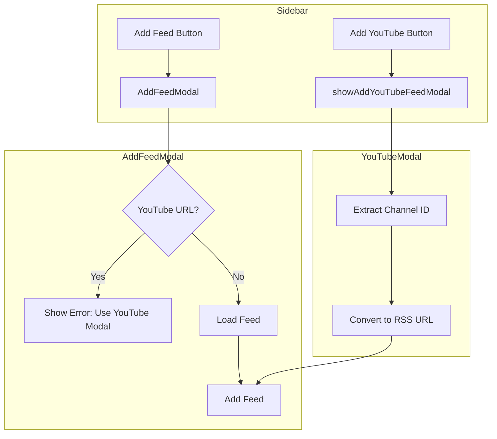
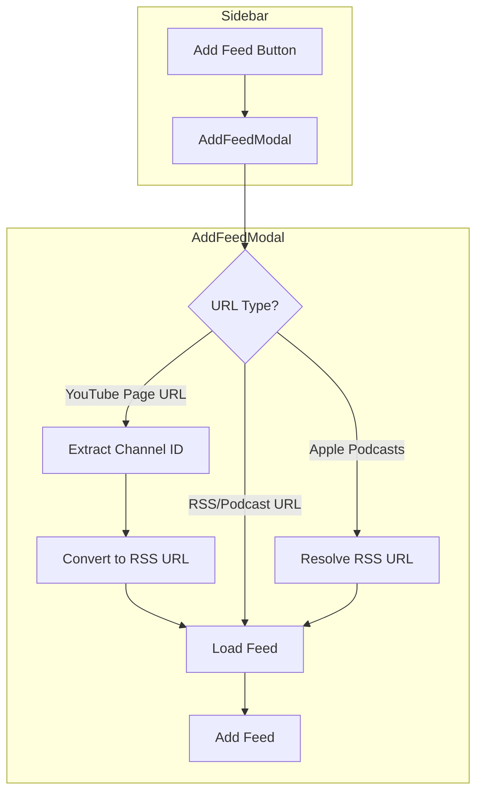

# Integrate YouTube Add Modal into Add Feed Modal

## Overview

This plan outlines the refactoring needed to integrate the YouTube channel add functionality directly into the existing Add Feed modal, eliminating the need for a separate YouTube modal and the unused `autoDetectMediaType` setting.

## Current State Analysis

### Problem Statement

1. **Unused Setting**: The `autoDetectMediaType` setting is defined but never used - media type detection always happens automatically in `MediaService.detectAndProcessFeed()`
2. **Duplicate Modals**: Two separate modals exist for adding feeds, causing user confusion about which to use
3. **Unnecessary UI Clutter**: The sidebar has both "Add feed" and "Add YouTube channel" buttons

### Files Involved

| File                               | Purpose                | Changes Needed                             |
| ---------------------------------- | ---------------------- | ------------------------------------------ |
| `src/modals/feed-manager-modal.ts` | Add Feed Modal         | Add YouTube URL detection and conversion   |
| `src/components/sidebar.ts`        | YouTube modal, buttons | Remove YouTube modal, remove button        |
| `src/settings/settings-tab.ts`     | Settings UI            | Remove `autoDetectMediaType` setting       |
| `src/types/types.ts`               | Type definitions       | Remove setting from interface and defaults |

## Architecture

### Current Flow



### Proposed Flow



## Implementation Tasks

### Phase 1: Modify Add Feed Modal

#### Task 1.1: Add YouTube URL Detection and Conversion

**File**: `src/modals/feed-manager-modal.ts`

**Location**: In the `AddFeedModal` class, modify the "Load" button click handler (around line 578)

**Current Code** (lines 578-650):

```typescript
.addButton((btn) => {
    btn.setButtonText("Load").onClick(() => {
        void (async () => {
            // Check for YouTube page URLs first
            if (isYouTubePageUrl(url)) {
                status =
                    "YouTube URL detected. Use 'Add Youtube channel' instead.";
                if (refs.statusDiv) {
                    refs.statusDiv.textContent = status;
                    refs.statusDiv.addClass(
                        "rss-dashboard-status-warning",
                    );
                }
                return;
            }

            status = "Loading...";
            // ... rest of loading logic
        })();
    });
});
```

**New Code**:

```typescript
.addButton((btn) => {
    btn.setButtonText("Load").onClick(() => {
        void (async () => {
            // Check for YouTube page URLs and convert to RSS feed
            if (isYouTubePageUrl(url)) {
                status = "Resolving YouTube channel...";
                if (refs.statusDiv) {
                    refs.statusDiv.textContent = status;
                    refs.statusDiv.removeClass(
                        "rss-dashboard-status-warning",
                    );
                }

                try {
                    const rssUrl = await MediaService.getYouTubeRssFeed(url);
                    if (!rssUrl) {
                        throw new Error("Could not resolve YouTube channel");
                    }
                    url = rssUrl;
                    if (urlInput) urlInput.value = rssUrl;
                    status = "Loading YouTube feed...";
                    if (refs.statusDiv) refs.statusDiv.textContent = status;
                } catch (e) {
                    status = `Error: ${e instanceof Error ? e.message : "Could not resolve YouTube channel"}`;
                    if (refs.statusDiv) refs.statusDiv.textContent = status;
                    return;
                }
            }

            status = "Loading...";
            // ... rest of loading logic continues unchanged
        })();
    });
});
```

#### Task 1.2: Add Required Import

**File**: `src/modals/feed-manager-modal.ts`

**Location**: Top of file (line 10)

**Add**:

```typescript
import { MediaService } from "../services/media-service";
```

Note: `MediaService` is already imported, but verify it's available.

#### Task 1.3: Update Modal Description

**File**: `src/modals/feed-manager-modal.ts`

**Location**: Around line 570-576

**Current Code**:

```typescript
.setDesc(
    document
        .createRange()
        .createContextualFragment(
            "Currently Supported: <b>XML</b>, <b>Apple Podcasts</b>",
        ),
)
```

**New Code**:

```typescript
.setDesc(
    document
        .createRange()
        .createContextualFragment(
            "Currently Supported: <b>XML</b>, <b>Apple Podcasts</b>, <b>YouTube Channels</b>",
        ),
)
```

#### Task 1.4: Apply Same Changes to EditFeedModal

**File**: `src/modals/feed-manager-modal.ts`

**Location**: In the `EditFeedModal` class, modify the "Load" button click handler (around line 96)

Apply the same YouTube URL detection and conversion logic as in Task 1.1.

### Phase 2: Remove YouTube Modal from Sidebar

#### Task 2.1: Remove showAddYouTubeFeedModal Method

**File**: `src/components/sidebar.ts`

**Location**: Lines 822-975

**Action**: Delete the entire `showAddYouTubeFeedModal()` method.

**Code to Remove**:

```typescript
private showAddYouTubeFeedModal(): void {
    const modal = document.body.createDiv({
        cls: "rss-dashboard-modal rss-dashboard-modal-container",
    });
    // ... entire method body (approximately 150 lines)
}
```

#### Task 2.2: Remove YouTube Button from Filters

**File**: `src/components/sidebar.ts`

**Location**: Lines 1615-1628 in `renderFilters()` method

**Code to Remove**:

```typescript
// Add YouTube channel button (at the top, before search)
const addYouTubeButton = row1.createDiv({
  cls: "rss-dashboard-filter-item rss-dashboard-add-youtube-button",
  attr: {
    title: "Add YouTube channel",
  },
});
const addYouTubeIcon = addYouTubeButton.createDiv({
  cls: "rss-dashboard-filter-icon",
});
setIcon(addYouTubeIcon, "youtube");
addYouTubeButton.addEventListener("click", () => {
  this.showAddYouTubeFeedModal();
});
```

#### Task 2.3: Remove YouTube Menu Items from Context Menus

**File**: `src/components/sidebar.ts`

**Location 1**: Lines 293-300 in `renderFeedFolders()` context menu

**Code to Remove**:

```typescript
menu.addItem((item: MenuItem) => {
  item
    .setTitle("Add YouTube channel")
    .setIcon("youtube")
    .onClick(() => {
      this.showAddYouTubeFeedModal();
    });
});
```

**Location 2**: Lines 523-530 in `renderFolder()` context menu

**Code to Remove**:

```typescript
menu.addItem((item: MenuItem) => {
  item
    .setTitle("Add YouTube channel")
    .setIcon("youtube")
    .onClick(() => {
      this.showAddYouTubeFeedModal();
    });
});
```

#### Task 2.4: Remove extractChannelIdAndNameFromYouTubePage Method

**File**: `src/components/sidebar.ts`

**Location**: Lines 977-996

**Action**: Delete the `extractChannelIdAndNameFromYouTubePage()` method.

Note: This functionality is now handled by `MediaService.getYouTubeRssFeed()`.

### Phase 3: Remove autoDetectMediaType Setting

#### Task 3.1: Remove from Settings UI

**File**: `src/settings/settings-tab.ts`

**Location**: Lines 544-556 in `createMediaSettings()` method

**Code to Remove**:

```typescript
new Setting(containerEl)
  .setName("Auto-detect media type")
  .setDesc(
    "Automatically detect if feeds are YouTube, podcasts, or regular articles",
  )
  .addToggle((toggle) =>
    toggle
      .setValue(this.plugin.settings.media.autoDetectMediaType)
      .onChange(async (value) => {
        this.plugin.settings.media.autoDetectMediaType = value;
        await this.plugin.saveSettings();
      }),
  );
```

#### Task 3.2: Remove from Types Interface

**File**: `src/types/types.ts`

**Location**: Line 128 in `MediaSettings` interface

**Code to Remove**:

```typescript
autoDetectMediaType: boolean;
```

#### Task 3.3: Remove from Default Settings

**File**: `src/types/types.ts`

**Location**: Line 290 in `DEFAULT_SETTINGS`

**Code to Remove**:

```typescript
autoDetectMediaType: false,
```

### Phase 4: Clean Up Unused Code

#### Task 4.1: Remove isYouTubePageUrl Function (Optional)

**File**: `src/modals/feed-manager-modal.ts`

**Location**: Lines 27-41

**Consideration**: This function is still useful for detecting YouTube page URLs vs RSS URLs. Keep it for now as it helps distinguish between:

- YouTube RSS feeds (`youtube.com/feeds/videos.xml`) - valid RSS, process normally
- YouTube page URLs (`youtube.com/@channel`) - need conversion

**Recommendation**: Keep the function but update its usage to convert URLs instead of rejecting them.

#### Task 4.2: Remove Unused Import

**File**: `src/components/sidebar.ts`

**Location**: Line 8

Check if `requestUrl` is still needed after removing YouTube modal. If only used in `extractChannelIdAndNameFromYouTubePage`, remove it.

**Code to Check**:

```typescript
import {
  Menu,
  MenuItem,
  Notice,
  App,
  setIcon,
  Setting,
  requestUrl, // Remove if no longer needed
} from "obsidian";
```

### Phase 5: Update Documentation

#### Task 5.1: Update README

**File**: `README.md`

Update any documentation that references:

- "Add YouTube channel" button
- Separate YouTube modal
- `autoDetectMediaType` setting

#### Task 5.2: Update CHANGELOG

**File**: `CHANGELOG.md`

Add entry for this refactor under the appropriate version.

## Testing Checklist

- [ ] Add regular RSS feed works correctly
- [ ] Add Apple Podcasts URL works correctly
- [ ] Add YouTube channel URL (`youtube.com/@handle`) converts and adds correctly
- [ ] Add YouTube channel ID directly works correctly
- [ ] Add YouTube RSS feed URL (`youtube.com/feeds/videos.xml`) works correctly
- [ ] Edit feed modal handles YouTube URLs correctly
- [ ] No console errors when opening modals
- [ ] Settings page loads without errors
- [ ] Existing feeds still function correctly
- [ ] Media type detection still works for new feeds

## Risk Assessment

| Risk                             | Likelihood | Impact | Mitigation                                                |
| -------------------------------- | ---------- | ------ | --------------------------------------------------------- |
| YouTube URL resolution fails     | Medium     | Medium | Show clear error message, suggest manual RSS URL entry    |
| Breaking existing feeds          | Low        | High   | Thorough testing, no changes to feed storage logic        |
| Users confused by missing button | Low        | Low    | Add tooltip to Add Feed button mentioning YouTube support |

## Rollback Plan

If issues arise, the changes can be easily reverted:

1. Restore `showAddYouTubeFeedModal()` method in sidebar.ts
2. Restore YouTube button in `renderFilters()`
3. Restore context menu items
4. Revert Add Feed modal to reject YouTube URLs
5. Restore `autoDetectMediaType` setting

All removed code should be preserved in git history for easy restoration.
