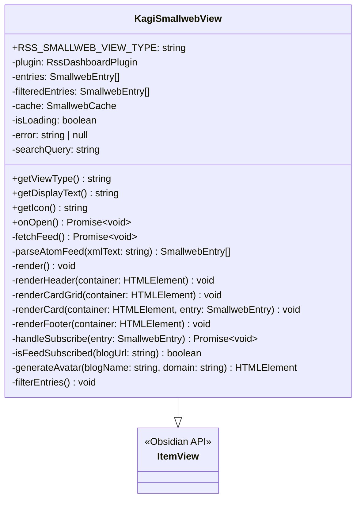
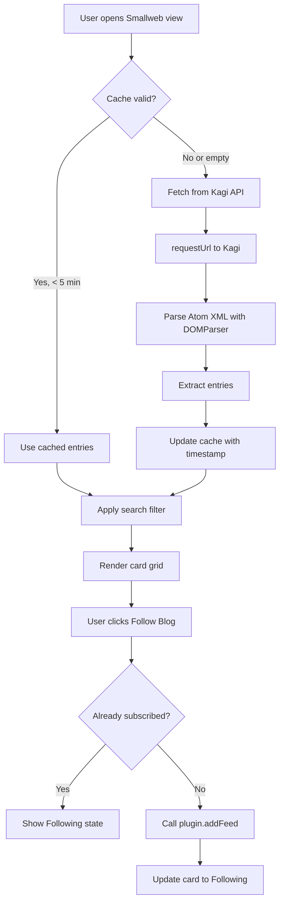

# Kagi Smallweb Discovery Page - Implementation Plan

## Overview

This document outlines the implementation plan for a standalone Kagi Smallweb page that surfaces recently active small web posts as discovery cards. This is a "what's live right now" feed, not a static catalog.

---

## 1. Architecture Audit Summary

### 1.1 Existing Discover Page Structure

**File Location:** [`src/views/discover-view.ts`](src/views/discover-view.ts)

**View Registration Pattern:**

- View type constant: `RSS_DISCOVER_VIEW_TYPE = "rss-discover-view"`
- Extends `ItemView` from Obsidian API
- Registered in [`main.ts`](main.ts:118-121) via `this.registerView()`
- Navigation via `this.plugin.activateDiscoverView()`

**Key Components:**

- Plugin reference passed to constructor for settings access and navigation
- State management via class properties (feeds, filters, isLoading, error)
- Render method empties container and rebuilds on each state change

### 1.2 CSS Classes Inventory

| Element                | CSS Class                           |
| ---------------------- | ----------------------------------- |
| Page container         | `.rss-discover-container`           |
| Layout wrapper         | `.rss-discover-layout`              |
| Sidebar                | `.rss-discover-sidebar`             |
| Content area           | `.rss-discover-content`             |
| Card grid              | `.rss-discover-grid`                |
| Individual card        | `.rss-discover-card`                |
| Card header            | `.rss-discover-card-header`         |
| Card title group       | `.rss-discover-card-title-group`    |
| Card title             | `.rss-discover-card-title`          |
| Card content           | `.rss-discover-card-content`        |
| Card summary           | `.rss-discover-card-summary`        |
| Card type badge        | `.rss-discover-card-type`           |
| Card tags container    | `.rss-discover-card-tags`           |
| Card tag chip          | `.rss-discover-card-tag`            |
| Card footer            | `.rss-discover-card-footer`         |
| Card logo container    | `.rss-discover-card-logo-container` |
| Card initials fallback | `.rss-discover-card-initials`       |
| Header bar             | `.rss-discover-header`              |
| Nav container          | `.rss-dashboard-nav-container`      |
| Nav button             | `.rss-dashboard-nav-button`         |
| Dropdown container     | `.rss-discover-sort-container`      |
| Dropdown select        | `.rss-discover-sort-dropdown`       |
| Loading state          | `.rss-discover-loading`             |
| Error state            | `.rss-discover-error`               |
| Empty state            | `.rss-discover-empty`               |
| Mobile header          | `.rss-discover-mobile-header`       |

### 1.3 Network Request Pattern

**API:** `requestUrl` from Obsidian API (bypasses CORS)

**Pattern from codebase:**

```typescript
import { requestUrl } from "obsidian";

const response = await requestUrl({
  url: "https://example.com/feed",
  method: "GET",
});
const textContent = response.text;
```

### 1.4 Subscribe/Add-Feed Action

**Location:** [`discover-view.ts:1160-1181`](src/views/discover-view.ts:1160-1181)

**Quick Add Flow:**

1. Calls `this.plugin.addFeed(title, url, folderName)`
2. Uses `this.plugin.ensureFolderExists(folderName)` if needed
3. Shows `Notice` on success/failure

**Add to Folder Flow:**

1. Opens `AddToFolderModal` with feed metadata
2. Callback refreshes view after adding

**Duplicate Detection:**

```typescript
const isAdded = this.plugin.settings.feeds.some(
  (f: Feed) => f.url === feed.url,
);
```

### 1.5 Header Navigation Structure

**Location:** [`discover-view.ts:409-431`](src/views/discover-view.ts:409-431)

```typescript
private renderNavTabs(container: HTMLElement): void {
  const navContainer = container.createDiv({
    cls: "rss-dashboard-nav-container",
  });

  const dashboardBtn = navContainer.createDiv({
    cls: "rss-dashboard-nav-button",
  });
  dashboardBtn.appendText("Dashboard");
  dashboardBtn.addEventListener("click", () => void this.plugin.activateView());

  const discoverBtn = navContainer.createDiv({
    cls: "rss-dashboard-nav-button active",
  });
  discoverBtn.appendText("Discover");
}
```

---

## 2. Kagi Smallweb API Analysis

### 2.1 Endpoint

```
GET https://kagi.com/api/v1/smallweb/feed?limit=50
```

### 2.2 Response Format

- **Format:** Atom XML feed (not JSON)
- **Authentication:** None required (free, unauthenticated)
- **Refresh Rate:** ~5 hours by Kagi
- **Query Parameters:** `?limit=` supported

### 2.3 Atom Entry Structure

```xml
<entry>
  <title>Post Title</title>
  <link href="https://example.com/blog/post-slug" rel="alternate"/>
  <author>
    <name>Blog Name</name>
  </author>
  <updated>2024-01-15T10:30:00Z</updated>
  <summary>Post excerpt or full content...</summary>
  <content>Full HTML content (optional)</content>
</entry>
```

### 2.4 Field Mapping

| SmallwebEntry Field | Atom Source                | Notes                          |
| ------------------- | -------------------------- | ------------------------------ |
| `postTitle`         | `<title>`                  | Direct text content            |
| `postUrl`           | `<link href>`              | Attribute extraction           |
| `blogName`          | `<author><name>`           | Fallback to domain             |
| `blogUrl`           | Derived                    | `new URL(postUrl).origin`      |
| `updatedAt`         | `<updated>`                | Parse ISO date                 |
| `excerpt`           | `<summary>` or `<content>` | Strip HTML, truncate 200 chars |
| `domain`            | Derived                    | `new URL(postUrl).hostname`    |

---

## 3. Data Model

### 3.1 SmallwebEntry Interface

```typescript
interface SmallwebEntry {
  postTitle: string; // <title> text content
  postUrl: string; // <link href="...">
  blogName: string; // <author><name> or domain fallback
  blogUrl: string; // derived: URL.origin
  updatedAt: Date; // parsed from <updated>
  excerpt: string; // stripped & truncated to 200 chars
  domain: string; // extracted hostname
}
```

### 3.2 Cache State

```typescript
interface SmallwebCache {
  entries: SmallwebEntry[];
  fetchedAt: Date;
}
```

---

## 4. Component Architecture

### 4.1 File Structure

```
src/
├── views/
│   └── kagi-smallweb-view.ts    # New standalone view
├── types/
│   └── smallweb-types.ts        # SmallwebEntry interface (optional)
```

### 4.2 View Class Structure



### 4.3 Data Flow



---

## 5. Implementation Phases

### Phase 1: Core View Setup

- [ ] Create `src/views/kagi-smallweb-view.ts`
- [ ] Define `RSS_SMALLWEB_VIEW_TYPE` constant
- [ ] Implement constructor with plugin reference
- [ ] Register view in `main.ts`
- [ ] Add `activateSmallwebView()` method to plugin
- [ ] Add command for opening Smallweb view

### Phase 2: Data Fetching & Parsing

- [ ] Implement `fetchFeed()` using `requestUrl`
- [ ] Implement Atom XML parsing with `DOMParser`
- [ ] Create `SmallwebEntry` interface
- [ ] Implement field extraction with error handling
- [ ] Implement HTML stripping and excerpt truncation
- [ ] Add 5-minute cache with timestamp check

### Phase 3: UI Rendering

- [ ] Implement `render()` method
- [ ] Implement header with title, subtitle, refresh button
- [ ] Implement "Updated X minutes ago" timestamp display
- [ ] Implement card grid using existing CSS classes
- [ ] Implement card rendering with:
  - [ ] Blog name as title
  - [ ] Post title as sub-line
  - [ ] Excerpt as summary
  - [ ] Domain as primary tag
  - [ ] Relative time as secondary tag
  - [ ] "Smallweb" type badge
  - [ ] Letter avatar fallback
- [ ] Implement footer with attribution

### Phase 4: Loading & Error States

- [ ] Implement loading skeleton cards (6 skeletons)
- [ ] Implement error state with retry button
- [ ] Implement empty state (should not occur but handle gracefully)

### Phase 5: Search & Filter

- [ ] Add search input in header
- [ ] Implement case-insensitive substring search
- [ ] Search fields: blogName, domain, postTitle, excerpt
- [ ] Implement 150ms debounce
- [ ] Show "X results" count when query active

### Phase 6: Subscribe Flow

- [ ] Implement "Follow Blog" button
- [ ] Check if feed already subscribed
- [ ] Show "Following" state for subscribed feeds
- [ ] Call `plugin.addFeed()` with blogUrl
- [ ] Handle subscribe errors gracefully
- [ ] No modal/confirmation - single click action

### Phase 7: Navigation Integration

- [ ] Add "Smallweb" button to Discover page header
- [ ] Add "Discover" back link in Smallweb header
- [ ] Match existing nav button styling

### Phase 8: Polish & Edge Cases

- [ ] Handle CORS (requestUrl bypasses)
- [ ] Truncate large excerpts at 200 chars
- [ ] Wrap per-entry parsing in try/catch
- [ ] Handle subdomain blogUrl correctly
- [ ] Fallback to domain for missing author
- [ ] Allow duplicate blog entries (multiple posts)
- [ ] Test responsive grid in narrow panes
- [ ] Verify dark mode compatibility

---

## 6. Edge Cases & Solutions

| Edge Case                | Solution                                  |
| ------------------------ | ----------------------------------------- |
| CORS restrictions        | `requestUrl` bypasses CORS in Obsidian    |
| Large `<content>` fields | Always truncate to 200 chars              |
| Malformed XML entries    | try/catch per entry, skip silently        |
| Missing `<author><name>` | Fallback to domain name                   |
| Subdomain blog URLs      | Use full `URL.origin`, not apex domain    |
| Same blog multiple posts | Render each as separate card              |
| Narrow/mobile panes      | Inherit responsive grid from discover.css |
| Feed already subscribed  | Show "Following" state immediately        |
| Subscribe failure        | Show inline error on card                 |

---

## 7. CSS Considerations

### 7.1 Reused Classes (No New CSS Needed)

- All card layout: `.rss-discover-card`, `.rss-discover-card-header`, etc.
- Grid layout: `.rss-discover-grid`
- Loading/error states: `.rss-discover-loading`, `.rss-discover-error`

### 7.2 New CSS Classes (Minimal)

- `.rss-smallweb-header` - Header with Kagi branding
- `.rss-smallweb-subtitle` - Subtitle text
- `.rss-smallweb-timestamp` - "Updated X ago" display
- `.rss-smallweb-avatar` - Letter avatar styling
- `.rss-smallweb-badge` - "Smallweb" type badge with distinct color
- `.rss-smallweb-footer` - Attribution footer

### 7.3 Letter Avatar Implementation

```typescript
private generateAvatar(blogName: string, domain: string): HTMLElement {
  const container = createDiv({ cls: "rss-discover-card-logo-container rss-smallweb-avatar" });
  const letter = blogName.charAt(0).toUpperCase();
  const color = this.getColorFromDomain(domain);
  container.style.backgroundColor = color;
  container.createDiv({ cls: "rss-discover-card-initials", text: letter });
  return container;
}

private getColorFromDomain(domain: string): string {
  const colors = [
    "hsl(0, 60%, 75%)",   // Red
    "hsl(30, 60%, 75%)",  // Orange
    "hsl(60, 60%, 75%)",  // Yellow
    "hsl(120, 60%, 75%)", // Green
    "hsl(180, 60%, 75%)", // Cyan
    "hsl(210, 60%, 75%)", // Blue
    "hsl(270, 60%, 75%)", // Purple
    "hsl(330, 60%, 75%)", // Pink
  ];
  let hash = 0;
  for (let i = 0; i < domain.length; i++) {
    hash = domain.charCodeAt(i) + ((hash << 5) - hash);
  }
  return colors[Math.abs(hash) % colors.length];
}
```

---

## 8. Testing Checklist

- [ ] View opens correctly from command
- [ ] Feed fetches and parses without errors
- [ ] Cards render with correct data
- [ ] Letter avatars display correctly
- [ ] Search filters cards in real-time
- [ ] Subscribe button works for new feeds
- [ ] "Following" state shows for existing feeds
- [ ] Cache prevents unnecessary refetches
- [ ] Refresh button forces new fetch
- [ ] Navigation to/from Discover works
- [ ] Responsive layout works on narrow panes
- [ ] Dark mode renders correctly
- [ ] Error state shows with retry option
- [ ] Loading skeletons display during fetch

---

## 9. Constraints Verification

| Constraint                                 | Status                       |
| ------------------------------------------ | ---------------------------- |
| No modification to existing Discover logic | ✅ Only adding nav button    |
| No new npm dependencies                    | ✅ Using DOMParser           |
| No native fetch                            | ✅ Using requestUrl          |
| No disk storage                            | ✅ Memory cache only         |
| Dark mode compatible                       | ✅ Using CSS variables       |
| Follows existing code style                | ✅ TypeScript, same patterns |

---

## 10. File Changes Summary

| File                              | Action | Description                          |
| --------------------------------- | ------ | ------------------------------------ |
| `src/views/kagi-smallweb-view.ts` | Create | New standalone view                  |
| `main.ts`                         | Modify | Register view, add activation method |
| `src/views/discover-view.ts`      | Modify | Add Smallweb nav button              |
| `src/styles/discover.css`         | Modify | Add minimal Smallweb-specific styles |

---

## 11. Implementation Notes

### CORS Handling

The `requestUrl` API in Obsidian bypasses CORS restrictions by routing requests through the Electron layer. This allows direct calls to the Kagi API without proxy services.

### Feed URL for Subscription

When subscribing, use the blog's root URL (`blogUrl`) as the feed URL. The existing `FeedParser` will attempt to discover the actual RSS/Atom feed from that URL.

### Relative Time Formatting

```typescript
private getRelativeTime(date: Date): string {
  const now = new Date();
  const diffMs = now.getTime() - date.getTime();
  const diffMins = Math.floor(diffMs / 60000);
  const diffHours = Math.floor(diffMins / 60);
  const diffDays = Math.floor(diffHours / 24);

  if (diffMins < 1) return "Just now";
  if (diffMins < 60) return `${diffMins} minute${diffMins > 1 ? 's' : ''} ago`;
  if (diffHours < 24) return `${diffHours} hour${diffHours > 1 ? 's' : ''} ago`;
  return `${diffDays} day${diffDays > 1 ? 's' : ''} ago`;
}
```

### HTML Stripping

```typescript
private stripHtml(html: string): string {
  const doc = new DOMParser().parseFromString(html, "text/html");
  return doc.body.textContent || "";
}
```
