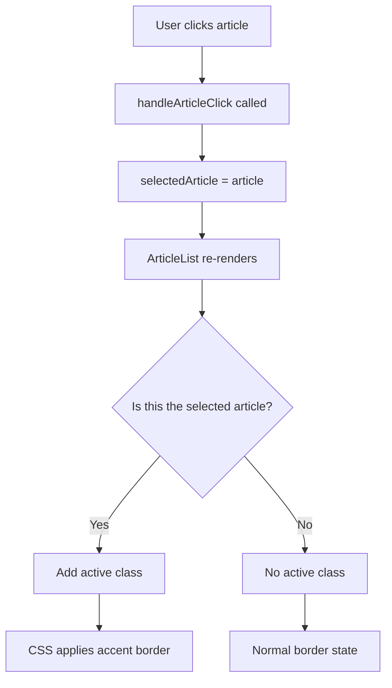

# Open Article Border Indicator Implementation Plan

## Overview

When a card is "open" (meaning the user has clicked on it to read it in the viewer), we should change the border state to be a solid color that matches the hover state to indicate that article is open in the viewer. When the card is "closed" (not open in the side panel), it should remove the border and return to normal state.

## Current Implementation Analysis

### Article Selection State

- In [`dashboard-view.ts:24`](src/views/dashboard-view.ts:24), there's a `selectedArticle` property that tracks the currently selected/open article
- When an article is clicked, [`handleArticleClick()`](src/views/dashboard-view.ts:755) sets `this.selectedArticle = article`
- The `selectedArticle` is passed to the `ArticleList` component constructor

### Card View - Already Has Active State

In [`article-list.ts:909-921`](src/components/article-list.ts:909), the card view already applies an "active" class:

```typescript
const card = container.createDiv({
    cls:
        "rss-dashboard-article-card" +
        (article === this.selectedArticle ? " active" : "") +
        ...
});
```

### List View - Missing Active State

In [`article-list.ts:501-512`](src/components/article-list.ts:501), the list view does NOT apply an "active" class:

```typescript
const articleEl = container.createDiv({
    cls:
        "rss-dashboard-article-item" +
        (article.read ? " read" : " unread") +
        // Missing: (article === this.selectedArticle ? " active" : "")
        ...
});
```

### CSS Styling - Already Exists

The CSS for the active state is already defined in [`articles.css:100-104`](src/styles/articles.css:100):

```css
.rss-dashboard-article-item:hover,
.rss-dashboard-article-item.active {
	box-shadow: 0 4px 16px rgb(0 0 0 / 0.08);
	border-color: var(--interactive-accent);
}
```

And for cards in [`articles.css:177-180`](src/styles/articles.css:177):

```css
.rss-dashboard-article-card.active {
	background-color: var(--background-modifier-active);
	border-color: var(--interactive-accent);
}
```

## Problem Summary

The list view is missing the "active" class in the class list. The CSS is already there, but the TypeScript code doesn't add the class when an article is selected.

## Implementation Steps

### Step 1: Add Active Class to List View Items

**File:** [`src/components/article-list.ts`](src/components/article-list.ts:501)

Add the active class check to the list view article element, similar to how it's done for card view:

```typescript
const articleEl = container.createDiv({
	cls:
		"rss-dashboard-article-item" +
		(article === this.selectedArticle ? " active" : "") + // ADD THIS LINE
		(article.read ? " read" : " unread") +
		(article.starred ? " starred" : " unstarred") +
		(article.saved ? " saved" : "") +
		(article.mediaType === "video" ? " video" : "") +
		(article.mediaType === "podcast" ? " podcast" : ""),
	attr: { id: `article-${article.guid}` },
});
```

### Step 2: Verify CSS Consistency

The existing CSS should work correctly. The hover state and active state share the same styling:

- Border color: `var(--interactive-accent)`
- Box shadow: `0 4px 16px rgb(0 0 0 / 0.08)` for list items

For cards, the active state has:

- Border color: `var(--interactive-accent)`
- Background color: `var(--background-modifier-active)`

This matches the hover state behavior, which is exactly what was requested.

## Files to Modify

| File                                                                   | Change                              |
| ---------------------------------------------------------------------- | ----------------------------------- |
| [`src/components/article-list.ts`](src/components/article-list.ts:501) | Add active class to list view items |

## Testing Checklist

- [ ] Click on an article in list view - border should change to accent color
- [ ] Click on another article - previous article's border should return to normal, new article should have accent border
- [ ] Click on an article in card view - verify it still works as expected
- [ ] Close the reader view - the border should return to normal
- [ ] Verify the styling matches the hover state

## Diagram: Article Selection Flow



## Notes

- The implementation is minimal - only one line of code needs to be added
- The CSS is already in place and working
- This change will make the list view behavior consistent with the card view
