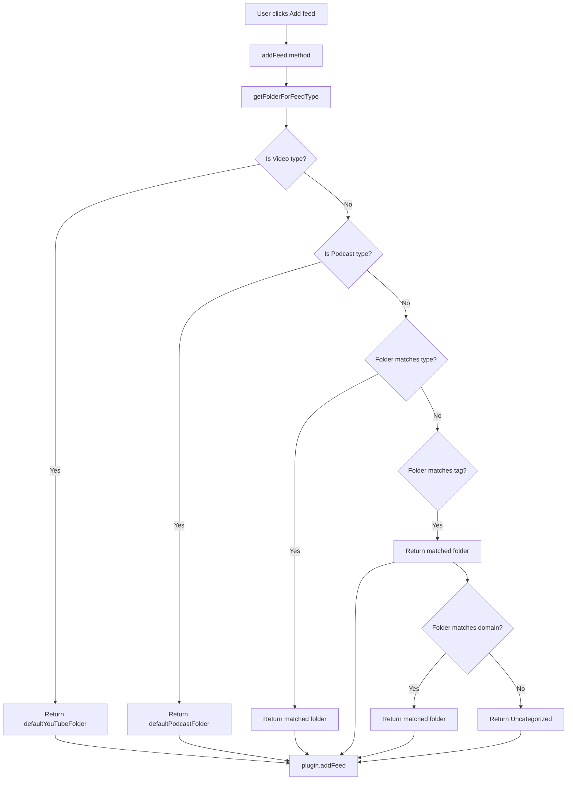

# Smart Folder Matching for Discover Feeds

## Problem Statement

When adding feeds from the Discover page, the current logic only considers video and podcast types for folder placement. All other feed types default to "Uncategorized", even when folders exist that match the feed's category.

**Example:** Adding "Science News Magazine" which has `type: "News"` and `tags: ["news", "science"]` currently goes to "Uncategorized" instead of checking if a "News" folder exists.

## Current Behavior

The [`getFolderForFeedType()`](src/views/discover-view.ts:1102) method in `discover-view.ts`:

```typescript
private getFolderForFeedType(feedType: string): string {
    const videoTypes = ['YouTube', 'video series', 'vlog'];
    const podcastTypes = ['Podcast'];

    if (videoTypes.includes(feedType)) {
        return this.plugin.settings.media.defaultYouTubeFolder;
    } else if (podcastTypes.includes(feedType)) {
        return this.plugin.settings.media.defaultPodcastFolder;
    }

    return "Uncategorized";
}
```

This only handles:

- Video types → `defaultYouTubeFolder` (default: "Videos")
- Podcast types → `defaultPodcastFolder` (default: "Podcasts")
- Everything else → "Uncategorized"

## Proposed Solution

Enhance the folder matching logic to check multiple data points from the feed metadata:

### Matching Priority (in order):

1. **Video/Podcast types** (existing behavior - highest priority)
    - YouTube, video series, vlog → defaultYouTubeFolder
    - Podcast → defaultPodcastFolder

2. **Feed Type matching**
    - Check if a folder exists with the same name as the feed's `type`
    - Types include: "News", "Magazine", "Blog", "Newsletter", "Journal", etc.

3. **Tag matching**
    - Check if any folder matches one of the feed's `tags`
    - Tags are lowercase in the feed data, so case-insensitive matching needed

4. **Domain matching** (optional enhancement)
    - Check if any folder matches the feed's `domain` (e.g., "Technology", "Science")

5. **Fallback**
    - "Uncategorized" if no match found

### Implementation Details

#### New Helper Method: `folderExists()`

Create a helper method to check if a folder exists by name (case-insensitive):

```typescript
private folderExists(folderName: string): string | null {
    const lowerName = folderName.toLowerCase();

    const findFolder = (folders: Folder[]): string | null => {
        for (const folder of folders) {
            if (folder.name.toLowerCase() === lowerName) {
                return folder.name;
            }
            // Check subfolders
            const found = findFolder(folder.subfolders);
            if (found) return found;
        }
        return null;
    };

    return findFolder(this.settings.folders);
}
```

#### Enhanced `getFolderForFeedType()` Method

```typescript
private getFolderForFeedType(feed: FeedMetadata): string {
    // 1. Check video/podcast types first (existing behavior)
    const videoTypes = ['YouTube', 'video series', 'vlog'];
    const podcastTypes = ['Podcast'];

    if (videoTypes.includes(feed.type)) {
        return this.plugin.settings.media.defaultYouTubeFolder;
    }
    if (podcastTypes.includes(feed.type)) {
        return this.plugin.settings.media.defaultPodcastFolder;
    }

    // 2. Check if folder matches feed type
    const typeMatch = this.folderExists(feed.type);
    if (typeMatch) {
        return typeMatch;
    }

    // 3. Check if folder matches any tag
    for (const tag of feed.tags) {
        const tagMatch = this.folderExists(tag);
        if (tagMatch) {
            return tagMatch;
        }
    }

    // 4. Check if folder matches any domain
    for (const domain of feed.domain) {
        const domainMatch = this.folderExists(domain);
        if (domainMatch) {
            return domainMatch;
        }
    }

    // 5. Fallback to Uncategorized
    return "Uncategorized";
}
```

### API Change Required

The [`addFeed()`](src/views/discover-view.ts:1092) method currently passes only `feed.type`:

```typescript
private async addFeed(feed: FeedMetadata): Promise<void> {
    try {
        const folder = this.getFolderForFeedType(feed.type);
        await this.plugin.addFeed(feed.title, feed.url, folder);
    } catch (error) {
        new Notice(`Failed to add feed: ${error instanceof Error ? error.message : 'Unknown error'}`);
    }
}
```

This needs to be changed to pass the entire `feed` object:

```typescript
private async addFeed(feed: FeedMetadata): Promise<void> {
    try {
        const folder = this.getFolderForFeedType(feed);
        await this.plugin.addFeed(feed.title, feed.url, folder);
    } catch (error) {
        new Notice(`Failed to add feed: ${error instanceof Error ? error.message : 'Unknown error'}`);
    }
}
```

## Data Flow Diagram



## Example Scenarios

| Feed                  | Type     | Tags                 | Domain              | Existing Folders       | Result                                   |
| --------------------- | -------- | -------------------- | ------------------- | ---------------------- | ---------------------------------------- |
| Science News Magazine | News     | news, science        | Science             | News, Videos, Podcasts | **News**                                 |
| WIRED                 | Magazine | tech, innovation     | Technology          | Technology, Videos     | **Technology**                           |
| BBC News - World      | News     | news, international  | News                | Videos, Podcasts       | **Uncategorized**                        |
| Lex Fridman Podcast   | Podcast  | AI, robotics, ethics | Technology, Science | Podcasts, Technology   | **Podcasts** (type match takes priority) |
| Two Minute Papers     | YouTube  | AI, videos           | Technology          | Videos, AI             | **Videos** (type match takes priority)   |

## Files to Modify

1. **[`src/views/discover-view.ts`](src/views/discover-view.ts)**
    - Add `folderExists()` helper method
    - Modify `getFolderForFeedType()` to accept full `FeedMetadata` object
    - Update `addFeed()` to pass full feed object

## Testing Considerations

1. Test with various folder configurations:
    - No matching folders → should fall back to "Uncategorized"
    - Multiple matching folders → should use first match in priority order
    - Case-insensitive matching → "News" folder should match "news" tag

2. Test with edge cases:
    - Empty tags array
    - Empty domain array
    - Nested subfolders
    - Folders with special characters

## Benefits

1. **Better organization**: Feeds automatically go to appropriate folders
2. **Less manual work**: Users don't need to move feeds after adding
3. **Flexible matching**: Multiple fallback options ensure good matches
4. **Backward compatible**: Existing video/podcast behavior unchanged
