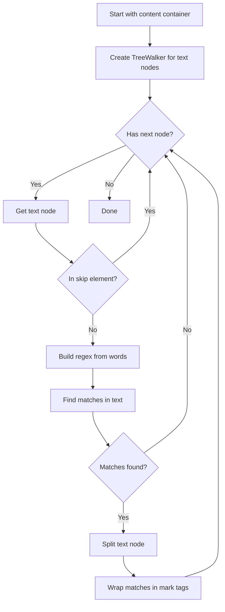

# Word Highlighting Feature Plan

## Overview

Add the ability for users to create a list of words/phrases that get highlighted in RSS article content. This helps users quickly identify topics of interest while reading.

## Feature Scope

### Phase 1 (Initial Implementation)

- Highlight words with user-selectable locations:
  - Article content (reader view)
  - Article titles (list/card view)
  - Article summaries/descriptions (card view)
- Users can mix and match - enable any combination of the three
- Settings-based word management in Display tab
- Case-insensitive matching by default
- Whole-word matching option
- Phrase support (multi-word highlights)
- Single default color with optional per-word customization

### Phase 2 (Future Enhancement)

- Context menu "Add to highlights" in reader view

---

## Data Structure

### New Types to Add in [`src/types/types.ts`](src/types/types.ts)

```typescript
export interface HighlightWord {
  id: string;
  text: string;
  color?: string; // Optional per-word color, falls back to default
  enabled: boolean;
  createdAt: number;
}

export interface HighlightSettings {
  enabled: boolean;
  defaultColor: string; // Default: "#ffeb3b" (yellow)
  caseSensitive: boolean; // Default: false
  wholeWord: boolean; // Default: true
  highlightInContent: boolean; // Default: true - reader view
  highlightInTitles: boolean; // Default: false - list/card view
  highlightInSummaries: boolean; // Default: false - card view descriptions
  words: HighlightWord[];
}
```

### Settings Integration

Add to `RssDashboardSettings` interface:

```typescript
export interface RssDashboardSettings {
  // ... existing properties
  highlights: HighlightSettings;
}
```

### Default Settings

Add to `DEFAULT_SETTINGS`:

```typescript
highlights: {
  enabled: false,
  defaultColor: "#ffeb3b",
  caseSensitive: false,
  wholeWord: true,
  highlightInContent: true,
  highlightInTitles: false,
  highlightInSummaries: false,
  words: []
}
```

---

## Implementation Components

### 1. Settings UI

**File:** [`src/settings/settings-tab.ts`](src/settings/settings-tab.ts)

Add a new "Highlights" section within the Display tab (after existing display settings):

```
Display Tab
├── Show cover images
├── Show summary
├── ... existing settings ...
├── ───────────────────
└── Highlights Section
    ├── Enable highlights (toggle)
    ├── Default highlight color (color picker)
    ├── Case sensitive (toggle)
    ├── Whole word only (toggle)
    ├── Highlight locations:
    │   ├── Article content (toggle) - default ON
    │   ├── Article titles (toggle) - default OFF
    │   └── Summaries (toggle) - default OFF
    └── Highlight words list
        ├── Word 1 [color] [enabled] [delete]
        ├── Word 2 [color] [enabled] [delete]
        └── [Add new word input]
```

### 2. Highlight Service

**New File:** `src/services/highlight-service.ts`

Create a dedicated service for highlight logic:

```typescript
export class HighlightService {
  private settings: HighlightSettings;

  constructor(settings: HighlightSettings) {
    this.settings = settings;
  }

  /**
   * Process HTML content and wrap matching words in <mark> tags
   */
  highlightContent(html: string): string;

  /**
   * Process a DOM node and apply highlights to text nodes
   */
  private highlightTextNode(node: Text): void;

  /**
   * Build regex pattern from highlight words
   */
  private buildPattern(): RegExp;

  /**
   * Check if element should be skipped (code, pre, etc.)
   */
  private shouldSkipElement(element: HTMLElement): boolean;
}
```

### 3. Reader View Integration

**File:** [`src/views/reader-view.ts`](src/views/reader-view.ts)

Modify the `renderArticle()` method to apply highlights after content is parsed:

```typescript
private renderArticle(item: FeedItem, fullContent?: string): void {
  // ... existing code ...

  // After content is added to contentContainer
  if (this.settings.highlights.enabled) {
    this.applyHighlights(contentContainer);
  }
}

private applyHighlights(container: HTMLElement): void {
  const highlightService = new HighlightService(this.settings.highlights);
  // Process text nodes and wrap matches
}
```

### 4. CSS Styles

**File:** [`src/styles/reader.css`](src/styles/reader.css) or new file

```css
/* Highlight styles */
.rss-reader-article-content mark.highlight-word {
  background-color: var(--highlight-color, #ffeb3b);
  padding: 0.1em 0.2em;
  border-radius: 3px;
  color: inherit;
}

/* Dark theme support */
.theme-dark .rss-reader-article-content mark.highlight-word {
  background-color: var(--highlight-color, #ffeb3b);
  opacity: 0.85;
}
```

---

## Algorithm: DOM-Based Highlighting

Using DOM traversal instead of regex on HTML strings to avoid issues with attributes and nested elements:



### Skip Elements

Do not highlight inside:

- `<code>` - Code blocks
- `<pre>` - Preformatted text
- `<script>` - Scripts
- `<style>` - Styles
- `<a>` - Links (optional, may want to highlight)
- Existing `<mark>` tags

---

## Files to Modify

| File                             | Changes                                                |
| -------------------------------- | ------------------------------------------------------ |
| `src/types/types.ts`             | Add `HighlightWord` and `HighlightSettings` interfaces |
| `src/settings/settings-tab.ts`   | Add highlights section to Display tab                  |
| `src/views/reader-view.ts`       | Apply highlights in `renderArticle()` for content      |
| `src/components/article-list.ts` | Apply highlights to titles and summaries               |
| `src/styles/reader.css`          | Add highlight CSS styles                               |
| `main.ts`                        | Pass highlight settings to views                       |

## Files to Create

| File                                | Purpose                            |
| ----------------------------------- | ---------------------------------- |
| `src/services/highlight-service.ts` | Highlight logic and DOM processing |

---

## Testing Considerations

1. **Performance**: Test with large articles and many highlight words
2. **Edge cases**:
   - Words spanning element boundaries
   - Special regex characters in words
   - Unicode/international characters
   - Very long phrases
3. **Theme compatibility**: Test with light and dark themes
4. **Mobile**: Ensure highlights work on mobile view

---

## Future Enhancements (Phase 2)

### Quick Add Context Menu

- Select text in reader view
- Right-click to show "Add to highlights" option
- Opens mini-modal to confirm and pick color

### Import/Export

- Export highlight word list
- Import from file
- Share highlight lists between users

---

## Implementation Order

1. [x] Add types to `src/types/types.ts`
2. [x] Add default settings to `DEFAULT_SETTINGS`
3. [ ] Create `src/services/highlight-service.ts`
4. [ ] Add highlight styles to CSS
5. [ ] Integrate highlight service in `reader-view.ts` (content)
6. [ ] Integrate highlight service in `article-list.ts` (titles/summaries)
7. [ ] Add settings UI in `settings-tab.ts`
8. [ ] Test and refine
