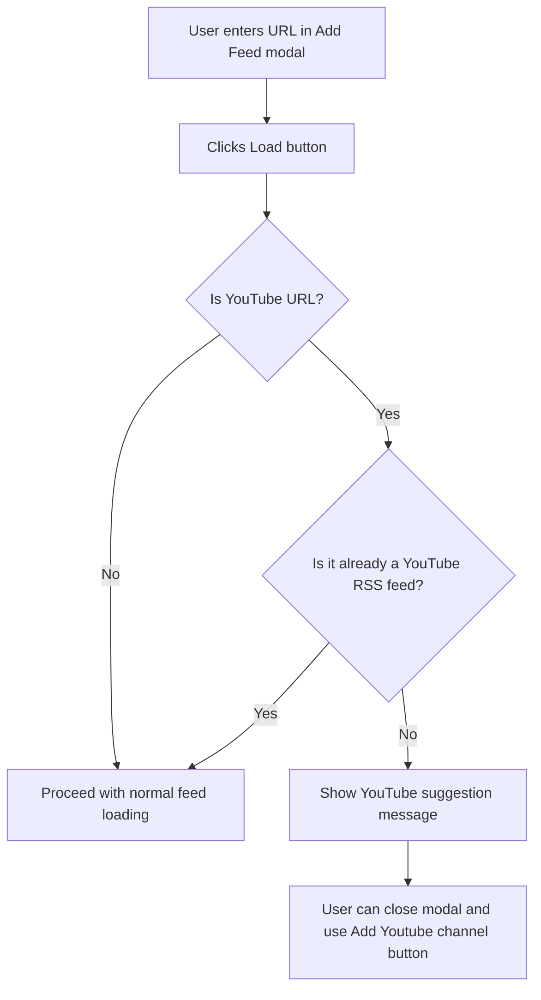

# YouTube URL Detection in Add Feed Modal

## Problem Statement

When users attempt to add a YouTube channel URL in the "Add Feed" modal, the feed loading fails with an error. This happens because YouTube channel URLs (e.g., `https://www.youtube.com/@channelname`) are not RSS feeds - they need to be converted to the YouTube RSS feed format (`https://www.youtube.com/feeds/videos.xml?channel_id=XXX`).

The plugin already has a dedicated "Add Youtube channel" button in the sidebar that handles this conversion properly, but users may not be aware of it and naturally try to use the generic "Add feed" modal.

## Current Implementation

### AddFeedModal Location

- File: [`src/modals/feed-manager-modal.ts`](src/modals/feed-manager-modal.ts)
- Class: `AddFeedModal` (lines 464-868)
- The Load button click handler is at lines 543-597

### YouTube Detection

- File: [`src/services/media-service.ts`](src/services/media-service.ts)
- `YOUTUBE_PATTERNS` array (lines 5-13) includes:
    - `youtube.com/feeds/videos.xml` - the actual RSS feed
    - `youtube.com/channel/`
    - `youtube.com/user/`
    - `youtube.com/c/`
    - `youtube.com/@`
    - `youtube.com/watch`
    - `youtu.be/`
- [`MediaService.isYouTubeFeed(url)`](src/services/media-service.ts:16) - checks if URL matches YouTube patterns
- [`MediaService.getYouTubeRssFeed(input)`](src/services/media-service.ts:22) - converts YouTube URLs to RSS feed URLs

### YouTube Channel Adding

- File: [`src/components/sidebar.ts`](src/components/sidebar.ts)
- [`showAddYouTubeFeedModal()`](src/components/sidebar.ts:747) - dedicated modal for YouTube channels

## Proposed Solution

### Detection Logic

Add a check in the `AddFeedModal` Load button handler to detect YouTube URLs BEFORE attempting to load the feed. The detection should:

1. Check if the URL matches YouTube patterns using `MediaService.isYouTubeFeed()`
2. Exclude URLs that are already YouTube RSS feeds (`youtube.com/feeds/videos.xml`)
3. Show a helpful message suggesting the user use the "Add Youtube channel" button

### User Experience Flow



### Implementation Details

#### 1. Import MediaService in feed-manager-modal.ts

The file already imports from `feed-parser.ts` but needs to import `MediaService` from `media-service.ts`:

```typescript
import { MediaService } from "../services/media-service";
```

#### 2. Add YouTube Detection Helper Function

Create a helper function to check if a URL is a YouTube channel/page URL but NOT already an RSS feed:

```typescript
/**
 * Check if URL is a YouTube page URL that should use the Add Youtube channel feature
 * Returns false for YouTube RSS feed URLs
 */
function isYouTubePageUrl(url: string): boolean {
	if (!url) return false;

	// Check if it matches YouTube patterns
	if (!MediaService.isYouTubeFeed(url)) return false;

	// Exclude YouTube RSS feed URLs
	if (url.includes("youtube.com/feeds/videos.xml")) return false;

	return true;
}
```

#### 3. Modify the Load Button Handler

In the `AddFeedModal.onOpen()` method, modify the Load button click handler (around line 543):

```typescript
.addButton((btn) => {
    btn.setButtonText("Load").onClick(() => {
        void (async () => {
            // Check for YouTube page URLs first
            if (isYouTubePageUrl(url)) {
                status = "YouTube URL detected. Please use 'Add Youtube channel' button instead.";
                if (refs.statusDiv) {
                    refs.statusDiv.textContent = status;
                    refs.statusDiv.addClass("rss-dashboard-status-warning");
                }
                return;
            }

            // Existing loading logic...
            status = "Loading...";
            // ... rest of existing code
        })();
    });
});
```

#### 4. Add Warning Style

Add a CSS class for the warning status in [`src/styles/modals.css`](src/styles/modals.css):

```css
.rss-dashboard-status-warning {
	color: var(--text-warning, #e6a700);
	font-weight: 500;
}
```

### Alternative Enhancement: Direct Conversion

As an alternative or additional enhancement, we could automatically convert the YouTube URL to its RSS feed equivalent using `MediaService.getYouTubeRssFeed()`. However, this would duplicate functionality that already exists in the dedicated YouTube modal, which provides more context and guidance.

## Files to Modify

1. **[`src/modals/feed-manager-modal.ts`](src/modals/feed-manager-modal.ts)**
    - Import `MediaService` from `../services/media-service`
    - Add `isYouTubePageUrl()` helper function
    - Modify Load button handler in `AddFeedModal` to check for YouTube URLs
    - Also apply same check to `EditFeedModal` for consistency

2. **[`src/styles/modals.css`](src/styles/modals.css)**
    - Add `.rss-dashboard-status-warning` CSS class

## Testing Considerations

- Test with various YouTube URL formats:
    - `https://www.youtube.com/@channelname`
    - `https://www.youtube.com/channel/UCxxxxxx`
    - `https://www.youtube.com/user/username`
    - `https://www.youtube.com/c/customname`
    - `https://youtu.be/xxxxx`
    - `https://www.youtube.com/watch?v=xxxxx`
- Verify that YouTube RSS feeds still work:
    - `https://www.youtube.com/feeds/videos.xml?channel_id=UCxxxxxx`
- Ensure regular RSS feeds are not affected
