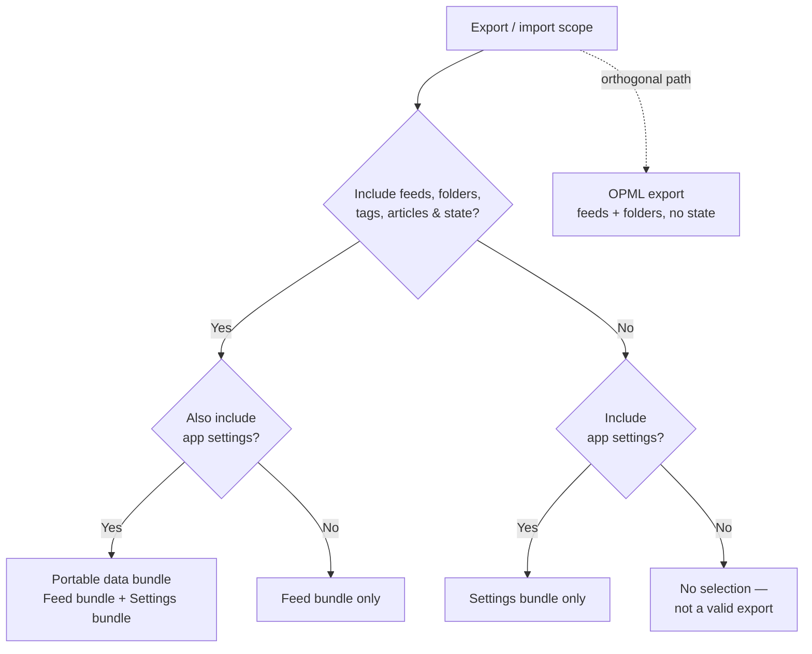
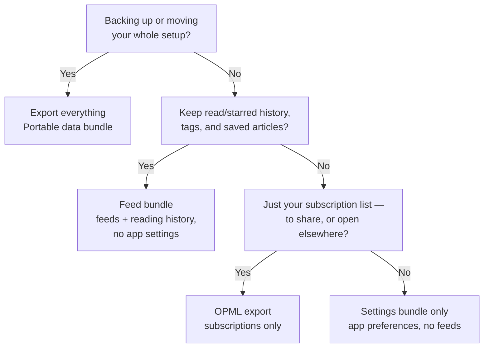

# Export Bundle Hierarchy Plan

Implements [ADR 0005](../adr/0005-split-portable-data-bundle-into-feed-and-settings-bundles.md): split the single portable data bundle into an independently exportable/importable Feed bundle and Settings bundle, while keeping the combined Portable data bundle and OPML export as-is.

## Goal

Let a user choose what they're exporting/importing instead of always getting everything:

- **Portable data bundle** (existing, unchanged content) = Feed bundle + Settings bundle.
- **Feed bundle** (new) = feeds, folders, tags, articles, article state (read/starred/tags/saved/playback). No app settings.
- **Settings bundle** (re-scoped from `usersettings.json`) = app preferences only. No feeds, folders, tags, or articles.
- **OPML export** (existing, unchanged) = feeds + folders, no state, no settings. Stays as the orthogonal no-state/interop path.

## Vocabulary

See `CONTEXT.md` → Storage → "Portable data bundle" for the canonical definition and cross-reference to ADR 0005. "Feed bundle" and "Settings bundle" are introduced by this plan and should be added to `CONTEXT.md` once implemented (not before — they don't exist yet).

## Technical hierarchy

Two toggles, four valid outcomes. No per-feed selection and no separate state toggle inside the JSON buckets — OPML already covers the no-state case.

## User-facing decision tree

Plain-language flow for the eventual settings-tab modal. Text-based decision tree is the first pass; the UI can be built as a wizard later without changing the logic below.

## Locked design decisions

| Decision | Rationale |
|---|---|
| Two-way split only — content+state vs. settings | No per-feed selection or state-exclusion toggle inside a bundle; OPML already serves the no-state case. |
| Folders and tags live in the Feed bundle | Fixes today's split behavior, where `usersettings.json` excludes them but the portable bundle's `metadata` includes them. |
| Symmetric import for all three JSON buckets | An export you can't import back isn't a real backup — undercuts the bug-recovery motivation. |
| No platform restriction | Portability is a stated product value; no usage data justifies gating it to desktop. |
| Storage-tab / Import-Export-tab button duplication left as-is | Existing tech debt, out of scope for this plan — needs its own follow-up. |

## Out of scope

- Deduplicating the portable-bundle controls currently repeated on both the Storage tab and the Import/Export tab.
- Per-feed selection or any state-exclusion toggle within the Feed bundle.
- Platform-specific (desktop-only) restrictions on any export/import path.

## Red-Green TDD Shape

### Red

1. Add `feed-storage-repository` tests that fail until `buildFeedBundle(settings)` and `buildSettingsBundle(settings)` exist, each producing the field subset defined above.
2. Add import tests that fail until `importFeedBundle(...)` and `importSettingsBundle(...)` exist, each validating and merging only their scope without touching the other.
3. Add a settings-tab test that fails until "Storage actions" (or wherever this lands) offers all three JSON scopes plus OPML, matching the decision-tree labels above.
4. Add a `usersettings.json`-equivalent regression test confirming the re-scoped Settings bundle still excludes `feeds`, and now also excludes `folders`/`availableTags` for Feed bundle exports instead of Settings bundle ones.

### Green

1. Implement `buildFeedBundle` / `buildSettingsBundle` in `src/services/feed-storage-repository.ts`, factored out of the existing `buildPortableDataBundle` so the combined bundle stays `{ ...feedBundle, ...settingsBundle }`-equivalent.
2. Implement matching import functions with the same rollback-on-failure behavior as `importPortableDataBundle`.
3. Add UI (button group or modal) presenting the four choices from the decision tree; wire to the plugin methods.
4. Update `CONTEXT.md` with the "Feed bundle" and "Settings bundle" glossary entries once the above lands.
