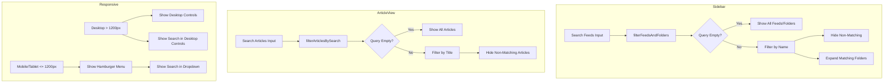

# Search Feature Refactor Plan

## Overview

This plan outlines the implementation of moving the article search feature from the sidebar to the article view, and converting the sidebar search to a "search feeds" feature that only searches feed and folder names.

## Current State Analysis

### Sidebar Search (sidebar.ts)

- Located in `renderFilters()` method (lines 1425-1541)
- Toggle button with search icon that expands/collapses a search input
- Placeholder text: "Search articles..."
- Searches article titles in the main content area by adding CSS classes (`hidden`/`visible`)
- Uses debouncing (150ms) for performance

### Article List Header (article-list.ts)

- Has `createControls()` method that creates filter controls
- Desktop controls and hamburger menu dropdown controls
- Contains: Filter button, Age dropdown, Sort dropdown, Group dropdown, View toggle, Refresh button, Mark all read button
- No search functionality currently

### Responsive Behavior

- Desktop (> 1200px): Desktop controls visible, hamburger hidden
- Tablet (769-1200px): Hamburger menu visible, desktop controls hidden
- Mobile (<= 768px): Hamburger menu visible, desktop controls hidden
- Dynamic `is-narrow` class added via ResizeObserver when header width <= 1200px

---

## Implementation Plan

### Phase 1: Add Article Search to Article View

#### Task 1.1: Add Search State to ArticleList Class

Add new private properties to the `ArticleList` class:

```typescript
// In article-list.ts, add to private properties section
private articleSearchQuery: string = "";
private isArticleSearchExpanded: boolean = false;
```

#### Task 1.2: Create Search UI in createControls Method

Add search input next to the filter button in `createControls()`:

```typescript
// In createControls() method, after the multiFilterBtn creation

// Article search input - desktop
const searchContainer = articleControls.createDiv({
  cls: "rss-dashboard-article-search-container",
});

const searchInput = searchContainer.createEl("input", {
  cls: "rss-dashboard-article-search-input",
  attr: {
    type: "text",
    placeholder: "Search articles...",
    autocomplete: "off",
    spellcheck: "false",
  },
});

// Search icon
const searchIcon = searchContainer.createDiv({
  cls: "rss-dashboard-article-search-icon",
});
setIcon(searchIcon, "search");

// Search input event handler with debouncing
let searchTimeout: number;
searchInput.addEventListener("input", (e) => {
  const query = ((e.target as HTMLInputElement)?.value || "")
    .toLowerCase()
    .trim();
  this.articleSearchQuery = query;

  if (searchTimeout) {
    window.clearTimeout(searchTimeout);
  }

  searchTimeout = window.setTimeout(() => {
    this.filterArticlesBySearch(query);
  }, 150);
});
```

#### Task 1.3: Add Search to Hamburger Menu

Add the same search input to the dropdown controls for mobile/tablet:

```typescript
// The createControls() method is called twice - once for desktop and once for dropdown
// The search will automatically be added to both since we add it to the articleControls div
// which is created at the start of createControls()
```

#### Task 1.4: Implement Search Filtering Method

Add a new method to filter articles by search query:

```typescript
private filterArticlesBySearch(query: string): void {
  const articlesList = this.container.querySelector(
    ".rss-dashboard-articles-list",
  );

  if (!articlesList) return;

  const articleElements = articlesList.querySelectorAll(
    ".rss-dashboard-article-item, .rss-dashboard-article-card",
  );

  articleElements.forEach((el) => {
    const titleEl = el.querySelector(".rss-dashboard-article-title");
    const title = titleEl?.textContent?.toLowerCase() || "";

    if (query && !title.includes(query)) {
      (el as HTMLElement).classList.add("search-hidden");
    } else {
      (el as HTMLElement).classList.remove("search-hidden");
    }
  });
}
```

#### Task 1.5: Add CSS Styles for Article Search

Add to `controls.css`:

```css
/* Article search container */
.rss-dashboard-article-search-container {
  position: relative;
  display: flex;
  align-items: center;
}

.rss-dashboard-article-search-input {
  width: 180px;
  padding: 6px 10px 6px 30px;
  border: 1px solid var(--background-modifier-border);
  border-radius: 6px;
  background: var(--background-secondary);
  color: var(--text-normal);
  font-size: 13px;
  transition:
    width 0.2s ease,
    border-color 0.15s;
}

.rss-dashboard-article-search-input:focus {
  outline: none;
  border-color: var(--interactive-accent);
  width: 220px;
}

.rss-dashboard-article-search-icon {
  position: absolute;
  left: 8px;
  top: 50%;
  transform: translateY(-50%);
  color: var(--text-muted);
  pointer-events: none;
}

.rss-dashboard-article-search-icon svg {
  width: 14px;
  height: 14px;
}

/* Search hidden state for articles */
.rss-dashboard-article-item.search-hidden,
.rss-dashboard-article-card.search-hidden {
  display: none !important;
}

/* Mobile styles for article search in hamburger */
.rss-dashboard-dropdown-controls .rss-dashboard-article-search-container {
  width: 100%;
  margin-bottom: 12px;
}

.rss-dashboard-dropdown-controls .rss-dashboard-article-search-input {
  width: 100%;
}

/* Hide search on very narrow viewports in desktop controls */
@media (max-width: 1400px) {
  .rss-dashboard-desktop-controls .rss-dashboard-article-search-container {
    display: none;
  }
}

/* But always show in hamburger menu */
.rss-dashboard-dropdown-controls .rss-dashboard-article-search-container {
  display: flex !important;
}
```

---

### Phase 2: Convert Sidebar Search to "Search Feeds"

#### Task 2.1: Update Sidebar Search Placeholder

Change the placeholder text in `renderFilters()`:

```typescript
// In sidebar.ts, renderFilters() method
// Change from:
placeholder: "Search articles...",
// To:
placeholder: "Search feeds...",
```

#### Task 2.2: Implement Feed/Folder Search Logic

Replace the current article search logic with feed/folder search:

```typescript
// In sidebar.ts, replace the search input event handler in renderFilters()

searchInput.addEventListener("input", (e) => {
  const query = ((e.target as HTMLInputElement)?.value || "")
    .toLowerCase()
    .trim();

  // Clear previous timeout
  if (searchTimeout) {
    window.clearTimeout(searchTimeout);
  }

  // Debounce search
  searchTimeout = window.setTimeout(() => {
    this.filterFeedsAndFolders(query);
  }, 150);
});
```

#### Task 2.3: Add Feed/Folder Filtering Method

Add a new method to the Sidebar class:

```typescript
private filterFeedsAndFolders(query: string): void {
  const feedFoldersSection = this.container.querySelector(
    ".rss-dashboard-feed-folders-section",
  );

  if (!feedFoldersSection) return;

  // Filter folder headers
  const folderHeaders = feedFoldersSection.querySelectorAll(
    ".rss-dashboard-feed-folder-header",
  );

  folderHeaders.forEach((header) => {
    const nameEl = header.querySelector(".rss-dashboard-feed-folder-name");
    const folderName = nameEl?.textContent?.toLowerCase() || "";
    const folderEl = header.closest(".rss-dashboard-feed-folder") as HTMLElement;

    if (query && !folderName.includes(query)) {
      folderEl.classList.add("search-hidden");
    } else {
      folderEl.classList.remove("search-hidden");
    }
  });

  // Filter individual feeds
  const feedEls = feedFoldersSection.querySelectorAll(
    ".rss-dashboard-feed",
  );

  feedEls.forEach((feedEl) => {
    const nameEl = feedEl.querySelector(".rss-dashboard-feed-name");
    const feedName = nameEl?.textContent?.toLowerCase() || "";

    if (query && !feedName.includes(query)) {
      (feedEl as HTMLElement).classList.add("search-hidden");
    } else {
      (feedEl as HTMLElement).classList.remove("search-hidden");
    }
  });

  // Show matching folders even if collapsed when searching
  if (query) {
    // Expand folders that have matching content
    folderHeaders.forEach((header) => {
      const folderEl = header.closest(".rss-dashboard-feed-folder") as HTMLElement;
      const folderFeeds = folderEl?.querySelectorAll(
        ".rss-dashboard-feed:not(.search-hidden)",
      );

      if (folderFeeds && folderFeeds.length > 0) {
        // This folder has visible feeds, make sure it's visible
        folderEl.classList.remove("search-hidden");
        header.classList.remove("collapsed");
        const feedsList = folderEl.querySelector(".rss-dashboard-folder-feeds");
        if (feedsList) {
          feedsList.classList.remove("collapsed");
        }
      }
    });
  }
}
```

#### Task 2.4: Add CSS for Sidebar Search Hidden State

Add to `sidebar.css` or `controls.css`:

```css
/* Sidebar feed/folder search hidden state */
.rss-dashboard-feed-folder.search-hidden,
.rss-dashboard-feed.search-hidden {
  display: none !important;
}

/* When searching, show matching items prominently */
.rss-dashboard-feed-folders-section.has-search
  .rss-dashboard-feed:not(.search-hidden),
.rss-dashboard-feed-folders-section.has-search
  .rss-dashboard-feed-folder:not(.search-hidden) {
  background-color: var(--background-modifier-hover);
}
```

---

### Phase 3: Clear Search on Navigation

#### Task 3.1: Add Callback for Navigation Events

Add a new callback to `ArticleListCallbacks`:

```typescript
// In article-list.ts
interface ArticleListCallbacks {
  // ... existing callbacks
  onSearchChange?: (query: string) => void;
}
```

#### Task 3.2: Clear Search on Feed/Folder Change

In `dashboard-view.ts`, clear the article search when changing views:

```typescript
// In handleFolderClick(), handleFeedClick(), handleTagClick()
// Reset the article search state
// This will be handled by re-rendering the ArticleList with empty search
```

---

## File Changes Summary

### Files to Modify

1. **src/components/article-list.ts**
   - Add search state properties
   - Add search UI in `createControls()`
   - Add `filterArticlesBySearch()` method
   - Update `refilter()` to respect search query

2. **src/components/sidebar.ts**
   - Change search placeholder to "Search feeds..."
   - Replace article search logic with feed/folder search
   - Add `filterFeedsAndFolders()` method

3. **src/styles/controls.css**
   - Add article search container styles
   - Add search-hidden class styles
   - Add responsive styles for search in hamburger menu

4. **src/styles/sidebar.css**
   - Add feed/folder search-hidden class styles

---

## Testing Checklist

- [ ] Article search appears next to filter button on desktop
- [ ] Article search appears inside hamburger menu on mobile/tablet
- [ ] Article search filters articles by title correctly
- [ ] Article search is debounced properly
- [ ] Sidebar search placeholder shows "Search feeds..."
- [ ] Sidebar search filters feeds by name
- [ ] Sidebar search filters folders by name
- [ ] Sidebar search expands collapsed folders when they contain matching feeds
- [ ] Both searches clear when navigating to different views
- [ ] CSS styles are consistent with existing design
- [ ] Responsive behavior works correctly at all breakpoints

---

## Mermaid Diagram: Component Flow



---

## Risk Assessment

1. **Performance**: Both searches use debouncing, should not impact performance
2. **State Management**: Need to ensure search state is properly reset on navigation
3. **CSS Conflicts**: Use specific class names to avoid conflicts with existing styles
4. **Accessibility**: Ensure search inputs have proper ARIA attributes

---

## Estimated Complexity

- **Phase 1**: Medium complexity - Adding new UI and filtering logic
- **Phase 2**: Low complexity - Modifying existing search behavior
- **Phase 3**: Low complexity - State management on navigation

Overall: Medium complexity task with clear separation of concerns.
