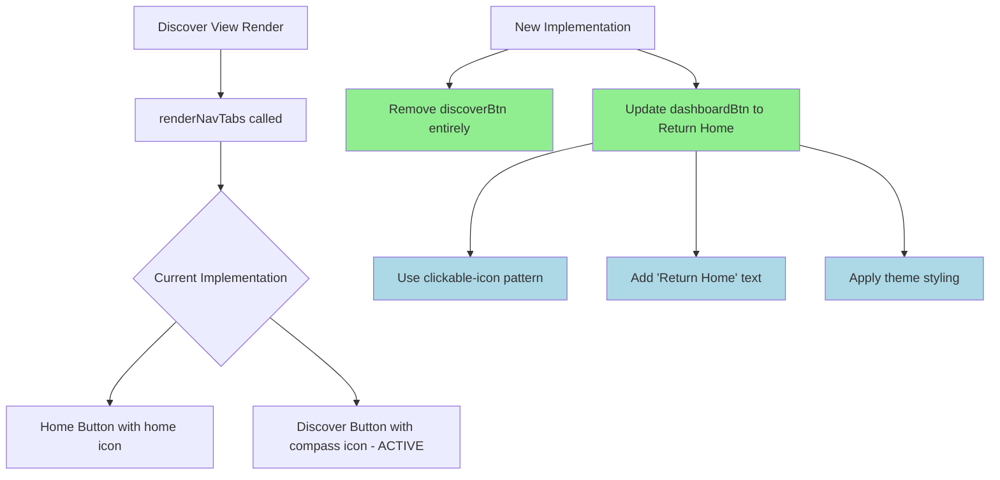

# Plan: Remove Discover Icon and Update Home Button in Discover View

## Summary

Refactor the discover view navigation to:

1. Remove the discover icon/button entirely from the toolbar (since user is already on the discover page)
2. Convert the Home icon to a standard "Return Home" button with text, matching the theme styling

## Files to Modify

1. **`src/views/discover-view.ts`** - Main logic changes in `renderNavTabs()` method (lines 547-593)
2. **`src/components/discover-sidebar.ts`** - Mirror changes for consistency
3. **`src/styles/discover.css`** - Add styling for the new "Return Home" button
4. **`docs/design/design-spec.md`** - Update if needed per requirements

## Detailed Changes

### 1. Update `src/views/discover-view.ts`

#### Current Implementation (lines 547-593):

```typescript
private renderNavTabs(container: HTMLElement): void {
  const navContainer = container.createDiv({
    cls: "rss-dashboard-nav-container",
  });

  // Home button - navigates to Dashboard
  const dashboardBtn = navContainer.createDiv({
    cls: "rss-dashboard-nav-button rss-dashboard-nav-button--icon",
    attr: { title: "Dashboard", ... },
  });
  setIcon(dashboardBtn, "home");
  dashboardBtn.addEventListener("click", () => void this.plugin.activateView());

  // Discover button - currently active, but should be removed
  const discoverBtn = navContainer.createDiv({
    cls: "rss-dashboard-nav-button rss-dashboard-nav-button--icon active",
    attr: { title: "Discover", ... },
  });
  setIcon(discoverBtn, "compass");
  discoverBtn.addEventListener("click", () => void this.plugin.activateDiscoverView());
}
```

#### Required Changes:

- **Remove**: The entire `discoverBtn` block (lines 573-592)
- **Update**: The `dashboardBtn` to become a "Return Home" button with:
  - Remove the "home" icon and use a more descriptive icon (e.g., "arrow-left" or keep "home")
  - Add text "Return Home"
  - Update title/aria-label to "Return to Dashboard"
  - Apply `clickable-icon` pattern per design-spec

### 2. Update `src/components/discover-sidebar.ts`

Mirror the same changes as discover-view.ts for consistency.

### 3. Add CSS in `src/styles/discover.css`

Add new styles for the "Return Home" button:

```css
/* Return Home button in Discover view */
.rss-discover-header .rss-dashboard-nav-button--return-home {
  display: flex;
  align-items: center;
  gap: 6px;
  padding: 6px 12px;
  background: var(--background-modifier-hover);
  border: 1px solid var(--background-modifier-border);
  border-radius: 6px;
  color: var(--text-normal);
  cursor: pointer;
  font-size: 13px;
  font-weight: 500;
  transition: all 0.15s ease;
}

.rss-discover-header .rss-dashboard-nav-button--return-home:hover {
  background: var(--background-modifier-active);
  border-color: var(--interactive-accent);
  color: var(--text-accent);
}

.rss-discover-header .rss-dashboard-nav-button--return-home svg {
  width: 16px;
  height: 16px;
}
```

### 4. Design Spec Compliance

Per `docs/design/design-spec.md`:

- ✅ Use `clickable-icon` pattern with proper `role`, `tabindex`, `aria-label`
- ✅ Handle keyboard events (Enter/Space)
- ✅ Theme-native colors via CSS variables
- ✅ Focus-visible states preserved

## Execution Order

1. Modify `src/views/discover-view.ts` - Remove discover button, update home button
2. Modify `src/components/discover-sidebar.ts` - Same changes for consistency
3. Add CSS to `src/styles/discover.css` - Style the Return Home button
4. Test the changes in both dark and light modes

## Mermaid Diagram



## Notes

- The discover button removal is logical since the user is already on the Discover page
- The "Return Home" naming is clearer for navigation - user knows they're returning to their feeds
- Text should inherit theme colors via CSS variables for dark/light mode compatibility
